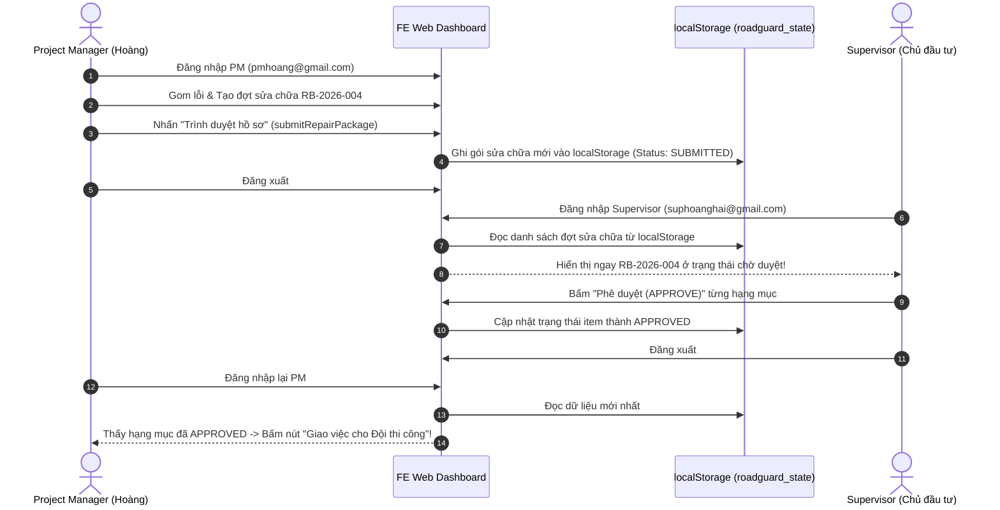

# TỔNG HỢP CHỨC NĂNG PM & SUPERVISOR VÀ KẾ HOẠCH CHI TIẾT XÂY DỰNG MOCK API

> **Tài liệu quy chuẩn dành cho Frontend Web RoadGuard (Nhà thầu Hoàng Hải)**  
> **Căn cứ gốc:** Trích xuất nguyên bản từ bộ đặc tả `v2.2` (Review-01 / R3), đối chiếu với `RoadGuard_Frontend_PM_Supervisor_ChiTietChucNang.md`, `openapi.yaml`, `01_Data_Dictionary.md`, và `AGENTS.md`.

---

## 📑 MỤC LỤC
1. [Các file nguồn căn cứ để kiểm tra Mock API & Data Contracts](#1-các-file-nguồn-căn-cứ-để-kiểm-tra-mock-api--data-contracts)
2. [Tổng hợp toàn bộ chức năng của Role SUPERVISOR (Giám sát / Quản trị viên)](#2-tổng-hợp-toàn-bộ-chức-năng-của-role-supervisor-giám-sát--quản-trị-viên)
3. [Tổng hợp toàn bộ chức năng của Role PM (Project Manager - Chỉ huy trưởng)](#3-tổng-hợp-toàn-bộ-chức-năng-của-role-pm-project-manager---chỉ-huy-trưởng)
4. [Bảng đối chiếu màn hình FE Web, Route URL và thẩm quyền thao tác](#4-bảng-đối-chiếu-màn-hình-fe-web-route-url-và-thẩm-quyền-thao-tác)
5. [Kế hoạch bóc tách chi tiết xây dựng Mock API Service (8 Phân hệ)](#5-kế-hoạch-bóc-tách-chi-tiết-xây-dựng-mock-api-service-8-phân-hệ)
6. [Cơ chế lưu trữ trạng thái chéo (Cross-Role Persistence via LocalStorage)](#6-cơ-chế-lưu-trữ-trạng-thái-chéo-cross-role-persistence-via-localstorage)

---

## 1. CÁC FILE NGUỒN CĂN CỨ ĐỂ KIỂM TRA MOCK API & DATA CONTRACTS

Để đảm bảo Mock API và FE code chuẩn xác 100%, không bịa field, không sai mã lỗi HTTP, lập trình viên cần đối chiếu trực tiếp các file sau:

### 1.1. Trong thư mục đặc tả `v2.2`:
1. `d:\hoctap\kì 9\đồ án\v2.2\RoadGuard_Frontend_PM_Supervisor_ChiTietChucNang.md`  
   *(Source of Truth bao quát nhất: 133 API operations, quy tắc BR-01 đến BR-48, 10 invariants, 12 wireframes WF-01..WF-12, và 10 loại báo cáo RPT-01..RPT-10)*.
2. `d:\hoctap\kì 9\đồ án\v2.2\05_Technical\openapi.yaml`  
   *(File OpenAPI 3.0 chính thức của Backend: định nghĩa toàn bộ Request Body, Response Schema, Query Params, Header `Idempotency-Key`, `If-Match`, và cấu trúc mã lỗi ProblemDetails)*.
3. `d:\hoctap\kì 9\đồ án\v2.2\03_Data\01_Data_Dictionary.md`  
   *(Từ điển dữ liệu: Kiểu dữ liệu, độ dài chuỗi, khóa ngoại, quan hệ thực thể giữa Project, RouteVersion, Segment, Slab, Defect, RepairPackage, RepairItem, Attempt, Case)*.
4. `d:\hoctap\kì 9\đồ án\v2.2\04_UI_UX\01_Wireframe_Annotations.md`  
   *(Đặc tả bố cục chi tiết 4 vùng A-B-C-D của từng màn hình, các nút CTA, form validation, và hành vi banner cảnh báo)*.
5. `d:\hoctap\kì 9\đồ án\v2.2\05_Technical\02_Auth_Permission_Model.md`  
   *(Mô hình xác thực Bearer JWT, phân quyền theo Role, cơ chế Single-flight token refresh, và header bắt buộc)*.
6. `d:\hoctap\kì 9\đồ án\v2.2\02_Requirements\02_Business_Rules.md`  
   *(48 Quy tắc nghiệp vụ cốt lõi: Fast Track không có gate duyệt trước, Approval Track duyệt từng item độc lập, bảo toàn dữ liệu bảo hành +5 năm, v.v.)*.

### 1.2. Trong thư mục mã nguồn `FE_Drone_Web`:
1. `src/types/domain.ts`: Định nghĩa Interface TypeScript chuẩn của các đối tượng dữ liệu.
2. `src/types/enums.ts`: Tập hợp các Enum bất biến (RoleCode, Severity, Urgency, DefectStatus, RepairBatchStatus, TaskMode, CoverageStatus, v.v.).
3. `src/data/mockData.ts`: Single Source of Truth (SSOT) chứa dữ liệu mẫu liên kết 5 tầng.
4. `src/api/client.ts`: Axios instance cấu hình interceptor gắn Header `Authorization`, `Idempotency-Key` và tự động điều hướng 401 về `/login`.

---

## 2. TỔNG HỢP TOÀN BỘ CHỨC NĂNG CỦA ROLE SUPERVISOR (GIÁM SÁT / QUẢN TRỊ VIÊN)

Supervisor đại diện cho **Chủ đầu tư / Lãnh đạo cấp cao của Nhà thầu Hoàng Hải**.  
Trên FE Web, Supervisor có **15 nhóm chức năng lớn** với hơn **35 hành vi tác nghiệp**:

| STT | Nhóm chức năng | Mã Use Case | Chi tiết hành vi thao tác trên Web | API Endpoint tương ứng |
|:---:|---|:---:|---|---|
| **01** | **Khởi tạo & Quản lý Dự án** | DA01 | Tạo dự án mới, nhập thời hạn bảo hành (tháng), ngày hết hạn, số tiền bảo lãnh giữ lại, hệ quy chiếu UTM SRID (32648), chỉ định duy nhất 1 PM chính. | `POST /api/v1/projects`<br>`PATCH /api/v1/projects/{id}` |
| **02** | **Phân quyền & Nhân sự dự án** | DA03 | Phân công PM chính, bổ nhiệm Drone Operator và Repair Crew vào dự án. Lưu lịch sử thay đổi PM. | `POST /api/v1/projects/{id}/memberships` |
| **03** | **Quản lý Hồ sơ & Hạn bảo hành** | DA04, DA05 | Xem toàn bộ danh mục dự án công ty, kiểm soát mốc hết hạn bảo hành, hồ sơ nghiệm thu bàn giao đính kèm. | `GET /api/v1/projects`<br>`GET /api/v1/projects/{id}` |
| **04** | **Đóng / Ngừng sử dụng dự án** | DA12 | Đóng dự án khi hết hạn bảo hành hoặc nghiệm thu xong toàn bộ. Khóa dự án thành chế độ chỉ đọc (Read-only). | `POST /api/v1/projects/{id}/close` |
| **05** | **Xác nhận Phiên bản Tuyến đường** | DA13 | Xem trước hình học tim đường và bề rộng trên MapLibre do PM trình; bấm "Xác nhận phiên bản tuyến" để khóa bất biến `RoadSectionVersion`. | `POST /api/v1/route-versions/{id}/confirm` |
| **06** | **Thẩm duyệt Hạng mục Sửa chữa (Approval Track)** | SC05, SC06, SC07 | Xem gói hồ sơ do PM trình (`WF-07`); ra quyết định độc lập trên từng hạng mục: `APPROVE`, `REQUEST_EVIDENCE`, `REQUEST_RECONSIDER`, `REJECT` kèm lý do. | `POST /api/v1/repair-items/{id}/decisions` |
| **07** | **Nghiệm thu Hạng mục Nhánh duyệt** | HT10 | Xem ảnh BEFORE/AFTER và biên bản hoàn công do PM trình; bấm "Chấp thuận nghiệm thu" hoặc "Yêu cầu sửa lại (Rework)". | `POST /api/v1/repair-attempts/{id}/acceptance` |
| **08** | **Đóng Tổng thể Vụ việc Hỗn hợp (Mixed Case)** | HT12 | Sau khi toàn bộ các hư hỏng trong vụ việc đã hoàn thành (Fast Track do PM đóng, Approval Track do Sup nghiệm thu), bấm đóng tổng thể vụ việc. Chặn nếu còn mục dở dang. | `POST /api/v1/cases/{id}/close` |
| **09** | **Quản trị Tài khoản & Phân quyền** | QT01, QT02 | Tạo lời mời nhân viên mới, đình chỉ tài khoản nghỉ việc (thu hồi token ngay), cập nhật thông tin, đặt lại mật khẩu nhân viên. | `POST /api/v1/invitations`<br>`PATCH /api/v1/users/{id}`<br>`POST /api/v1/users/{id}/password-reset` |
| **10** | **Quản trị Danh mục Hư hỏng** | QT03, QT04 | Thêm mới, cập nhật danh mục loại hư hỏng, đơn vị đo tiêu chuẩn, quy tắc phân mức nghiêm trọng/khẩn cấp. | `GET /api/v1/catalog/defect-types`<br>`PUT /api/v1/catalog/defect-types/{code}` |
| **11** | **Cấu hình Thông báo Nhắc việc** | QT05 | Cài đặt chu kỳ gửi thông báo nhắc việc rà soát hàng tuần cho PM, số ngày cảnh báo trước khi hết hạn bảo hành. | `GET /api/v1/reminder-configuration`<br>`PUT /api/v1/reminder-configuration` |
| **12** | **Quản lý Phiên bản Mô hình AI** | QT06, QT07 | Khai báo phiên bản AI mới, kích hoạt mô hình vận hành, ngừng dùng mô hình cũ; xuất tập nhãn đã duyệt cho đội AI huấn luyện. | `POST /api/v1/model-versions`<br>`POST /model-versions/{id}/activate`<br>`POST /api/v1/training-exports` |
| **13** | **Giám sát Máy chủ & Audit Trail** | QT08, QT09 | Giám sát hàng đợi xử lý AI; tra cứu nhật ký kiểm toán bất biến (Audit Trail) hiển thị chi tiết thời gian, tác nhân, hành động, giá trị trước/sau. | `GET /api/v1/admin/processing-jobs`<br>`GET /api/v1/audit-events` |
| **14** | **Pháp lý, Lưu trữ (+5 năm) & Legal Hold** | QT12, QT13, QT14 | Bật/tắt lệnh giữ hồ sơ pháp lý (`Legal Hold`) khi có tranh chấp; phê duyệt hoặc từ chối yêu cầu xóa dữ liệu đã hết hạn bảo hành +5 năm do PM lập. | `PUT /api/v1/projects/{id}/legal-hold`<br>`POST /retention/deletion-requests/{id}/decision` |
| **15** | **Dashboard Toàn danh mục & Xuất hồ sơ** | BC01, BC03, BC04, BC06, BC07 | Xem KPI toàn danh mục dự án, tỷ lệ hoàn thành sửa chữa, cảnh báo rủi ro suy thoái; xuất hồ sơ PDF và file ZIP chứa dữ liệu gốc có mã Checksum SHA-256. | `GET /api/v1/projects/{id}/dashboard`<br>`POST /api/v1/exports` |

---

## 3. TỔNG HỢP TOÀN BỘ CHỨC NĂNG CỦA ROLE PM (PROJECT MANAGER - CHỈ HUY TRƯỞNG)

Project Manager là người **trực tiếp chỉ đạo và điều hành công tác bảo hành tại dự án được phân công**.  
Trên FE Web, PM có **17 nhóm chức năng lớn** với hơn **50 hành vi tác nghiệp**:

| STT | Nhóm chức năng | Mã Use Case | Chi tiết hành vi thao tác trên Web | API Endpoint tương ứng |
|:---:|---|:---:|---|---|
| **01** | **Thiết lập Tuyến đường & Hình học** | DA02, DA13 | Nhập chuỗi tọa độ tim đường (hoặc upload GPX), cấu hình Station Origin, bề rộng mặt đường từng đoạn, hành lang khảo sát; xem trước MapLibre và trình Supervisor xác nhận. | `POST /api/v1/projects/{id}/route-drafts`<br>`PUT /route-versions/{id}/draft` |
| **02** | **Phân chia Phân đoạn (Segment)** | DA14, DA15 | Nhập độ dài mục tiêu (100m, 500m) hoặc tùy chỉnh ranh giới lý trình; xem trước danh sách segment và đoạn dư; bấm "Công bố tập đoạn đường (Publish SegmentSet)". | `POST /segment-set-previews`<br>`POST /segment-sets/{id}/publish` |
| **03** | **Quản lý Đường nhánh & Lưới tấm (Slab)** | DA17, DA18 | Khai báo mạng lưới đường nhánh nút giao; tạo dải tấm bê tông xi măng (Slab 4m/5m); liên kết hư hỏng vào tấm tương ứng. | `POST /api/v1/projects/{id}/branches`<br>`POST /api/v1/projects/{id}/slabs`<br>`PUT /defects/{id}/slab-links` |
| **04** | **Lập Kế hoạch Khảo sát Drone** | DA06, DA07, DA08, DA09 | Lập kế hoạch khảo sát gốc (Baseline), định kỳ hoặc đột xuất; chọn bộ Segment và dải quan sát (SURFACE, LEFT_EDGE, RIGHT_EDGE); hoãn lịch do thời tiết nếu cần. | `POST /api/v1/projects/{id}/survey-plans`<br>`POST /survey-plans/{id}/postpone` |
| **05** | **Giao nhiệm vụ Bay & Yêu cầu Bay bổ sung** | KS01, KS04, KS11, KS13, KS15 | Giao việc cho Drone Operator, chỉ định điểm cất hạ cánh; kiểm tra độ phủ dữ liệu (`Coverage`); yêu cầu bay bổ sung vùng thiếu/mờ; xuất kế hoạch bay Dronelink. | `POST /survey-tasks`<br>`GET /datasets/{id}/coverage`<br>`POST /survey-tasks/{id}/supplements` |
| **06** | **Xác nhận Mốc chuẩn Khảo sát gốc (Baseline)** | DA10 | Khi dữ liệu bay đạt độ phủ SUFFICIENT và các phát hiện AI đã rà soát xong, PM bấm "Xác nhận Baseline" độc lập cho từng cặp (segment, band). | `POST /api/v1/projects/{id}/baselines` |
| **07** | **Kích hoạt Xử lý AI & Rà soát Lỗi (Inbox)** | AI01, AI04..AI08, AI13..AI15 | Kích hoạt job phân tích video 2 giai đoạn; rà soát phát hiện sơ bộ trên MapLibre và khung ảnh video (Bounding Box); hiệu chỉnh loại lỗi; loại bỏ phát hiện sai kèm lý do; xử lý gộp trùng; duyệt nhãn huấn luyện AI. | `POST /api/v1/processing-jobs`<br>`POST /api/v1/projects/{id}/defects`<br>`POST /labels/{id}/review` |
| **08** | **Tiếp nhận Phản ánh & Liên kết Báo trùng** | PA03, PA04, PA05, PA07 | Tiếp nhận phản ánh từ Reporter; đối chiếu không gian; liên kết các báo cáo trùng vào 1 IncidentCase chính; ghi nhận kết luận kiểm chứng (`DEFECT_FOUND`, `NO_DEFECT`, `OUT_OF_SCOPE`). | `POST /cases/{id}/triage`<br>`POST /cases/{id}/report-links`<br>`POST /cases/{id}/conclusion` |
| **09** | **Phân cấp Hư hỏng & Ưu tiên Xử lý** | SC14, AI05, AI12 | Phân cấp độc lập 2 trục: Severity (`LOW`, `MEDIUM`, `HIGH`, `CRITICAL`) và Urgency (`NORMAL`, `SOON`, `URGENT`); xác nhận lỗi chính thức (`VERIFIED`); sắp xếp thứ tự ưu tiên xử lý trong dự án. | `POST /defects/{id}/assessments`<br>`POST /defects/{id}/verification`<br>`PUT /projects/{id}/work-order` |
| **10** | **Lập Chính sách Sửa nhanh (Fast Track)** | SC13 | Thiết lập quy định FastTrackPolicy dự án: danh mục loại lỗi cho phép, ngưỡng kích thước tối đa (dài, rộng, sâu, diện tích), biện pháp thi công và yêu cầu ảnh Before/After; kích hoạt chính sách. | `POST /projects/{id}/policy-versions`<br>`POST /policy-versions/{id}/activate` |
| **11** | **Giao việc Đo đạc Hiện trường (Field Inspection)** | TN01, TN06, TN07 | Giao đợt đo gom nhiều lỗi (chế độ bắt buộc `MEASURE_ONLY`, cấm sửa); hoặc giao xử lý 1 lỗi nhỏ riêng lẻ (chế độ `INSPECT_AND_REPAIR` kèm snapshot policy). | `POST /inspection-batches`<br>`POST /inspection-tasks` |
| **12** | **Lập Gói Đề xuất Sửa chữa (Approval Track)** | SC01, SC02, SC03, SC04 | Lập gói hồ sơ `RepairPackage` cho các lỗi `VERIFIED`; nhập phương án kỹ thuật tổng quát cho từng `RepairItem`; khóa phiên bản và trình duyệt lên Supervisor. | `POST /repair-packages`<br>`POST /repair-packages/{id}/submit` |
| **13** | **Chỉnh sửa & Giao việc Thi công (Crew Assignment)** | SC08, SC09, SC11 | Chỉnh sửa các hạng mục bị Supervisor yêu cầu bổ sung bằng chứng / lập lại phương án; phân công đội thi công cho các hạng mục đã được Supervisor duyệt (`APPROVED`). | `POST /repair-items/{id}/revisions`<br>`POST /repair-items/{id}/assignments` |
| **14** | **Kiểm tra Hiện trường & Đóng lỗi Fast Track** | HT09, HT10, HT11 | Xem ảnh BEFORE/AFTER và số đo hoàn công; tự kiểm tra và bấm "Đóng lỗi Fast Track" (Defect -> RESOLVED, phát thông báo cho Sup); hoặc trình Supervisor nghiệm thu với nhánh Approval Track. | `POST /repair-attempts/{id}/review` |
| **15** | **Kích hoạt Xử lý Khẩn cấp (Emergency)** | SC10, HT12 | Khi xảy ra sự cố hố sâu/sạt lở nguy hiểm, PM kích hoạt nhiệm vụ Emergency xử lý an toàn tạm thời (rào chắn, biển cảnh báo, lấp tạm). Tự động báo động Supervisor. | `POST /projects/{id}/emergency-tasks` |
| **16** | **Phân tích Tái phát & Công bố Kết quả** | PA08, PA07 | Phân tích hư hỏng tái phát tại vị trí cũ (lỗi do thi công kém hay phát sinh mới); chọn ảnh AFTER tiêu biểu công bố tiến độ hoàn thành cho người dân theo dõi. | `POST /defects/{id}/recurrence-assessments`<br>`POST /cases/{id}/publish` |
| **17** | **Báo cáo Điều hành & Lập yêu cầu xóa (+5 năm)** | BC02, QT11 | Theo dõi Dashboard điều hành dự án mình phụ trách; xuất hồ sơ PDF/ZIP; rà soát hồ sơ đã hết hạn bảo hành đủ 5 năm để lập yêu cầu xóa dữ liệu trình Supervisor duyệt. | `GET /projects/{id}/dashboard`<br>`POST /retention/deletion-requests` |

---

## 4. BẢNG ĐỐI CHIẾU MÀN HÌNH FE WEB, ROUTE URL VÀ THẨM QUYỀN THAO TÁC

Căn cứ theo bảng phân chia phẳng trong `AGENTS.md` và mã Wireframe `04_UI_UX/01_Wireframe_Annotations.md`:

| STT | Mã Wireframe | Tên màn hình trên Web | Route URL | Vai trò được phép | File Component hiện hữu |
|:---:|:---:|---|---|:---:|---|
| **01** | **WF-01** | Đăng nhập & Đổi mật khẩu lần đầu | `/login`, `/force-change-password` | Chung | `src/pages/(auth)/Login.tsx` |
| **02** | **WF-10** | Dashboard KPI & Lối tắt PM | `/pm/dashboard` | PM | `src/pages/(pm)/PMDashboard.tsx` |
| **03** | **WF-10** | Dashboard KPI & Rủi ro Giám sát | `/sup/dashboard` | SUPERVISOR | `src/pages/(sup)/SupDashboard.tsx` |
| **04** | **WF-02** | Danh sách dự án bảo hành | `/pm/projects`, `/sup/projects` | Chung (Scope khác nhau) | `src/pages/(pm)/ProjectList.tsx` |
| **05** | **WF-02** | Tuyến đường, Hình học & Phân đoạn | `/pm/projects/:id/alignment` | PM (Nhập) / SUP (Duyệt) | `src/pages/(pm)/AlignmentSegments.tsx` |
| **06** | **WF-09** | Danh sách yêu cầu bay khảo sát | `/pm/surveys` | PM | `src/pages/(pm)/SurveyRequests.tsx` |
| **07** | **WF-09** | Tạo yêu cầu bay khảo sát Drone | `/pm/surveys/create` | PM | `src/pages/(pm)/CreateSurvey.tsx` |
| **08** | **WF-09** | Quản lý bay & Rà soát AI Drone | `/pm/surveys/:id/ai-review` | PM | `src/pages/(pm)/DroneMissionAIReview.tsx` |
| **09** | **WF-04** | Hộp thư tiếp nhận lỗi AI (AI Inbox) | `/pm/ai-inbox` | PM | `src/pages/(pm)/AIReviewInbox.tsx` |
| **10** | **WF-04** | Thẩm định chi tiết lỗi AI (Bounding box) | `/pm/defects/:id/verify-a` | PM | `src/pages/(pm)/DefectDetailVerify.tsx` |
| **11** | **WF-04** | So sánh ảnh hư hỏng đa kỳ (Temporal) | `/pm/defects/:id/verify-b` | PM | `src/pages/(pm)/DefectDetailVerify.tsx` |
| **12** | **WF-05** | Nhiệm vụ đo đạc hiện trường (Field Tasks) | `/pm/field-tasks` | PM | `src/pages/(pm)/FieldTasks.tsx` |
| **13** | **WF-07** | Gom đợt sửa chữa & Lập dự toán BOQ | `/pm/repair-batches/create` | PM | `src/pages/(pm)/RepairBatching.tsx` |
| **14** | **WF-07** | Trình duyệt hồ sơ đợt sửa chữa | `/pm/repair-batches/:id/submit` | PM | `src/pages/(pm)/SubmitApproval.tsx` |
| **15** | **WF-07** | Thẩm duyệt hồ sơ đợt sửa chữa | `/sup/approvals` | SUPERVISOR | `src/pages/(sup)/BatchApprovals.tsx` |
| **16** | **WF-07** | Yêu cầu sửa đổi / Từ chối đợt sửa | `/sup/approvals/:id/reject` | SUPERVISOR | `src/pages/(sup)/BatchRejection.tsx` |
| **17** | **WF-07** | Phân công đội thi công (Assign Crew) | `/pm/repair-batches/:id/assign` | PM | `src/pages/(pm)/AssignCrew.tsx` |
| **18** | **WF-08** | Xác nhận hoàn thành công việc | `/pm/work-orders/:id/confirm` | PM | `src/pages/(pm)/WorkOrderConfirm.tsx` |
| **19** | **WF-08** | Nghiệm thu chất lượng ngoài hiện trường | `/sup/acceptance/:batchId` | SUPERVISOR | `src/pages/(sup)/FieldAcceptance.tsx` |
| **20** | **WF-08** | Chi tiết bằng chứng đóng hồ sơ | `/sup/closeout/:batchId` | SUPERVISOR | `src/pages/(sup)/EvidenceCloseoutDetail.tsx` |
| **21** | **WF-12** | Nhật ký truy vết kiểm toán (Audit Trail) | `/sup/audit-trail` | SUPERVISOR | `src/pages/(sup)/AuditTrail.tsx` |
| **22** | **WF-10** | Phân tích rủi ro & Ký số đóng đợt | `/sup/risk-analytics`, `/sup/signoff` | SUPERVISOR | `src/pages/(sup)/RiskAnalytics.tsx`, `SignOffClosure.tsx` |

---

## 5. KẾ HOẠCH BÓC TÁCH CHI TIẾT XÂY DỰNG MOCK API SERVICE (8 PHÂN HỆ)

Để thay thế triệt để các lệnh đọc dữ liệu cứng và mô phỏng chính xác nghiệp vụ thực tế, cấu trúc Mock API được tổ chức thành **8 module dịch vụ** đặt tại `src/api/services/`. Mỗi hàm đều hỗ trợ chuyển đổi linh hoạt qua cờ `VITE_USE_MOCK`:

```
src/api/services/
├── authService.ts         # Module 1: Đăng nhập, Token, Profile, Role Switching
├── projectService.ts      # Module 2: Dự án, Tuyến đường, Segments, Slabs, Nhân sự
├── surveyService.ts       # Module 3: Khảo sát Drone, Flight Telemetry, Báo cáo độ phủ
├── aiService.ts           # Module 4: Kích hoạt Job AI, Hộp thư lỗi, Thẩm định Bounding box, Baseline
├── triageService.ts       # Module 5: Phản ánh người dân, Liên kết báo trùng, Phân cấp Severity x Urgency
├── fastTrackService.ts    # Module 6: Chính sách Fast Track, Giao đo đạc, Mô phỏng Crew
├── repairService.ts       # Module 7: Gói sửa chữa, Phê duyệt Supervisor, Giao việc thi công
└── acceptanceService.ts   # Module 8: Nghiệm thu Before/After, Đóng Fast Track, Đóng Mixed Case, Audit
```

---

### Module 1: `authService.ts` (Xác thực & Quản lý phiên)
- **Hàm cần tạo:**
  1. `login(email, password)`: Xác thực thông tin. Nếu đăng nhập bằng `pmhoang@gmail.com` -> trả về Token vai trò `PROJECT_MANAGER`. Nếu đăng nhập bằng `suphoanghai@gmail.com` -> trả về Token vai trò `SUPERVISOR`. Hỗ trợ trả cờ `mustChangePassword`.
  2. `refreshTokens(refreshToken)`: Cấp token mới khi token cũ hết hạn (Single-flight simulation).
  3. `logout()`: Thu hồi token và xóa session bộ nhớ.
  4. `getMe()`: Trả về thông tin người dùng đăng nhập hiện tại kèm danh sách `assignedProjectIds`.
  5. `changePassword(oldPass, newPass)`: Cập nhật mật khẩu và gỡ cờ bắt buộc đổi mật khẩu.
- **Trạng thái lưu trữ:** `localStorage.getItem('roadguard_current_user')`.

---

### Module 2: `projectService.ts` (Dự án, Tuyến đường & Phân đoạn)
- **Hàm cần tạo:**
  1. `getProjects(params)`: Trả về danh sách dự án. **Tự động lọc theo Role:** Nếu PM đăng nhập -> Chỉ trả về các dự án PM được phân công (`PRJ-QL1A-02` và `PRJ-LSTL-05`). Nếu Supervisor đăng nhập -> Trả về tất cả dự án trong công ty.
  2. `getProjectById(id)`: Lấy chi tiết thông số bảo hành, giá trị giữ lại, và PM phụ trách.
  3. `createProject(data)`: Supervisor tạo dự án mới, lưu vào `localStorage`.
  4. `createRouteDraft(projectId, draftData)`: PM nhập chuỗi tọa độ tim đường, bề rộng mặt đường theo từng đoạn, tính toán hình học phẳng WGS84 -> Sinh bản nháp tuyến.
  5. `confirmRouteVersion(routeVersionId)`: Supervisor bấm phê duyệt -> Khóa tuyến đường thành `CONFIRMED`.
  6. `previewSegmentSet(projectId, targetLength)`: PM xem trước danh sách phân đoạn 100m/500m.
  7. `publishSegmentSet(segmentSetId)`: PM bấm công bố tập phân đoạn chính thức.
  8. `getSlabsByProject(projectId)` / `createSlab(data)`: Quản lý danh sách tấm bê tông.

---

### Module 3: `surveyService.ts` (Khảo sát Drone & Dữ liệu bay)
- **Hàm cần tạo:**
  1. `getSurveyPlans(projectId)`: Lấy danh sách kế hoạch khảo sát gốc và định kỳ.
  2. `createSurveyPlan(data)`: PM tạo kế hoạch khảo sát cho các đoạn tuyến đã công bố.
  3. `getSurveyTasks(params)`: Lấy danh sách nhiệm vụ bay của Drone.
  4. `createSurveyTask(data)`: PM chỉ định phi công bay từ danh sách `AVAILABLE_PILOTS`, độ cao bay (45m/60m/tự chọn), độ phủ chồng ảnh (80%/70%), và điểm cất hạ cánh.
  5. `getDatasetCoverage(datasetId)`: Trả về đánh giá 3 chiều: Vị trí bay (Position), Chất lượng ảnh (Quality), và Độ phủ (Coverage: `SUFFICIENT`, `PARTIAL`, `INSUFFICIENT`).
  6. `requestSurveySupplement(taskId, supplementData)`: PM yêu cầu bay bổ sung vùng thiếu/mờ.
  7. `simulateDroneFlightCompletion(taskId)`: *(Hàm trợ giúp Demo)* Mô phỏng sự kiện Drone bay xong và nộp video MP4 + file SRT định vị lên server.

---

### Module 4: `aiService.ts` (Xử lý AI, Bounding Box & Xác nhận Baseline)
- **Hàm cần tạo:**
  1. `triggerAIProcessingJob(datasetId)`: PM bấm kích hoạt xử lý AI 2 giai đoạn -> Khởi tạo Job với trạng thái `RUNNING` -> Sau 2 giây chuyển thành `RESULT_READY`.
  2. `getAIDetectedDefects(projectId)`: Lấy danh sách các phát hiện sơ bộ do AI quét được vào Hộp thư tiếp nhận (AI Inbox).
  3. `verifyDefect(defectId, verifiedData)`: PM thẩm định Bounding Box trên ảnh: chỉnh sửa tọa độ, xác nhận loại vết nứt hoặc bấm Loại bỏ (Reject) kèm lý do giải trình.
  4. `mergeDuplicateDefects(targetDefectId, duplicateDefectIds)`: PM xác nhận gộp các phát hiện trùng lặp vào một vết nứt chính.
  5. `confirmBaseline(projectId, segmentId, band)`: PM bấm xác nhận mốc chuẩn khảo sát gốc cho từng cặp (segment, band).

---

### Module 5: `triageService.ts` (Tiếp nhận phản ánh & Phân cấp hư hỏng)
- **Hàm cần tạo:**
  1. `getIncidentReports(params)`: Lấy danh sách phản ánh từ người dân và tuần đường.
  2. `triageCaseToProject(caseId, projectId)`: Điều phối phản ánh vào đúng tuyến đường dự án.
  3. `linkDuplicateReports(caseId, reportIds)`: Liên kết nhiều người phản ánh trùng vào cùng 1 Case.
  4. `concludeCase(caseId, conclusion)`: Kết luận kiểm chứng (`DEFECT_FOUND`, `NO_DEFECT` kèm lý do, `OUT_OF_SCOPE`).
  5. `assessDefectSeverityUrgency(defectId, assessment)`: PM chính thức phân cấp 2 trục: Severity (`LOW`..`CRITICAL`) và Urgency (`NORMAL`..`URGENT`).
  6. `updateWorkOrderPriority(projectId, orderedDefectIds)`: Lưu thứ tự ưu tiên xử lý của PM.

---

### Module 6: `fastTrackService.ts` (Chính sách Fast Track & Đo đạc hiện trường)
- **Hàm cần tạo:**
  1. `getFastTrackPolicy(projectId)`: Lấy phiên bản chính sách sửa nhanh đang có hiệu lực.
  2. `createAndActivatePolicy(projectId, policyData)`: PM thiết lập danh mục lỗi và ngưỡng kích thước (chiều dài, chiều rộng, chiều sâu tối đa) được phép sửa nhanh.
  3. `createInspectionBatch(data)`: PM gom nhiều lỗi thành 1 đợt đo (chế độ bắt buộc `MEASURE_ONLY`).
  4. `createInspectionTask(data)`: PM giao 1 lỗi nhỏ riêng lẻ (chế độ `INSPECT_AND_REPAIR`).
  5. `simulateCrewSubmitMeasurements(taskId, measurements)`: *(Hàm trợ giúp Demo)* Mô phỏng đội hiện trường đo kích thước thực tế và tải ảnh thước đo lên máy chủ.

---

### Module 7: `repairService.ts` (Gói hồ sơ sửa chữa & Thẩm duyệt Supervisor)
- **Hàm cần tạo:**
  1. `getRepairPackages(projectId)`: Lấy danh sách các đợt sửa chữa / gói đề xuất BOQ.
  2. `createRepairPackage(data)`: PM gom các lỗi `VERIFIED` thành đợt sửa chữa, nhập phương án kỹ thuật và bóc tách dự toán hạng mục. Tổng tiền tự động tính bằng SUM các item.
  3. `submitRepairPackage(packageId)`: PM bấm khóa phiên bản và trình duyệt lên Supervisor -> Trạng thái chuyển `SUBMITTED`.
  4. `decideRepairItem(itemId, decision, reason)`: **Supervisor thao tác độc lập trên từng dòng:** Bấm `APPROVE`, `REQUEST_EVIDENCE`, `REQUEST_RECONSIDER`, hoặc `REJECT`.
  5. `reviseRepairItem(itemId, revisionData)`: PM chỉnh sửa bổ sung các hạng mục bị Supervisor yêu cầu sửa lại.
  6. `assignCrewToApprovedItem(itemId, crewId, dueDate)`: PM giao việc thi công cho đội thi công (chỉ sáng nút đối với các item đã có trạng thái `APPROVED`).

---

### Module 8: `acceptanceService.ts` (Nghiệm thu, Ký số, Đóng hồ sơ & Audit Trail)
- **Hàm cần tạo:**
  1. `getRepairAttempts(itemId)`: Lấy thông tin lần thi công của đội hiện trường kèm cặp ảnh BEFORE/AFTER và biên bản hoàn công.
  2. `closeFastTrackDefect(attemptId, notes)`: PM tự kiểm tra và đóng lỗi Fast Track -> Defect chuyển `RESOLVED`, tự động phát sinh thông báo cho Supervisor.
  3. `submitAttemptToSupervisor(attemptId)`: PM xác nhận đạt và trình Supervisor nghiệm thu với các hạng mục nhánh duyệt.
  4. `acceptApprovalAttempt(attemptId, decision)`: Supervisor bấm chấp thuận nghiệm thu hoặc yêu cầu sửa lại (Rework).
  5. `closeMixedCase(caseId)`: Supervisor bấm đóng tổng thể hồ sơ vụ việc. Hệ thống kiểm tra: Nếu 100% hạng mục đã hoàn thành -> Cho phép đóng; nếu còn hạng mục dở dang -> Chặn và báo lỗi `CASE_HAS_OPEN_REQUIRED_ITEMS`.
  6. `publishCaseResult(caseId, selectedPhotoId)`: PM công bố ảnh hoàn thành ra giao diện người dân.
  7. `getAuditEvents(params)`: Supervisor tra cứu toàn bộ lịch sử thao tác nhật ký kiểm toán (Audit Trail) đã ghi nhận trong hệ thống.
  8. `triggerExport(type: 'PDF' | 'ZIP')`: Xuất hồ sơ bằng chứng số phục vụ bảo hành.

---

## 6. CƠ CHẾ LƯU TRỮ TRẠNG THÁI CHÉO (CROSS-ROLE PERSISTENCE VIA LOCALSTORAGE)

Để đảm bảo quy trình demo liền mạch giữa 2 vai trò trên cùng một trình duyệt:



### Các khóa lưu trữ chuẩn trong `localStorage`:
- `roadguard_current_user`: Thông tin phiên đăng nhập hiện tại.
- `roadguard_projects`: Danh sách dự án (chứa thông tin PM phụ trách, trạng thái tuyến đường).
- `roadguard_defects`: Danh sách hư hỏng (chứa trạng thái OPEN, VERIFIED, RESOLVED, Bounding box).
- `roadguard_repair_batches`: Danh sách các đợt sửa chữa và quyết định phê duyệt của Supervisor.
- `roadguard_survey_tasks`: Danh sách nhiệm vụ khảo sát bay chụp của Drone.
- `roadguard_audit_trail`: Danh sách sự kiện kiểm toán sinh ra sau mỗi thao tác.

---

> [!TIP]
> **Quy tắc chuyển đổi sang API thật:**  
> Sau này khi Backend hoàn thiện, chỉ cần đổi `VITE_USE_MOCK=false` trong file `.env`. Toàn bộ các hàm trong `src/api/services/` sẽ tự động chuyển hướng gọi trực tiếp đến Backend qua Axios mà không làm thay đổi bất kỳ dòng code giao diện (JSX/CSS) nào trên các màn hình!
