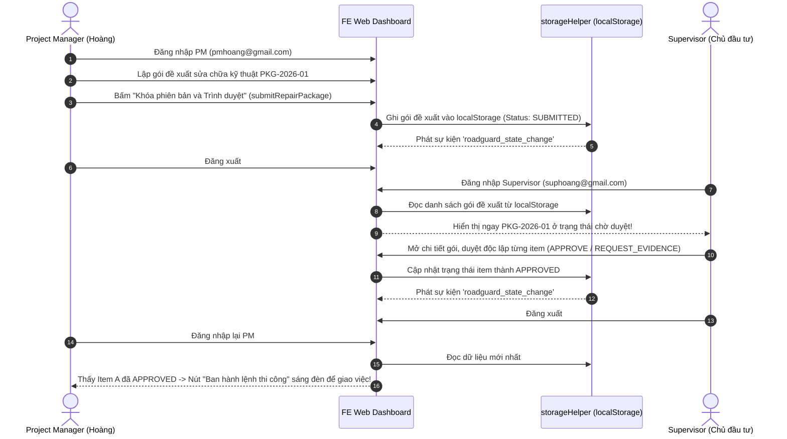

# TỔNG HỢP CHỨC NĂNG PM & SUPERVISOR VÀ KẾ HOẠCH CHI TIẾT XÂY DỰNG MOCK API

> **Tài liệu quy chuẩn dành cho Frontend Web RoadGuard (Nhà thầu Hoàng Hải)**  
> **Căn cứ gốc:** Trích xuất 100% từ bộ đặc tả chuẩn **`docs/specs/29_9/`** (`operation_catalog.md`, `01_FRD_SRS.md`, `02_Business_Rules.md`, `04_Use_Cases.md`, `01_FE_Scope_Implementation_Guide.md`, `06_Report_Analytics_Requirements.md`, `api.types.ts`) kết hợp **10 Điều bất biến (Invariants) trong `AGENTS.md`**.  
> **Nguyên tắc kỹ thuật:** Hệ thống quản lý bảo hành đường bộ thuần túy kỹ thuật (diện tích $m^2$, chiều dài trám nứt $m$, chiều sâu $cm$, TCVN 8819:2011). Tuyệt đối **KHÔNG** tính toán giá tiền, đơn giá tài chính hay bảng BOQ tiền tệ.

---

## 📑 MỤC LỤC
1. [Các file nguồn căn cứ chuẩn trong `docs/specs/29_9/`](#1-các-file-nguồn-căn-cứ-chuẩn-trong-docsspecs29_9)
2. [Tổng hợp toàn bộ chức năng & API của Role SUPERVISOR (Giám sát / Chủ đầu tư)](#2-tổng-hợp-toàn-bộ-chức-năng--api-của-role-supervisor-giám-sát--chủ-đầu-tư)
3. [Tổng hợp toàn bộ chức năng & API của Role PM (Project Manager - Chỉ huy trưởng)](#3-tổng-hợp-toàn-bộ-chức-năng--api-của-role-pm-project-manager---chỉ-huy-trưởng)
4. [Bảng đối chiếu màn hình FE Web thực tế, Route URL và thẩm quyền thao tác](#4-bảng-đối-chiếu-màn-hình-fe-web-thực-tế-route-url-và-thẩm-quyền-thao-tác)
5. [Kế hoạch kiến trúc Mock API Service (9 Module tập trung)](#5-kế-hoạch-kiến-trúc-mock-api-service-9-module-tập-trung)
6. [Cơ chế lưu trữ trạng thái chéo & Reactive Events (Cross-Role Persistence)](#6-cơ-chế-lưu-trữ-trạng-thái-chéo--reactive-events-cross-role-persistence)

---

## 1. CÁC FILE NGUỒN CĂN CỨ CHUẨN TRONG `docs/specs/29_9/`

Để đảm bảo Mock API và mã nguồn Frontend Web chuẩn xác 100%, không bịa field, không sai HTTP Method/Path và tuân thủ chặt chẽ hợp đồng API Backend:

1. **[`operation_catalog.md`](file:///D:/hoctap/k%C3%AC%209/%C4%91%E1%BB%93%20%C3%A1n/FE_Drone_Web/docs/specs/29_9/operation_catalog.md)**: Danh mục chuẩn toàn bộ API operations từ baseline (Operation ID, Method, Path, Role, Request/Response Schema, Required Headers `Idempotency-Key`, `If-Match`).
2. **[`01_FRD_SRS.md`](file:///D:/hoctap/k%C3%AC%209/%C4%91%E1%BB%93%20%C3%A1n/FE_Drone_Web/docs/specs/29_9/01_FRD_SRS.md)**: Đặc tả yêu cầu chức năng hệ thống (FR-01 đến FR-36), điều kiện đầu vào/đầu ra và tiêu chí kiểm chứng chấp nhận.
3. **[`02_Business_Rules.md`](file:///D:/hoctap/k%C3%AC%209/%C4%91%E1%BB%93%20%C3%A1n/FE_Drone_Web/docs/specs/29_9/02_Business_Rules.md)**: 48 Quy tắc nghiệp vụ bất biến cốt lõi (BR-01 đến BR-48: Fast Track không có gate duyệt trước, Approval Track duyệt từng item độc lập, lưu trữ dữ liệu pháp lý bảo hành +5 năm...).
4. **[`04_Use_Cases.md`](file:///D:/hoctap/k%C3%AC%209/%C4%91%E1%BB%93%20%C3%A1n/FE_Drone_Web/docs/specs/29_9/04_Use_Cases.md)**: Đặc tả chi tiết các Use Case tác nghiệp (DA, KS, AI, PA, SC, TN, HT, QT, BC).
5. **[`01_FE_Scope_Implementation_Guide.md`](file:///D:/hoctap/k%C3%AC%209/%C4%91%E1%BB%93%20%C3%A1n/FE_Drone_Web/docs/specs/29_9/01_FE_Scope_Implementation_Guide.md)**: Hướng dẫn phân định ranh giới Web Dashboard và App Mobile, 10 Invariants bất biến, chuẩn Header và cơ chế xử lý ngoại tuyến/đồng bộ.
6. **[`02_Authentication_Flow.md`](file:///D:/hoctap/k%C3%AC%209/%C4%91%E1%BB%93%20%C3%A1n/FE_Drone_Web/docs/specs/29_9/02_Authentication_Flow.md)**: Quy trình xác thực JWT Bearer, Token Rotation, Force Change Password lần đầu và phân quyền theo Role.
7. **[`03_Error_Response_UI_Convention.md`](file:///D:/hoctap/k%C3%AC%209/%C4%91%E1%BB%93%20%C3%A1n/FE_Drone_Web/docs/specs/29_9/03_Error_Response_UI_Convention.md)**: Chuẩn cấu trúc phản hồi lỗi RFC 7807 ProblemDetails (`type`, `title`, `status`, `detail`, `instance`, `invalidParams`).
8. **[`06_Report_Analytics_Requirements.md`](file:///D:/hoctap/k%C3%AC%209/%C4%91%E1%BB%93%20%C3%A1n/FE_Drone_Web/docs/specs/29_9/06_Report_Analytics_Requirements.md)**: Quy chuẩn 10 loại báo cáo (RPT-01 đến RPT-10) và các chỉ số KPI suy thoái MET-01, MET-04, MET-08, MET-11.
9. **[`api.types.ts`](file:///D:/hoctap/k%C3%AC%209/%C4%91%E1%BB%93%20%C3%A1n/FE_Drone_Web/docs/specs/29_9/api.types.ts)**: Hệ thống định nghĩa kiểu dữ liệu TypeScript DTO schemas và domain entities chuẩn.

---

## 2. TỔNG HỢP TOÀN BỘ CHỨC NĂNG & API CỦA ROLE SUPERVISOR (GIÁM SÁT / CHỦ ĐẦU TƯ)

Supervisor đại diện cho **Chủ đầu tư / Lãnh đạo cấp cao của Nhà thầu Hoàng Hải**.  
Trên Web Dashboard, Supervisor có **15 nhóm chức năng lớn**, tương ứng các Operation ID chuẩn từ `operation_catalog.md`:

| STT | Nhóm chức năng | Mã Use Case / FR | Hành vi tác nghiệp trên Web Dashboard | Operation ID & Endpoint chuẩn (29_9) | Headers bắt buộc |
|:---:|---|:---:|---|---|:---:|
| **01** | **Khởi tạo & Quản lý Dự án** | DA01, FR-04, BR-01 | Tạo dự án bảo hành mới, nhập thời hạn bảo hành (tháng), ngày hết hạn, tiêu chuẩn kiểm định TCVN 8819, hệ quy chiếu UTM SRID (32648), chỉ định duy nhất 1 PM chính. | `createProject`<br>`POST /api/v1/projects`<br>`getProject`<br>`GET /api/v1/projects/{projectId}`<br>`listProjects`<br>`GET /api/v1/projects` | `Idempotency-Key` (cho POST) |
| **02** | **Cập nhật & Đóng Dự án** | DA05, DA12, FR-04, BR-45 | Chỉnh sửa thông tin dự án; đóng dự án khi hết thời hạn bảo hành chuyển trạng thái sang `CLOSED` (chế độ Read-only). | `updateProject`<br>`PATCH /api/v1/projects/{projectId}`<br>`closeProject`<br>`POST /api/v1/projects/{projectId}/close` | `Idempotency-Key`<br>`If-Match` |
| **03** | **Phân quyền & Đội thi công** | DA03, FR-02, BR-02 | Phân công PM chính, bổ nhiệm Drone Operator và Repair Crew vào dự án; tạo mới đội thi công công ty. | `setMembership`<br>`POST /api/v1/projects/{projectId}/memberships`<br>`createCrew`<br>`POST /api/v1/projects/{projectId}/crews`<br>`listCrews`<br>`GET /api/v1/projects/{projectId}/crews` | `Idempotency-Key` |
| **04** | **Xác nhận Tuyến đường** | DA13, FR-06, BR-04 | Xem trước tim đường và bề rộng mặt đường trên MapLibre do PM trình; bấm "Xác nhận phiên bản tuyến" để khóa bất biến `RoadSectionVersion`. | `confirmRoute`<br>`POST /api/v1/route-versions/{routeVersionId}/confirm`<br>`getRouteVersion`<br>`GET /api/v1/route-versions/{routeVersionId}` | `Idempotency-Key`<br>`If-Match` |
| **05** | **Thẩm duyệt Hạng mục Sửa chữa (Approval Track)** | SC06, FR-19, BR-21 | Xem gói hồ sơ do PM trình (`WF-07`); ra quyết định độc lập trên từng hạng mục: `APPROVE`, `REQUEST_EVIDENCE`, `REQUEST_RECONSIDER`, `REJECT` kèm lý do giải trình. | `decideRepairItem`<br>`POST /api/v1/repair-items/{itemId}/decisions`<br>`getRepairPackage`<br>`GET /api/v1/repair-packages/{packageId}`<br>`getRepairItem`<br>`GET /api/v1/repair-items/{itemId}` | `Idempotency-Key`<br>`If-Match` |
| **06** | **Nghiệm thu Hạng mục Nhánh duyệt** | HT10, FR-24, BR-26 | Xem chuỗi ảnh đối chứng BEFORE/AFTER và biên bản hoàn công do PM trình; bấm "Chấp thuận nghiệm thu" hoặc "Yêu cầu sửa lại (Rework)". | `acceptApprovalAttempt`<br>`POST /api/v1/repair-attempts/{attemptId}/acceptance`<br>`getRepairAttempt`<br>`GET /api/v1/repair-attempts/{attemptId}` | `Idempotency-Key`<br>`If-Match` |
| **07** | **Đóng Tổng thể Vụ việc Hỗn hợp (Mixed Case)** | HT12, FR-25, BR-26 | Sau khi 100% hạng mục trong vụ việc đã hoàn thành (Fast Track do PM đóng, Approval Track do Sup nghiệm thu), bấm đóng vụ việc sang `CLOSED`. Chặn đóng nếu còn mục dở dang. | `closeMixedCase`<br>`POST /api/v1/cases/{caseId}/close` | `Idempotency-Key`<br>`If-Match` |
| **08** | **Quản trị Tài khoản & Lời mời** | QT01, QT02, FR-01, FR-02 | Tạo thư mời nhân sự mới, đình chỉ tài khoản nghỉ việc (thu hồi token ngay), cập nhật thông tin, đặt lại mật khẩu nhân viên. | `createInvitation`<br>`POST /api/v1/invitations`<br>`adminResetPassword`<br>`POST /api/v1/users/{userId}/password-reset`<br>`updateAccount`<br>`PATCH /api/v1/users/{userId}`<br>`getAccount`<br>`GET /api/v1/users/{userId}` | `Idempotency-Key`<br>`If-Match` |
| **09** | **Quản trị Danh mục Hư hỏng** | QT03, QT04, FR-36 | Xem, thêm mới và cập nhật danh mục loại hư hỏng chuẩn TCVN, đơn vị đo kỹ thuật, quy tắc phân mức nghiêm trọng/khẩn cấp. | `listDefectTypes`<br>`GET /api/v1/catalog/defect-types`<br>`updateDefectType`<br>`PUT /api/v1/catalog/defect-types/{code}` | `Idempotency-Key`<br>`If-Match` |
| **10** | **Cấu hình Nhắc việc & Cảnh báo** | QT05, FR-36 | Cài đặt chu kỳ gửi thông báo nhắc việc định kỳ cho PM, số ngày cảnh báo trước khi hết hạn bảo hành công trình. | `getReminderConfig`<br>`GET /api/v1/reminder-configuration`<br>`setReminderConfig`<br>`PUT /api/v1/reminder-configuration` | `Idempotency-Key`<br>`If-Match` |
| **11** | **Quản lý Phiên bản AI Model** | QT06, QT07, FR-36 | Khai báo phiên bản mô hình AI mới, kích hoạt vận hành (`ACTIVE`), ngừng dùng mô hình cũ; xuất tập nhãn đã duyệt cho đội ngũ AI huấn luyện. | `createModelVersion`<br>`POST /api/v1/model-versions`<br>`activateModelVersion`<br>`POST /api/v1/model-versions/{modelVersionId}/activate`<br>`retireModelVersion`<br>`POST /api/v1/model-versions/{modelVersionId}/retire`<br>`exportApprovedLabels`<br>`POST /api/v1/training-exports`<br>`getModelVersion`<br>`GET /api/v1/model-versions/{modelVersionId}` | `Idempotency-Key`<br>`If-Match` |
| **12** | **Giám sát Máy chủ & Audit Trail** | QT08, QT09, FR-35, BR-45 | Giám sát danh sách job xử lý AI; tra cứu nhật ký kiểm toán bất biến (Audit Trail) hiển thị thời gian, tác nhân, hành động, giá trị trước/sau. | `listAdminJobs`<br>`GET /api/v1/admin/processing-jobs`<br>`listAuditEvents`<br>`GET /api/v1/audit-events` | — |
| **13** | **Phong tỏa Pháp lý Legal Hold** | QT12, FR-35, BR-45 | Bật/tắt lệnh phong tỏa hồ sơ pháp lý (`Legal Hold`) khi có tranh chấp, ngăn chặn mọi thao tác xóa dữ liệu bảo hành. | `setLegalHold`<br>`PUT /api/v1/projects/{projectId}/legal-hold` | `Idempotency-Key`<br>`If-Match` |
| **14** | **Phê duyệt Xóa Dữ liệu (+5 năm)** | QT14, FR-35, BR-45 | Phê duyệt hoặc từ chối yêu cầu tiêu hủy dữ liệu đã hết hạn bảo hành đủ 5 năm do PM lập. | `decideDeletion`<br>`POST /api/v1/retention/deletion-requests/{requestId}/decision`<br>`getDeletionRequest`<br>`GET /api/v1/retention/deletion-requests/{requestId}` | `Idempotency-Key`<br>`If-Match` |
| **15** | **Dashboard Toàn danh mục & Xuất hồ sơ** | BC01..BC07, RPT-01..RPT-10 | Xem KPI toàn danh mục dự án, tỷ lệ hoàn thành sửa chữa, cảnh báo rủi ro suy thoái MET-01, MET-04, MET-08, MET-11; tạo lệnh xuất hồ sơ PDF và ZIP kèm Checksum SHA-256. | `getDashboard`<br>`GET /api/v1/projects/{projectId}/dashboard`<br>`createExport`<br>`POST /api/v1/exports`<br>`getExport`<br>`GET /api/v1/exports/{exportId}` | `Idempotency-Key` (cho POST) |

---

## 3. TỔNG HỢP TOÀN BỘ CHỨC NĂNG & API CỦA ROLE PM (PROJECT MANAGER - CHỈ HUY TRƯỞNG)

Project Manager là người **trực tiếp chỉ đạo và điều hành công tác bảo hành tại dự án được phân công**.  
Trên Web Dashboard, PM có **17 nhóm chức năng lớn**, tương ứng các Operation ID chuẩn từ `operation_catalog.md`:

| STT | Nhóm chức năng | Mã Use Case / FR | Hành vi tác nghiệp trên Web Dashboard | Operation ID & Endpoint chuẩn (29_9) | Headers bắt buộc |
|:---:|---|:---:|---|---|:---:|
| **01** | **Thiết lập Tuyến đường & Tim tuyến** | DA02, FR-05, FR-06 | Nhập chuỗi tọa độ tim đường (upload GPX/GeoJSON), cấu hình Station Origin, bề rộng mặt đường từng đoạn (RoadWidthProfile); xem trước MapLibre và trình Supervisor xác nhận. | `createRouteDraft`<br>`POST /api/v1/projects/{projectId}/route-drafts`<br>`updateRouteDraft`<br>`PUT /api/v1/route-versions/{routeVersionId}/draft` | `Idempotency-Key`<br>`If-Match` (PUT) |
| **02** | **Phân chia Phân đoạn (SegmentSet)** | DA14, DA15, FR-07 | Nhập độ dài mục tiêu (100m, 500m, 1000m) hoặc tùy chỉnh ranh giới lý trình; xem trước danh sách segment; bấm "Công bố tập đoạn đường (Publish SegmentSet)". | `previewSegmentSet`<br>`POST /api/v1/projects/{projectId}/segment-set-previews`<br>`publishSegmentSet`<br>`POST /api/v1/segment-sets/{segmentSetId}/publish`<br>`getSegmentSet`<br>`GET /api/v1/segment-sets/{segmentSetId}` | `Idempotency-Key`<br>`If-Match` (Publish) |
| **03** | **Quản lý Tuyến nhánh (Branch) & Lưới tấm (Slab)** | DA17, DA18, FR-08 | Khai báo mạng lưới đường nhánh nút giao / đường gom kết nối vào trục chính (điểm rẽ BranchStation, chiều dài, bề rộng, dải phân cách); chọn nhánh để phân chia phân đoạn (Segment) riêng; tạo dải tấm bê tông xi măng (Slab 4m/5m, dày 24-28cm) và liên kết hư hỏng. | `createBranch`<br>`POST /api/v1/projects/{projectId}/branches`<br>`createSlab`<br>`POST /api/v1/projects/{projectId}/slabs`<br>`setDefectSlabLinks`<br>`PUT /api/v1/defects/{defectId}/slab-links` | `Idempotency-Key`<br>`If-Match` (PUT) |
| **04** | **Lập Kế hoạch Khảo sát Drone** | DA06, DA07, FR-09 | Lập kế hoạch khảo sát gốc (Baseline) hoặc định kỳ; chọn bộ Segment và dải quan sát (SURFACE, LEFT_EDGE, RIGHT_EDGE); hoãn lịch do thời tiết nếu cần. | `createSurveyPlan`<br>`POST /api/v1/projects/{projectId}/survey-plans`<br>`postponeSurveyPlan`<br>`POST /api/v1/survey-plans/{planId}/postpone` | `Idempotency-Key`<br>`If-Match` (Postpone) |
| **05** | **Giao nhiệm vụ Bay & Bay bù** | KS01, KS04, KS11, FR-10..FR-12 | Giao việc cho Drone Operator, chọn điểm cất hạ cánh; kiểm tra độ phủ (`Coverage`); yêu cầu bay bổ sung vùng thiếu/mờ; xuất nhiệm vụ Dronelink; hủy/điều chuyển nhiệm vụ. | `createSurveyTask`<br>`POST /api/v1/projects/{projectId}/survey-tasks`<br>`getSurveyTask`<br>`GET /api/v1/survey-tasks/{taskId}`<br>`cancelSurveyTask`<br>`POST /api/v1/survey-tasks/{taskId}/cancel`<br>`reassignSurveyTask`<br>`POST /api/v1/survey-tasks/{taskId}/reassign`<br>`requestSurveySupplement`<br>`POST /api/v1/survey-tasks/{taskId}/supplements`<br>`setSurveyAccessPoint`<br>`PUT /api/v1/survey-tasks/{taskId}/access-point`<br>`getDatasetCoverage`<br>`GET /api/v1/datasets/{datasetId}/coverage`<br>`exportMission`<br>`POST /api/v1/projects/{projectId}/mission-exports` | `Idempotency-Key`<br>`If-Match` |
| **06** | **Xác nhận Mốc chuẩn Baseline** | DA10, FR-13, BR-40 | Khi dữ liệu bay đạt độ phủ SUFFICIENT và các phát hiện AI đã rà soát xong, PM bấm "Xác nhận Baseline" độc lập cho từng cặp (segment, band) để khóa mốc chuẩn. | `confirmBaseline`<br>`POST /api/v1/projects/{projectId}/baselines` | `Idempotency-Key` |
| **07** | **Kích hoạt AI & Rà soát Lỗi (Inbox)** | AI01..AI08, FR-14..FR-16 | Kích hoạt job phân tích video 2 giai đoạn; rà soát phát hiện sơ bộ trên MapLibre và khung ảnh video (Bounding Box); hiệu chỉnh loại lỗi; loại bỏ phát hiện sai kèm lý do; duyệt nhãn huấn luyện AI. | `createProcessingJob`<br>`POST /api/v1/processing-jobs`<br>`getProcessingJob`<br>`GET /api/v1/processing-jobs/{jobId}`<br>`retryProcessingJob`<br>`POST /api/v1/processing-jobs/{jobId}/retry`<br>`createPreliminaryDefect`<br>`POST /api/v1/projects/{projectId}/defects`<br>`listDefects`<br>`GET /api/v1/projects/{projectId}/defects`<br>`getDefect`<br>`GET /api/v1/defects/{defectId}`<br>`reviewTrainingLabel`<br>`POST /api/v1/labels/{labelId}/review`<br>`createValidationRun`<br>`POST /api/v1/projects/{projectId}/validation-runs`<br>`getValidationResult`<br>`GET /api/v1/validation-runs/{runId}` | `Idempotency-Key`<br>`If-Match` |
| **08** | **Tiếp nhận Phản ánh & Báo trùng (Triage)** | PA03..PA05, FR-17, BR-30 | Tiếp nhận phản ánh từ Reporter; đối chiếu không gian; liên kết các báo cáo trùng vào 1 IncidentCase chính (`linkReports`); kết luận kiểm chứng (`DEFECT_FOUND`, `NO_DEFECT`, `OUT_OF_SCOPE`); điều phối dự án. | `listCases`<br>`GET /api/v1/projects/{projectId}/cases`<br>`getCase`<br>`GET /api/v1/cases/{caseId}`<br>`triageCase`<br>`POST /api/v1/cases/{caseId}/triage`<br>`linkReports`<br>`POST /api/v1/cases/{caseId}/report-links`<br>`concludeCase`<br>`POST /api/v1/cases/{caseId}/conclusion` | `Idempotency-Key`<br>`If-Match` |
| **09** | **Phân cấp Hư hỏng & Ưu tiên** | SC14, FR-18, BR-05 | Phân cấp độc lập 2 trục: Severity (`LOW`..`CRITICAL`) và Urgency (`NORMAL`..`URGENT`); xác nhận lỗi chính thức (`VERIFIED`); sắp xếp thứ tự ưu tiên xử lý trong dự án. | `assessDefect`<br>`POST /api/v1/defects/{defectId}/assessments`<br>`verifyDefect`<br>`POST /api/v1/defects/{defectId}/verification`<br>`setWorkOrder`<br>`PUT /api/v1/projects/{projectId}/work-order`<br>`getWorkOrder`<br>`GET /api/v1/projects/{projectId}/work-order` | `Idempotency-Key`<br>`If-Match` |
| **10** | **Chính sách Sửa nhanh (Fast Track)** | SC13, FR-18, BR-08..BR-11 | Thiết lập quy định FastTrackPolicy dự án: danh mục loại lỗi cho phép, ngưỡng kích thước tối đa (dài, rộng, sâu, diện tích), biện pháp thi công và yêu cầu ảnh Before/After; kích hoạt chính sách. | `createPolicyVersion`<br>`POST /api/v1/projects/{projectId}/policy-versions`<br>`getPolicyVersion`<br>`GET /api/v1/policy-versions/{policyVersionId}`<br>`activatePolicyVersion`<br>`POST /api/v1/policy-versions/{policyVersionId}/activate` | `Idempotency-Key`<br>`If-Match` |
| **11** | **Giao việc Đo đạc Hiện trường** | TN01, TN06, FR-18, BR-24 | Giao đợt đo gom nhiều lỗi (chế độ bắt buộc `MEASURE_ONLY`, cấm sửa tại chỗ); hoặc giao xử lý 1 lỗi nhỏ riêng lẻ (chế độ `INSPECT_AND_REPAIR` kèm snapshot policy). | `createInspectionBatch`<br>`POST /api/v1/projects/{projectId}/inspection-batches`<br>`createInspectionTask`<br>`POST /api/v1/projects/{projectId}/inspection-tasks`<br>`getInspectionTask`<br>`GET /api/v1/inspection-tasks/{taskId}` | `Idempotency-Key` |
| **12** | **Lập Gói Đề xuất Kỹ thuật (Approval Track)** | SC01..SC04, FR-19, BR-21 | Lập gói hồ sơ `RepairPackage` cho các lỗi `VERIFIED`; bóc tách khối lượng thi công ($m^2$, mét dài, chiều sâu $cm$, định mức vật tư); khóa phiên bản và trình duyệt lên Supervisor. | `createRepairPackage`<br>`POST /api/v1/projects/{projectId}/repair-packages`<br>`getRepairPackage`<br>`GET /api/v1/repair-packages/{packageId}`<br>`submitRepairPackage`<br>`POST /api/v1/repair-packages/{packageId}/submit` | `Idempotency-Key`<br>`If-Match` (Submit) |
| **13** | **Chỉnh sửa & Giao việc Thi công** | SC08, SC09, FR-20, BR-23 | Chỉnh sửa các hạng mục bị Supervisor yêu cầu sửa đổi (`REQUEST_EVIDENCE` / `REQUEST_RECONSIDER`); phân công đội thi công cho các hạng mục đã được duyệt (`APPROVED`). | `reviseRepairItem`<br>`POST /api/v1/repair-items/{itemId}/revisions`<br>`assignRepairItem`<br>`POST /api/v1/repair-items/{itemId}/assignments`<br>`reassignRepairItem`<br>`POST /api/v1/repair-items/{itemId}/reassignments` | `Idempotency-Key`<br>`If-Match` |
| **14** | **Kiểm tra Hiện trường & Đóng Fast Track** | HT09, FR-23, BR-25 | Xem ảnh BEFORE/AFTER và số đo hoàn công; tự kiểm tra và bấm "Đóng lỗi Fast Track" (Defect chuyển `RESOLVED`, phát thông báo cho Sup); hoặc trình Supervisor nghiệm thu với nhánh Approval Track. | `reviewRepairAttempt`<br>`POST /api/v1/repair-attempts/{attemptId}/review`<br>`getRepairAttempt`<br>`GET /api/v1/repair-attempts/{attemptId}` | `Idempotency-Key`<br>`If-Match` |
| **15** | **Kích hoạt Xử lý Khẩn cấp (Emergency)** | SC10, FR-18, BR-46 | Khi xảy ra sự cố hố sâu/sụt lở nguy hiểm, PM kích hoạt nhiệm vụ Emergency xử lý an toàn tạm thời (rào chắn, biển cảnh báo phản quang 4h, lấp tạm). Tự động cảnh báo Supervisor. | `createEmergencyTask`<br>`POST /api/v1/projects/{projectId}/emergency-tasks` | `Idempotency-Key` |
| **16** | **Phân tích Tái phát & Công bố Kết quả** | PA08, PA07, FR-17, BR-48 | Phân tích hư hỏng tái phát tại vị trí cũ (lỗi do thi công kém hay phát sinh mới); chọn ảnh AFTER hoàn công công bố tiến độ hoàn thành cho người dân theo dõi. | `assessRecurrence`<br>`POST /api/v1/defects/{defectId}/recurrence-assessments`<br>`publishCase`<br>`POST /api/v1/cases/{caseId}/publish` | `Idempotency-Key`<br>`If-Match` |
| **17** | **Báo cáo Điều hành & Lập yêu cầu xóa (+5 năm)** | BC02, QT11, FR-35, BR-45 | Theo dõi Dashboard điều hành dự án; xuất hồ sơ PDF/ZIP; rà soát hồ sơ đã hết hạn bảo hành đủ 5 năm để lập yêu cầu xóa dữ liệu trình Supervisor duyệt. | `getDashboard`<br>`GET /api/v1/projects/{projectId}/dashboard`<br>`getProjectTimeline`<br>`GET /api/v1/projects/{projectId}/timeline`<br>`createExport`<br>`POST /api/v1/exports`<br>`requestDeletion`<br>`POST /api/v1/retention/deletion-requests` | `Idempotency-Key` (POST) |

---

## 4. BẢNG ĐỐI CHIẾU MÀN HÌNH FE WEB THỰC TẾ, ROUTE URL VÀ THẨM QUYỀN THAO TÁC

Căn cứ cấu trúc các màn hình hiện hữu sau khi hoàn thiện Refactor kiến trúc trong `src/pages/(pm)/` và `src/pages/(sup)/`:

| STT | Mã Wireframe | Tên màn hình trên Web | Route URL | Vai trò được phép | File Component hiện hữu |
|:---:|:---:|---|---|:---:|---|
| **01** | **WF-01** | Đăng nhập & Đổi mật khẩu lần đầu | `/login`, `/force-change-password` | Chung | `src/pages/(auth)/Login.tsx`, `ForceChangePassword.tsx` |
| **02** | **WF-01** | Tiếp nhận thư mời Onboarding | `/accept-invitation` | Chung | `src/pages/(auth)/AcceptInvitation.tsx` |
| **03** | **WF-10** | Dashboard KPI & Lối tắt PM | `/pm/dashboard` | PM | `src/pages/(pm)/PMDashboard.tsx` |
| **04** | **WF-10** | Dashboard KPI & Rủi ro Giám sát | `/sup/dashboard` | SUPERVISOR | `src/pages/(sup)/SupDashboard.tsx` |
| **05** | **WF-02** | Danh sách dự án bảo hành | `/pm/projects`, `/sup/projects` | Chung (Scope theo quyền) | `src/pages/(pm)/ProjectList.tsx` |
| **06** | **WF-02** | Chi tiết tổng quan dự án | `/pm/projects/:id`, `/sup/projects/:id` | Chung | `src/pages/(pm)/ProjectOverview.tsx` |
| **07** | **WF-02** | Tuyến đường, Hình học & Phân đoạn | `/pm/alignment`, `/sup/alignment` | PM (Nhập) / SUP (Duyệt) | `src/pages/(pm)/AlignmentSegments.tsx` |
| **08** | **WF-09** | Danh sách yêu cầu bay khảo sát | `/pm/surveys` | PM | `src/pages/(pm)/SurveyRequests.tsx` |
| **09** | **WF-09** | Tạo yêu cầu bay khảo sát Drone | `/pm/surveys/create` | PM | `src/pages/(pm)/CreateSurvey.tsx` |
| **10** | **WF-09** | Rà soát ảnh trực giao & AI Drone | `/pm/surveys/:id/ai-review` | PM | `src/pages/(pm)/DroneMissionAIReview.tsx` |
| **11** | **WF-04** | Hộp thư tiếp nhận lỗi AI & Triage dân | `/pm/ai-inbox` | PM | `src/pages/(pm)/AIReviewInbox.tsx` |
| **12** | **WF-04** | Thẩm định Bounding box & So sánh đa kỳ | `/pm/defects/:id/verify-a`, `:id/verify-b` | PM | `src/pages/(pm)/DefectDetailVerify.tsx` |
| **13** | **WF-05** | Chính sách Fast Track & Giao việc | `/pm/fast-track` | PM | `src/pages/(pm)/FastTrackDispatch.tsx` |
| **14** | **WF-05** | Nhiệm vụ đo đạc hiện trường & Xung đột | `/pm/field-tasks` | PM | `src/pages/(pm)/FieldTasks.tsx` |
| **15** | **WF-07** | Gói đề xuất sửa chữa & Khối lượng | `/pm/proposals` | PM | `src/pages/(pm)/RepairProposals.tsx` |
| **16** | **WF-07** | Thẩm duyệt hồ sơ gói đề xuất sửa chữa | `/sup/proposals`, `/sup/approvals/:id` | SUPERVISOR | `src/pages/(sup)/ProposalApprovalDetail.tsx` |
| **17** | **WF-07** | Yêu cầu sửa đổi / Từ chối đợt sửa | `/sup/approvals/:id/reject` | SUPERVISOR | `src/pages/(sup)/BatchRejection.tsx` |
| **18** | **WF-07** | Phân công đội thi công (Assign Crew) | `/pm/repair-batches/assign` | PM | `src/pages/(pm)/AssignCrew.tsx` |
| **19** | **WF-08** | Nghiệm thu bằng chứng Before/After | `/sup/acceptance`, `/pm/acceptance` | Chung (Scope theo quyền) | `src/pages/(sup)/EvidenceCloseoutDetail.tsx` |
| **20** | **WF-10** | Phân tích rủi ro & Xuất hồ sơ PDF/ZIP | `/sup/risk-analytics` | SUPERVISOR | `src/pages/(sup)/RiskAnalytics.tsx` |
| **21** | **WF-11** | Báo cáo kiểm định thực nghiệm AI | `/sup/research-validation` | SUPERVISOR, PM | `src/pages/(sup)/ResearchValidation.tsx` |
| **22** | **WF-12** | Nhật ký kiểm toán bất biến (Audit Trail) | `/sup/audit-trail` | SUPERVISOR | `src/pages/(sup)/AuditTrail.tsx` |
| **23** | **WF-03** | Quản trị hệ thống, AI & Legal Hold | `/sup/system-control` | SUPERVISOR | `src/pages/(sup)/SystemControl.tsx` |

---

## 5. KẾ HOẠCH KIẾN TRÚC MOCK API SERVICE (9 MODULE TẬP TRUNG)

Tầng dịch vụ Frontend Web được tổ chức thành **9 module chuyên biệt** đặt tại thư mục `src/api/services/`. Mọi hàm đều tương thích 100% với hợp đồng API Backend từ `operation_catalog.md` và hỗ trợ chuyển đổi qua cờ `VITE_USE_MOCK`:

```text
src/api/services/
├── storageHelper.ts      # Quản lý lưu trữ bền vững localStorage & phát sự kiện reactive
├── authService.ts        # Module 1: Xác thực, Profile, Đổi mật khẩu, Role Switch
├── projectService.ts     # Module 2: Quản lý Dự án, Tuyến đường, Segments, Slabs, Crews
├── surveyService.ts      # Module 3: Khảo sát Drone, Flight Telemetry, Coverage, Simulator
├── aiService.ts          # Module 4: Pipeline xử lý AI, Hộp thư lỗi, Bounding Box, Baseline
├── triageService.ts      # Module 5: Tiếp nhận phản ánh dân, Báo trùng, Phân cấp Severity x Urgency
├── fastTrackService.ts   # Module 6: Chính sách Fast Track, Giao đo đạc, Khẩn cấp Emergency
├── repairService.ts      # Module 7: Gói đề xuất sửa chữa, Thẩm duyệt Supervisor, Giao Crew
└── acceptanceService.ts  # Module 8: Nghiệm thu Before/After, Đóng vụ việc, Ký số, Export ZIP/PDF
```

---

### Module 1: `authService.ts` (Xác thực & Phiên làm việc)
*Căn cứ `02_Authentication_Flow.md` và `operation_catalog.md`*
- `login(credentials)`: Operation `login` (`POST /auth/login`). Hỗ trợ đăng nhập `pmhoang@gmail.com` (PM) hoặc `suphoang@gmail.com` (Supervisor). Trả về JWT TokenPair, cờ `must_change_password`.
- `refreshTokens(refreshToken)`: Operation `refreshTokens` (`POST /auth/refresh`). Cấp cặp token mới theo cơ chế Token Rotation (Single-flight simulation).
- `logout()`: Operation `logout` (`POST /auth/logout`). Thu hồi token và hủy phiên làm việc.
- `getMe()`: Operation `getMe` (`GET /me`). Trả về thông tin Actor hiện tại kèm danh sách `assignedProjectIds`.
- `updateMe(profileData)`: Operation `updateMe` (`PATCH /me`).
- `changePassword(oldPass, newPass)`: Operation `changePassword` (`POST /auth/change-password`). Gỡ cờ `must_change_password`.
- `acceptInvitation(token, password)`: Operation `acceptInvitation` (`POST /invitations/accept`). Kích hoạt tài khoản nhân sự từ thư mời.

---

### Module 2: `projectService.ts` (Dự án, Tuyến đường & Phân đoạn)
*Căn cứ FR-04, FR-05, FR-06, FR-07, FR-08 và `operation_catalog.md`*
- `getProjects(params)`: Operation `listProjects` (`GET /projects`). **Tự động lọc theo Role:** PM chỉ thấy dự án được phân công; Supervisor thấy toàn bộ danh mục công ty.
- `getProjectById(projectId)`: Operation `getProject` (`GET /projects/{projectId}`). Lấy chi tiết thông số bảo hành, tiêu chuẩn TCVN, lý trình và PM phụ trách.
- `createProject(projectData)`: Operation `createProject` (`POST /projects`). Supervisor tạo dự án mới, lưu vào `localStorage`.
- `updateProject(projectId, updateData)`: Operation `updateProject` (`PATCH /projects/{projectId}`).
- `closeProject(projectId, reason)`: Operation `closeProject` (`POST /projects/{projectId}/close`). Đóng dự án sang `CLOSED`.
- `setMembership(projectId, membershipData)`: Operation `setMembership` (`POST /projects/{projectId}/memberships`). Phân công nhân sự PM, Operator, Crew.
- `createRouteDraft(projectId, draftData)`: Operation `createRouteDraft` (`POST /projects/{projectId}/route-drafts`). PM tạo bản nháp tim tuyến và bề rộng mặt đường WGS84.
- `confirmRouteVersion(routeVersionId)`: Operation `confirmRoute` (`POST /route-versions/{routeVersionId}/confirm`). Supervisor phê duyệt và khóa phiên bản tuyến thành `CONFIRMED`.
- `previewSegmentSet(projectId, targetLength)`: Operation `previewSegmentSet` (`POST /projects/{projectId}/segment-set-previews`). PM xem trước phân đoạn 100m, 500m, 1000m.
- `publishSegmentSet(segmentSetId)`: Operation `publishSegmentSet` (`POST /segment-sets/{segmentSetId}/publish`). PM công bố tập phân đoạn chính thức.
- `createBranch(projectId, branchData)`: Operation `createBranch` (`POST /projects/{projectId}/branches`). Khai báo đường nhánh nút giao.
- `createSlab(projectId, slabData)`: Operation `createSlab` (`POST /projects/{projectId}/slabs`). Khai báo mạng lưới tấm bê tông.

---

### Module 3: `surveyService.ts` (Khảo sát Drone & Dữ liệu bay)
*Căn cứ FR-09, FR-10, FR-11, FR-12, FR-13 và `operation_catalog.md`*
- `getSurveyPlans(projectId)`: Lấy danh sách kế hoạch khảo sát gốc và định kỳ.
- `createSurveyPlan(projectId, planData)`: Operation `createSurveyPlan` (`POST /projects/{projectId}/survey-plans`). PM tạo kế hoạch khảo sát.
- `postponeSurveyPlan(planId, reason)`: Operation `postponeSurveyPlan` (`POST /survey-plans/{planId}/postpone`). Hoãn lịch bay do thời tiết xấu.
- `getSurveyTasks(params)`: Lấy danh sách nhiệm vụ bay của phi công.
- `createSurveyTask(projectId, taskData)`: Operation `createSurveyTask` (`POST /projects/{projectId}/survey-tasks`). PM giao nhiệm vụ bay kèm cao độ, độ phủ và điểm cất hạ cánh.
- `getDatasetCoverage(datasetId)`: Operation `getDatasetCoverage` (`GET /datasets/{datasetId}/coverage`). Trả về đánh giá độ phủ 3 chiều: Vị trí (Position), Chất lượng ảnh (Quality), Độ phủ (Coverage: `SUFFICIENT`, `PARTIAL`, `INSUFFICIENT`).
- `requestSurveySupplement(taskId, supplementData)`: Operation `requestSurveySupplement` (`POST /survey-tasks/{taskId}/supplements`). PM yêu cầu bay bổ sung vùng thiếu/mờ.
- `confirmBaseline(projectId, baselineData)`: Operation `confirmBaseline` (`POST /projects/{projectId}/baselines`). PM khóa mốc chuẩn khảo sát gốc cho từng cặp (segment, band).
- `simulateDroneFlightCompletion(taskId)`: *(Hàm trợ giúp Demo)* Mô phỏng Drone bay xong qua 3 pha Telemetry HUD (Bay quét RTK $\rightarrow$ Thu nạp 1,920 ảnh 4K $\rightarrow$ Pipeline AI Road-YOLOv9 phát hiện hư hỏng), cập nhật trạng thái `PENDING_AI_REVIEW`.

---

### Module 4: `aiService.ts` (Pipeline AI, Hộp thư lỗi & Bounding Box)
*Căn cứ FR-14, FR-15, FR-16 và `operation_catalog.md`*
- `createProcessingJob(jobData)`: Operation `createProcessingJob` (`POST /processing-jobs`). PM kích hoạt job phân tích video AI 2 giai đoạn.
- `getProcessingJob(jobId)`: Operation `getProcessingJob` (`GET /processing-jobs/{jobId}`).
- `retryProcessingJob(jobId, reason)`: Operation `retryProcessingJob` (`POST /processing-jobs/{jobId}/retry`).
- `getAIDetectedDefects(projectId)`: Operation `listDefects` (`GET /projects/{projectId}/defects`). Lấy danh sách hư hỏng sơ bộ vào AI Inbox.
- `verifyDefect(defectId, verifiedData)`: Operation `verifyDefect` (`POST /defects/{defectId}/verification`). PM thẩm định Bounding Box, hiệu chỉnh tọa độ, xác nhận loại lỗi hoặc bấm Loại bỏ (Reject) kèm lý do giải trình.
- `assessRecurrence(defectId, recurrenceData)`: Operation `assessRecurrence` (`POST /defects/{defectId}/recurrence-assessments`). So sánh ảnh đa kỳ (Temporal) đánh giá hư hỏng tái phát.
- `reviewTrainingLabel(labelId, reviewData)`: Operation `reviewTrainingLabel` (`POST /labels/{labelId}/review`). PM duyệt nhãn trích xuất dữ liệu huấn luyện mô hình.

---

### Module 5: `triageService.ts` (Tiếp nhận phản ánh & Phân cấp hư hỏng)
*Căn cứ FR-17, FR-18, BR-30, BR-31 và `operation_catalog.md`*
- `getCases(projectId)`: Operation `listCases` (`GET /projects/{projectId}/cases`). Lấy danh sách các ca vụ việc phản ánh người dân.
- `triageCaseToProject(caseId, triageData)`: Operation `triageCase` (`POST /cases/{caseId}/triage`). Điều phối phản ánh mới vào đúng tuyến đường dự án.
- `linkReports(caseId, linkData)`: Operation `linkReports` (`POST /cases/{caseId}/report-links`). Liên kết các báo cáo phản ánh trùng vào cùng 1 Case chính, bảo toàn ảnh gốc người dân.
- `concludeCase(caseId, conclusionData)`: Operation `concludeCase` (`POST /cases/{caseId}/conclusion`). Ghi nhận kết luận kiểm chứng vụ việc (`DEFECT_FOUND`, `NO_DEFECT` kèm lý do giải trình, `OUT_OF_SCOPE`).
- `assessDefectSeverityUrgency(defectId, assessmentData)`: Operation `assessDefect` (`POST /defects/{defectId}/assessments`). PM phân cấp độc lập 2 trục: Mức độ nghiêm trọng (`LOW`..`CRITICAL`) và Độ khẩn cấp (`NORMAL`..`URGENT`).
- `updateWorkOrderPriority(projectId, orderData)`: Operation `setWorkOrder` (`PUT /projects/{projectId}/work-order`). Lưu thứ tự ưu tiên xử lý hiện trường.

---

### Module 6: `fastTrackService.ts` (Chính sách Fast Track & Giao đo đạc)
*Căn cứ FR-18, BR-08..BR-11, BR-24, BR-46 và `operation_catalog.md`*
- `getFastTrackPolicy(projectId)`: Operation `getPolicyVersion` (`GET /policy-versions/{policyVersionId}`). Lấy phiên bản chính sách sửa nhanh đang hiệu lực.
- `createAndActivatePolicy(projectId, policyData)`: Operation `createPolicyVersion` (`POST /projects/{projectId}/policy-versions`) và `activatePolicyVersion` (`POST /policy-versions/{policyVersionId}/activate`). PM thiết lập danh mục lỗi và ngưỡng kích thước tối đa cho phép tự sửa.
- `createInspectionBatch(projectId, batchData)`: Operation `createInspectionBatch` (`POST /projects/{projectId}/inspection-batches`). PM gom nhiều lỗi thành đợt đo hiện trường (chế độ bắt buộc `MEASURE_ONLY`, cấm sửa).
- `createInspectionTask(projectId, taskData)`: Operation `createInspectionTask` (`POST /projects/{projectId}/inspection-tasks`). PM giao 1 lỗi nhỏ đơn lẻ sửa nhanh (chế độ `INSPECT_AND_REPAIR` kèm snapshot policy).
- `createEmergencyTask(projectId, emergencyData)`: Operation `createEmergencyTask` (`POST /projects/{projectId}/emergency-tasks`). PM kích hoạt lệnh xử lý khẩn cấp 24/7 (rào chắn, biển cảnh báo phản quang 4h, lấp tạm).

---

### Module 7: `repairService.ts` (Gói đề xuất kỹ thuật & Thẩm duyệt Supervisor)
*Căn cứ FR-19, FR-20, BR-21, BR-23 và `operation_catalog.md`*
- `getPackages(projectId)`: Lấy danh sách các gói đề xuất phương án kỹ thuật thi công.
- `getPackageById(packageId)`: Operation `getRepairPackage` (`GET /repair-packages/{packageId}`). Lấy chi tiết gói và danh sách các hạng mục bóc tách khối lượng kỹ thuật.
- `createPackage(packageData)`: Operation `createRepairPackage` (`POST /projects/{projectId}/repair-packages`). PM gom các lỗi `VERIFIED` thành gói đề xuất, nhập phương án kỹ thuật và bóc tách khối lượng ($m^2$, mét dài, chiều sâu $cm$, định mức vật tư TCVN 8819). Tuyệt đối không chứa trường giá tiền hay đơn giá.
- `submitPackage(packageId)`: Operation `submitRepairPackage` (`POST /repair-packages/{packageId}/submit`). PM bấm khóa phiên bản và trình duyệt lên Supervisor -> Trạng thái chuyển `SUBMITTED`.
- `decideRepairItem(itemId, decision, reason)`: Operation `decideRepairItem` (`POST /repair-items/{itemId}/decisions`). **Supervisor thẩm duyệt độc lập trên từng dòng:** Bấm `APPROVE`, `REQUEST_EVIDENCE`, `REQUEST_RECONSIDER`, hoặc `REJECT` kèm lý do giải trình.
- `reviseRepairItem(itemId, revisionData)`: Operation `reviseRepairItem` (`POST /repair-items/{itemId}/revisions`). PM cập nhật bổ sung các hạng mục bị yêu cầu giải trình lại.
- `dispatchPackage(packageId, dispatchData)`: Operation `assignRepairItem` (`POST /repair-items/{itemId}/assignments`). PM ban hành lệnh thi công và giao việc cho đội thi công (chỉ sáng nút đối với các item đã có quyết định `APPROVED`).

---

### Module 8: `acceptanceService.ts` (Nghiệm thu Before/After, Đóng hồ sơ & Export)
*Căn cứ FR-23, FR-24, FR-25, BR-25, BR-26, BR-48 và `operation_catalog.md`*
- `getRepairAttempts(itemId)`: Operation `getRepairAttempt` (`GET /repair-attempts/{attemptId}`). Lấy thông tin kết quả thi công hiện trường kèm cặp ảnh BEFORE/AFTER và số đo kiểm chứng.
- `closeFastTrackDefect(attemptId, notes)`: Operation `reviewRepairAttempt` (`POST /repair-attempts/{attemptId}/review`). PM tự kiểm tra và đóng lỗi Fast Track -> Defect chuyển `RESOLVED`, tự động phát sinh thông báo cho Supervisor. **Quy trình kết thúc, Supervisor không duyệt lại (BR-25)!**
- `submitAttemptToSupervisor(attemptId)`: PM xác nhận đạt và trình Supervisor nghiệm thu đối với các hạng mục Approval Track.
- `acceptApprovalAttempt(attemptId, decision)`: Operation `acceptApprovalAttempt` (`POST /repair-attempts/{attemptId}/acceptance`). Supervisor bấm "Chấp thuận nghiệm thu" hoặc "Yêu cầu sửa lại (Rework)".
- `closeMixedCase(caseId)`: Operation `closeMixedCase` (`POST /cases/{caseId}/close`). Supervisor bấm đóng tổng thể vụ việc sau khi 100% hạng mục đã hoàn thành. Hệ thống chặn đóng nếu còn mục dở dang.
- `publishCaseResult(caseId, photoId)`: Operation `publishCase` (`POST /cases/{caseId}/publish`). PM chọn ảnh hoàn công đẹp nhất công bố kết quả cho người dân theo dõi.
- `getAuditEvents(params)`: Operation `listAuditEvents` (`GET /audit-events`). Tra cứu nhật ký kiểm toán bất biến hệ thống.
- `createExport(exportData)`: Operation `createExport` (`POST /exports`). Tạo lệnh xuất hồ sơ PDF và tệp nén ZIP chứa dữ liệu gốc có mã băm Checksum SHA-256.

---

## 6. CƠ CHẾ LƯU TRỮ TRẠNG THÁI CHÉO & REACTIVE EVENTS (CROSS-ROLE PERSISTENCE)

Để đảm bảo quy trình demo liền mạch giữa 2 vai trò trên cùng một trình duyệt mà không bị mất dữ liệu khi chuyển đổi tài khoản hoặc F5 tải lại trang:



### Các khóa lưu trữ chuẩn trong `localStorage`:
- `roadguard_current_user`: Lưu trữ phiên đăng nhập hiện tại và vai trò của người dùng.
- `roadguard_projects`: Danh sách dự án (chứa thông tin PM phụ trách, tiêu chuẩn TCVN, trạng thái tuyến đường).
- `roadguard_defects`: Danh sách khiếm khuyết hư hỏng (trạng thái `OPEN`, `VERIFIED`, `RESOLVED`, Bounding box, ảnh Before/After).
- `roadguard_repair_packages`: Danh sách các gói đề xuất kỹ thuật và quyết định phê duyệt độc lập của Supervisor.
- `roadguard_survey_tasks`: Danh sách nhiệm vụ khảo sát bay chụp của Drone và tiến trình Telemetry Simulator.
- `roadguard_audit_trail`: Danh sách sự kiện kiểm toán bất biến sinh ra sau mỗi hành động phê duyệt, ký số và đóng hồ sơ.
- `roadguard_active_role_view`: Trạng thái giả lập chuyển đổi góc nhìn vai trò phục vụ hội đồng chấm đồ án.

---

---

## 7. DANH MỤC CÁC MÀN HÌNH CẦN ĐIỀU CHỈNH KHI BỔ SUNG CHỨC NĂNG TUYẾN NHÁNH (BRANCH ALIGNMENT)

Khi bổ sung chức năng **Tạo & Quản lý Tuyến nhánh (Branch / Ramp / Frontage Road)** vào dự án theo `DA17`, các màn hình sau đây được quy hoạch điều chỉnh đồng bộ để đảm bảo trên giao diện FE xem rõ ràng dự án nào, trục chính hay tuyến nhánh nào:

### 7.1 Màn hình Thiết lập Tuyến & Phân đoạn (`/pm/alignment` & `/sup/alignment`)
- **Vị trí điều chỉnh:**
  1. **Tab Tuyến đường:** Bổ sung nút bấm `+ Thêm Tuyến Nhánh / Đường Gom`. Form nhập gồm:
     - Tên nhánh: ví dụ *Nhánh rẽ Đèo Hải Vân*, *Đường gom KCN Liên Chiểu*.
     - Điểm rẽ từ trục chính: Lý trình giao cắt (`BranchStationKm`, ví dụ `Km 1024+500`).
     - Hướng rẽ: `RẼ PHẢI`, `RẼ TRÁI`, `NÚT GIAO KHÁC MỨC`.
     - Chiều dài nhánh ($km$), Bề rộng mặt đường nhánh ($m$), Số làn xe.
     - Tọa độ tim nhánh (cho phép chấm điểm trên bản đồ MapLibre hoặc nạp GeoJSON nhánh).
  2. **Bản đồ MapLibre:** Vẽ đường tim trục chính nét liền màu xanh navy; vẽ các tuyến nhánh nét đứt màu cam hoặc tím phân biệt, có nhãn đính kèm tại điểm nút rẽ.
  3. **Tab Phân đoạn (SegmentSet):** Bổ sung Dropdown lựa chọn phạm vi phân đoạn:
     - `[ Trục chính: QL1A Km 1020 - Km 1045 (25.0 km) ]` $\rightarrow$ bấm chia đoạn tự động cho trục chính.
     - `[ Tuyến nhánh #01: Nhánh rẽ Hải Vân (1.85 km) ]` $\rightarrow$ bấm chia đoạn tự động cho riêng nhánh đó.
  4. **Phê duyệt phía Supervisor (`/sup/alignment`):** Hiển thị sơ đồ cây gồm Trục chính + danh sách Tuyến nhánh để Supervisor bấm duyệt đồng bộ một lần.

---

### 7.2 Màn hình Lập Kế hoạch Bay Khảo sát Drone (`/pm/surveys/create`)
- **Vị trí điều chỉnh:**
  - Dropdown **Chọn Tuyến Bay** thay vì chỉ chọn dự án chung chung:
    ```text
    ▼ Dự án: PRJ-QL1A-02 (QL1A Giai đoạn 2)
      ├── [Trục chính] QL1A (Km 1020+000 → Km 1045+000)
      ├── [Tuyến nhánh] Nhánh rẽ Đèo Hải Vân (Km 0+000 → Km 1+850)
      └── [Đường gom] Đường gom KCN Liên Chiểu (Km 0+000 → Km 3+200)
    ```
  - **Hành vi tương tác:** Khi PM chọn Tuyến nhánh, bản đồ bên phải tự động di chuyển (Fly-to) đến tuyến nhánh đó, tự điền lý trình từ `Km 0+000` đến hết chiều dài nhánh, và vẽ dải hành lang an toàn bay riêng cho nhánh.

---

### 7.3 Hộp thư Tiếp nhận Lỗi AI & Phản ánh Người dân (`/pm/ai-inbox`)
- **Vị trí điều chỉnh:**
  - Cột **Vị trí & Lý trình** bổ sung nhãn phân loại:
    - Nếu thuộc trục chính: `[Trục chính] Km 1025+400 • Làn cơ giới`.
    - Nếu thuộc tuyến nhánh: `[Nhánh Hải Vân] Km 0+350 • Làn rẽ phải`.
  - Bộ lọc danh sách (Filter Bar): Thêm bộ lọc `Phạm vi tuyến` (`Tất cả`, `Chỉ trục chính`, `Từng tuyến nhánh`).
  - Bản đồ thu nhỏ: Hiển thị marker vị trí sự cố ghim đúng trên tọa độ nhánh rẽ.

---

### 7.4 Thẩm định Chi tiết Hư hỏng (`/pm/defects/:id/verify-a`)
- **Vị trí điều chỉnh:**
  - Thanh thông tin Header: Hiển thị breadcrumb phân cấp:  
    `PRJ-QL1A-02 > [Tuyến nhánh: Nhánh rẽ Hải Vân] > Km 0+350 > Bản BTXM SLAB-HV-08`.
  - Cấu hình phương án TCVN: Cho phép thiết lập định mức cào bóc/trám nứt theo bề rộng mặt đường riêng của tuyến nhánh.

---

### 7.5 Gom Đợt Sửa Chữa & Lập Phương án Kỹ thuật (`/pm/proposals`)
- **Vị trí điều chỉnh:**
  - Bảng chọn hư hỏng để gom đợt: Hiển thị rõ cột `Tuyến / Nhánh` giúp PM gom đợt sửa chữa theo từng khu vực (ví dụ: *Đợt sửa chữa cấp bách Tuyến nhánh Hải Vân* riêng biệt với *Đợt sửa chữa đại tu Trục chính*).
  - Tổng hợp khối lượng kỹ thuật: Tách dòng tổng diện tích cào bóc cho Trục chính ($\sum m^2$) và Tuyến nhánh ($\sum m^2$).

---

> [!TIP]
> **Quy tắc chuyển đổi sang Backend ASP.NET Core thật:**  
> Toàn bộ 9 module dịch vụ trong `src/api/services/` đã được thiết kế sẵn sàng theo chuẩn Adapter Pattern. Khi Backend ASP.NET Core triển khai xong, lập trình viên chỉ cần chuyển cờ `VITE_USE_MOCK=false` trong file `.env`. Toàn bộ các hàm sẽ tự động điều hướng gọi trực tiếp đến API endpoints qua Axios với đầy đủ Headers `Authorization`, `Idempotency-Key` và `If-Match` mà **không cần chỉnh sửa bất kỳ dòng code JSX nào trên giao diện 23 màn hình**!

