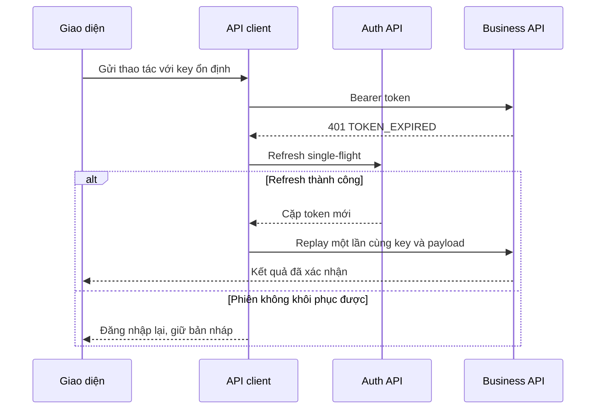

# RoadGuard — 02. Authentication Flow

**Phiên bản:** FE-R3-v1 • **Ngày:** 27/09/2026 • **Trạng thái:** đặc tả đề xuất để FE/BE/QA review, chưa xác nhận triển khai.

## 1. Phạm vi và hợp đồng hiện có

Nguồn: TECH-R3 Auth §5.4, OpenAPI `login`, `refreshTokens`, `getMe`, `logout`; FR-01/03. Kế thừa bearer token. OAuth/SSO chưa có endpoint hoặc provider đã chọn. Đăng ký email + OTP không đồng nghĩa đăng nhập OAuth.

| Thao tác | Request, tính từ `/api/v1` | Response thành công |
|---|---|---|
| Login | POST `/auth/login`, `{email,password}` | 200 TokenPair |
| Khôi phục phiên | POST `/auth/refresh`, `{refreshToken}` | 200 TokenPair mới, rotation |
| Lấy actor hiện hành | GET `/me`, bearer | 200 Actor |
| Logout | POST `/auth/logout`, bearer + Idempotency-Key | 204, không parse JSON |
| Đổi mật khẩu | POST `/auth/change-password`, theo schema ChangePassword + Idempotency-Key | 204 |
| Reporter đăng ký | POST `/auth/reporter-registrations`, RegisterReporter + Idempotency-Key | 202 RegistrationIntent |
| OTP | POST `/auth/reporter-registrations/verify`, VerifyOtp + Idempotency-Key | 200 TokenPair |
| Gửi lại OTP | POST `/auth/reporter-registrations/resend`, ResendOtp + Idempotency-Key | 202 RegistrationIntent |

Tên field chính xác lấy từ `contracts/api.schemas.json`; không suy payload từ nhãn UI. Auth responses không cache. Không log password, OTP, refresh token, access token hoặc signed URL.

## 2. Trình tự login

1. Validate email và password không rỗng, disable nút trong khi gửi; không tự lowercase password hay trim password. Chuẩn hóa email chỉ theo BE đã thống nhất.
2. Gửi JSON đến API origin đã cấu hình; không tự gắn token cũ vào public login.
3. Parse TokenPair bằng runtime schema: accessToken, refreshToken, tokenType="Bearer", expiresIn (giây), mustChangePassword, user. `expiresIn` không phải timestamp.
4. Lưu credential theo platform ở §3; cập nhật clock expiry từ thời điểm nhận, dùng monotonic elapsed khi có. Kiểm `mustChangePassword` trước mở chức năng nghiệp vụ.
5. GET `/me` khi online để lấy actor hiện hành; không coi role trong token là authorization của BE. Quyền đối tượng cần membership/assignment/state ngoài role.
6. Nạp cache theo môi trường + account; chỉ mở queue cùng actor. Nếu user khác account cũ, khóa partition cũ.
7. Nếu lỗi không để UI ở trạng thái nửa đăng nhập. Sai thông tin đăng nhập hiển thị thông báo chung, không xác nhận email tồn tại.

REVIEW-01 đã bổ sung 401 login/refresh và code cụ thể trong YAML0.1.1-draft-review1. FE-GAP-01 đóng phần thiếu tài liệu/code catalog; TTL, rotation timeout và provider tests vẫn mở. Xem Error Handling §8.7; không xem sửa YAML là đã triển khai.

## 3. Credential theo platform

| Client | Đề xuất v1 | Giới hạn / gate |
|---|---|---|
| Android hiện trường | Access token trong memory; refresh token được mã hóa bằng khóa bảo vệ nền tảng; thay cặp token atomically | Không lưu raw token trong Room, log, backup hoặc media folder. Khi khóa mất, login lại; không xóa evidence |
| Web với bearer contract hiện có | Access/refresh chỉ memory cho prototype; reload cần login lại | Không mặc định localStorage/sessionStorage cho refresh. Chưa đạt UX phiên bền vững của production |
| Web production đề xuất | BFF cùng origin giữ token phía server; browser có session cookie HttpOnly/Secure, CSRF protection | Chờ FE-GAP-02: endpoint BFF, CSRF, cookie path/domain/SameSite, logout và rotation. Không gọi cookie flow như đã có trong YAML |

Web native `fetch` không tự refresh. BFF và bearer client là hai adapter khác nhau; không cho một interceptor gửi đồng thời cookie và bearer theo phỏng đoán. `credentials: include` chỉ bật khi cookie flow đã được chốt, cùng CORS/CSRF. Feature flag phía FE không cấp quyền BE.

## 4. Gắn token, concurrency và replay

```http
GET /api/v1/me HTTP/1.1
Authorization: Bearer <accessToken>
Accept: application/json
```

JSON mutation thêm Content-Type, Idempotency-Key khi operation yêu cầu và If-Match lấy từ ETag. Không thêm Content-Type JSON vào upload binary hoặc form-data. Chỉ gắn bearer đến API origin tin cậy; signed storage PUT dùng client riêng, tuyệt đối không đính bearer của RoadGuard.

Tất cả request cùng phiên chia sẻ một refresh coordinator. Chỉ 401 TOKEN_EXPIRED kích hoạt refresh. TOKEN_MISSING/TOKEN_INVALID/SESSION_REVOKED/legacy AUTH_REQUIRED không tự refresh. Khi nhiều TOKEN_EXPIRED đồng thời: request đầu tạo refresh promise; các request sau chờ cùng kết quả. Trước refresh so generation token đã dùng với token hiện tại; nếu đã có token mới thì replay một lần bằng token mới. Mỗi request chỉ có một lượt phục hồi auth. Refresh/login/logout không đi qua nhánh tự refresh.

| Tình huống | Xử lý |
|---|---|
| Access token sắp hết hạn, online | Có thể refresh trước hạn với safety window đề xuất 30 giây, không lớn hơn TTL; không liên tục refresh khi idle |
| 401 TOKEN_EXPIRED, còn refresh | Single-flight refresh; lưu cặp mới; replay GET hoặc mutation idempotent giữ nguyên payload/key |
| 401 SESSION_REVOKED | Dừng sync, khóa session, yêu cầu login; không thử refresh vô hạn |
| Refresh 401/403 được contract xác định là vô hiệu | Xóa credential, giữ partition dữ liệu; login lại |
| Refresh timeout/mất mạng | Outcome rotation có thể chưa biết; không lặp refresh cũ tùy tiện vì reuse có thể revoke cả family; giữ queue, yêu cầu login khi không khôi phục được |
| Refresh 429 | Chờ Retry-After; không biến thành logout và không phát thêm refresh song song |
| 403 nghiệp vụ | Không refresh; giữ nháp và thông báo quyền |
| Token hết hạn khi offline | Dừng network worker; local workflow được phép vẫn hoạt động theo snapshot, không có TTL tác nghiệp tự đặt |

Mutation chưa có Idempotency-Key/dedup contract không được replay tự động sau lỗi mơ hồ. Logout đang chạy đặt session generation mới, hủy request; refresh cũ về trễ không được khôi phục phiên. Với BFF nhiều tab, server phải serialize rotation; BroadcastChannel chỉ báo session changed, không phát token ra các tab.



## 5. Startup, offline unlock và logout

Online startup: bootstrap config → mở local store → khôi phục auth nếu được → `/me` → scope → sync coordinator → màn hình. Không block màn hình đọc local vô hạn để chờ mạng.

Offline startup của tài khoản đã dùng: xác minh local unlock theo policy thiết bị đề xuất (khóa máy/PIN/biometric), mở đúng partition; hiển thị “Ngoại tuyến — dữ liệu cập nhật lúc …”. Local unlock không tạo access token. Cài mới hoặc chưa tải task không thể đăng nhập offline hay tự phát nhiệm vụ.

Logout luôn được phép: hiển thị số việc chưa sync và lựa chọn quay lại đồng bộ hoặc đăng xuất giữ bản cục bộ đã khóa. Sau xác nhận, bỏ credential, cancel worker và đóng UI partition. Không yêu cầu sync thành công mới cho logout, không xóa key mã hóa evidence. Online logout cố revoke server; offline chỉ local logout, UI nói rõ phiên server chưa được xác nhận thu hồi. Credential cũ không được giữ chỉ để retry logout. Đề nghị BE quản lý phiên/thu hồi mọi phiên là gap riêng nếu cần.

Tài khoản bị suspend: không nhận/sửa server bằng snapshot cũ. Giữ local có bảo vệ và chuyển quy trình cứu dữ liệu Q17; không đổi actor hay upload bằng tài khoản PM. Không tự remote wipe evidence chưa sync.

## 6. OAuth nếu bổ sung

Phần conditional, chưa bật UI “Đăng nhập Google”. Cần chọn IdP, client IDs riêng cho web/Android, redirect URI allowlist, scope tối thiểu, mapping tài khoản và verified email. Flow đề xuất Authorization Code + PKCE (S256), state và OIDC nonce khi dùng OIDC; native mở system browser. Không nhúng client secret vào FE, không implicit/password grant. IdP token không mặc nhiên được API RoadGuard chấp nhận; BE phải chốt token exchange/session. Account linking cần xác minh, không merge chỉ vì chuỗi email. Tham khảo RFC9700 trong tài liệu nguồn; đây không phải quyết định thêm SSO vào scope.

## 7. Điều kiện nghiệm thu

10 request cùng hết hạn chỉ tạo một refresh; logout trong khi refresh không resurrect session; refresh fail không mất hàng đợi; sai account không đọc dữ liệu cũ; mustChangePassword chặn nghiệp vụ; unknown auth error dùng fallback an toàn; offline restart vẫn mở nhiệm vụ đã tải theo local unlock. Xem TC-FE-01–10 và 25–28.

## V2(3) amendment — 2026-09-28

This document follows `planning/V2/V2-3_DECISION_REGISTER.md`. D01-D28 are approved business decisions; `APPROVED_PILOT_CONFIG` and `APPROVED_TARGET` are not empirical verification. The document must distinguish `contractStatus`, `implementationStatus`, and `verificationStatus`. Reporter email/password plus one-time email OTP is the approved authentication flow; web cookie transport, pilot limits, retention and performance values remain configuration/target registers. Fast Track uses measurement-only intake followed by a separately authorized PM repair task; policy framework, reopen, partial publication, handover/conflict, BEFORE incident, curing and traffic release remain explicit contracts. Offline evaluation and AI two-stage processing are proposed until schema, fixtures and runtime/provider evidence pass.
