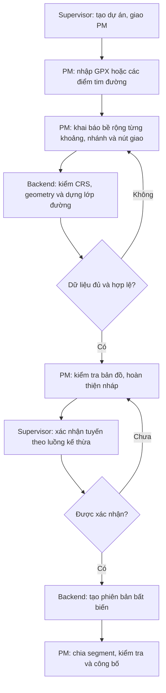
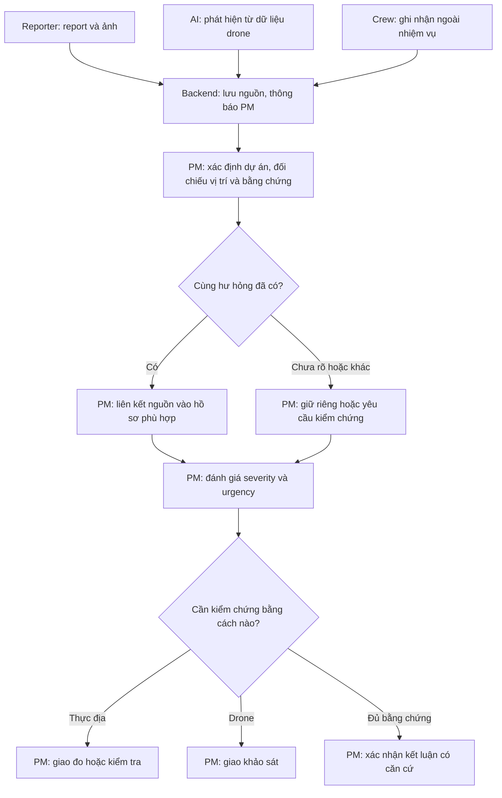
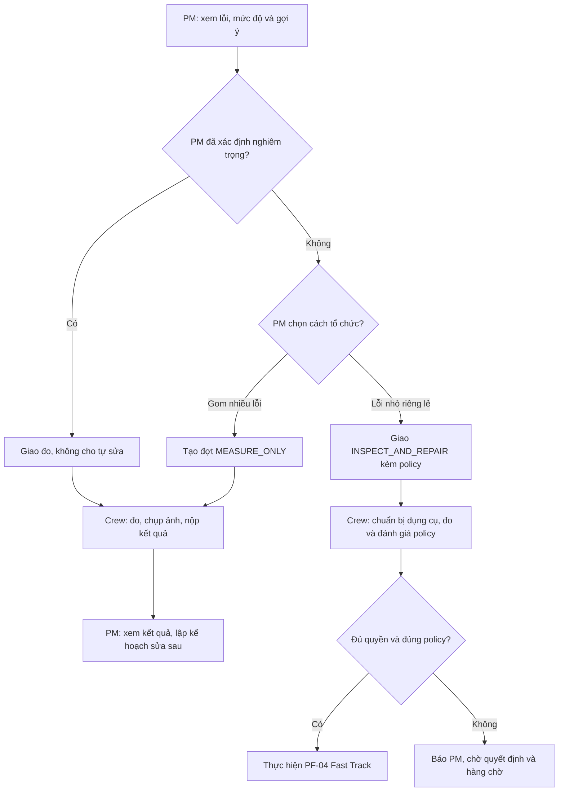
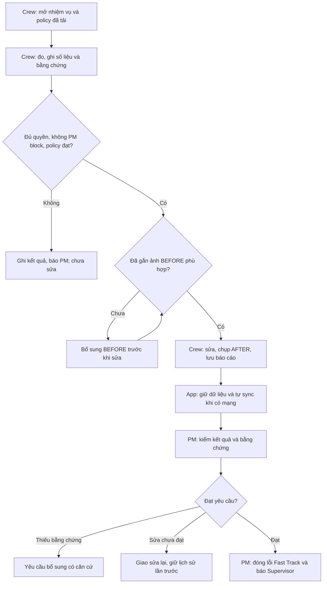
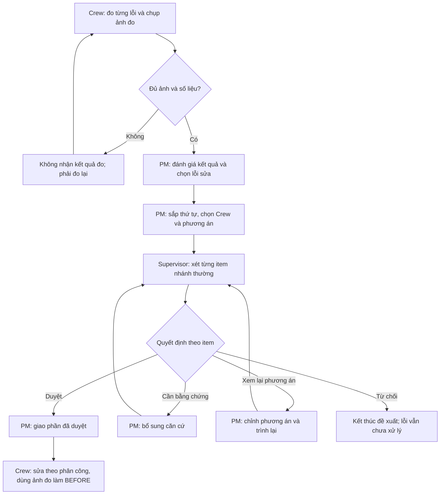
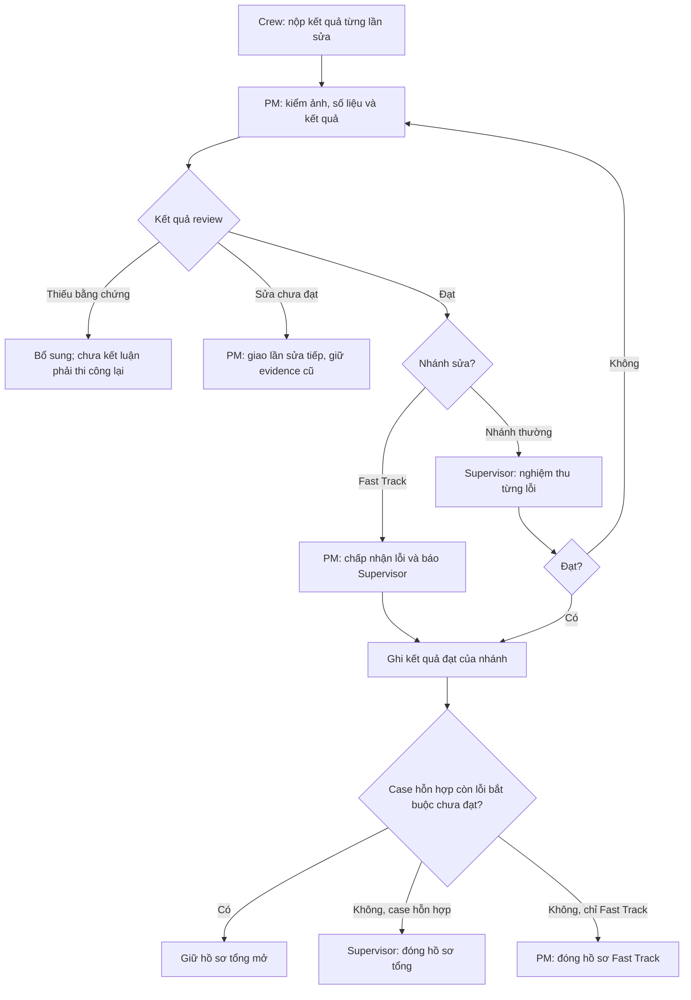
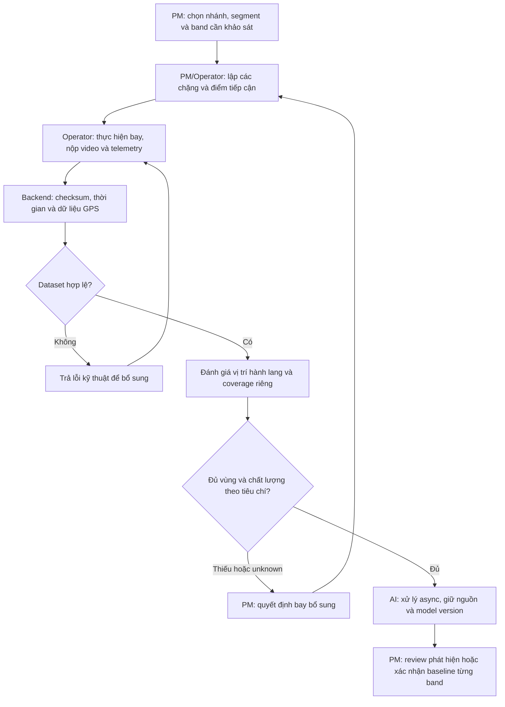
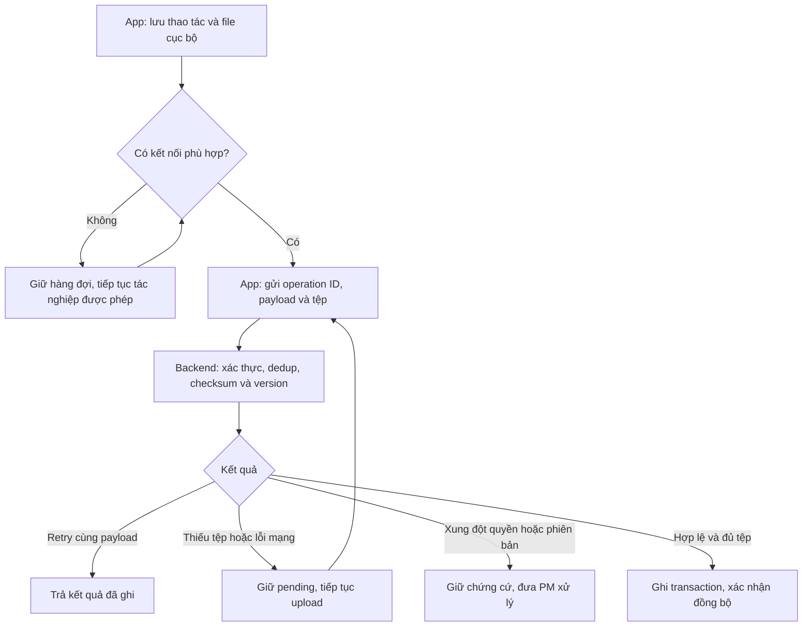

# ROADGUARD — PROCESS FLOW / TO-BE PROCESS

**Phiên bản:** FLOW-2026-09-26-R1. **Phạm vi:** quy trình nghiệp vụ mục tiêu trước triển khai; đồng bộ UseCase R3, User Stories R3, FRD/SRS, Business Rules và Data Dictionary R3. **Ký pháp:** flowchart Mermaid, không tuyên bố đây là BPMN 2.0 thực thi được. Nhãn nút ghi tác nhân; hệ thống chỉ gợi ý, kiểm điều kiện, lưu và thông báo.

CHỐT là quyết định người dùng. KẾ THỪA là quy tắc nền còn giữ. ĐỀ XUẤT/TBD không được coi đã duyệt. Các tên trạng thái ở sơ đồ biểu đạt nghiệp vụ; enum API cần đối chiếu Data Dictionary và code trước migration. Không cập nhật trạng thái Done backend bằng tài liệu này.

## 1. Ranh giới và vai trò

| Vai trò | Quyết định / công việc |
|---|---|
| Supervisor | Tạo dự án; xác nhận tuyến theo luồng kế thừa; xét từng phương án nhánh thường; đóng hồ sơ tổng hỗn hợp khi đủ kết quả. Nhận báo cáo Fast Track, không duyệt có được sửa Fast Track hay không. |
| PM | Nhập tuyến/bề rộng; lập policy Fast Track; phân cấp severity/urgency; chọn kiểm chứng; gom đo, lập phương án, sắp thứ tự và giao Crew; kiểm/đóng Fast Track. |
| Repair Crew | Đo, ghi số liệu/ảnh; sửa trong quyền nhiệm vụ và policy; không vượt PM; báo lỗi ngoài nhiệm vụ; làm offline, đồng bộ khi có mạng. |
| Drone Operator | Nhận phạm vi và điểm tiếp cận; tổ chức thực hiện bay, nộp tệp; xử lý lỗi kỹ thuật hoặc bay bổ sung theo yêu cầu. RoadGuard không trực tiếp điều khiển drone. |
| Reporter | Gửi phản ánh/ảnh/căn cứ; xem tiến độ được công bố của phản ánh mình; không quyết định mức chính thức. |
| Backend / AI | Kiểm dữ liệu, đề xuất vị trí/loại/mức, đo coverage và tạo thông báo; không tự duyệt, xếp lại kế hoạch hay cấp quyền sửa. |

**Đơn vị xuyên suốt:** tuyến/segment để quản lý; tấm để xác định vị trí; từng lỗi để đánh giá và nghiệm thu; nhóm công việc để gom chuyến. Report, evidence, ticket/case và notification không đồng nghĩa nhau.

## 2. PF-01 — Khởi tạo dự án và công bố tuyến

**Truy vết:** BR-01, BR-32–37; FR-04–10; US-03, US-24, US-30–32, US-36, US-38.  
**Đầu vào:** dự án Supervisor tạo, PM được giao, tọa độ/tim đường và bề rộng có nguồn. **Đầu ra:** route version xác nhận, segment set và lớp bản đồ có phiên bản.

- GPX Sprint 1 là nháp; lọc điểm không biến GPS thành khảo sát chính xác. GPS drone lấy tuyến thuộc Sprint 2; ghi GPS điện thoại chưa chốt.
- Mỗi nhánh có hướng lý trình; network topology và panel mapping là thiết kế đề xuất. Không nối giả qua ngã tư/cầu chỉ vì tọa độ gần nhau.
- Mặt đường 8 m rồi 10 m giữ hai bề rộng thật; hành lang tổng 12 m tương ứng 6 m mỗi bên tim, khác road polygon. Nhập nhiều điểm đo đúng tại đường cong; nội suy không tăng độ chính xác nguồn.
- Đổi tuyến sau tác nghiệp tạo version mới; survey/repair cũ giữ version cũ. Tránh segment dư vài mm bằng quy tắc gộp phần dư dưới minimum — ngưỡng và ngoại lệ tuyến ngắn phải được chốt.

## 3. PF-02 — Tiếp nhận, đối chiếu trùng và chọn kiểm chứng

**Truy vết:** BR-04, BR-07, BR-29–31, BR-39, BR-47; FR-11–14; US-08, US-21–23, US-34.  
**Đầu vào:** phản ánh người dân, phát hiện drone hoặc ghi nhận Crew. **Đầu ra:** nguồn được giữ, PM xác định phạm vi và cách xử lý.

**5 người cùng báo:** giữ 5 report, ảnh và quyền chủ sở hữu; đề xuất liên kết một case/Defect khi PM xác nhận cùng hư hỏng. Không tạo 5 công việc sửa. Khoảng cách 1–2 m chỉ là gợi ý cần chốt, không đủ để hợp nhất ổ gà và vỡ mép hai bên đường. Drone không cần report công dân giả. Không tìm thấy lỗi cần căn cứ đủ, không suy từ AI không phát hiện.

## 4. PF-03 — PM chọn đo+sửa hay gom đợt chỉ đo

**Truy vết:** BR-03, BR-05–14; FR-14–18; US-20, US-33–35.  
**Đầu vào:** lỗi/phản ánh trong dự án, mức chính thức/gợi ý, policy. **Đầu ra:** nhiệm vụ có phạm vi và quyền rõ ràng.

**Quy tắc ưu tiên:** 10 lỗi trong đợt có 5 lỗi nhỏ thì cả đợt chỉ đo, không tự sửa 5 lỗi. Policy ELIGIBLE không ghi đè nhiệm vụ MEASURE_ONLY. “Một tuần” là ví dụ PM gom công việc để tiết kiệm, không buộc chờ đủ tuần hoặc hệ thống tự chọn nhánh. Báo cáo mới xuất hiện không tự hủy quyền nhiệm vụ đã giao.

**D02:** sau khi batch đo hoàn tất, PM tạo/giao task sửa riêng; task mới có thể Fast Track nếu nằm trong policy và đủ quyền/bằng chứng. Không đổi hồi tố MEASURE_ONLY và bước H không tự chọn track. Cấp urgency cao không tự kích hoạt quyền khẩn cấp; lỗi ngoài nhiệm vụ chỉ ghi nhận.

## 5. PF-04 — Fast Track tại hiện trường, gồm offline

**Truy vết:** BR-05, BR-08, BR-11–20, BR-25; FR-15, FR-17–18, FR-21–23; US-02, US-13–14, US-20, US-33.  
**Đầu vào:** nhiệm vụ PM cho đo+sửa đã tải, policy version và phạm vi. **Đầu ra:** lỗi được PM kiểm/đóng hoặc quay lại bổ sung/sửa; Supervisor nhận báo cáo.

Ảnh BEFORE Fast Track được lấy từ người dân/drone nếu phù hợp; không tạo nguồn giả. Ảnh đo và số liệu vẫn cần theo nhiệm vụ/policy; reuse BEFORE không miễn đo. Ảnh sau sửa không được đổi nhãn BEFORE. Nếu đã sửa ngoài app nhưng thiếu BEFORE không thể phục hồi, giữ ngoại lệ chưa đạt, cách xử lý Q06 cần chốt — không bịa ảnh để đóng hồ sơ.

Không giới hạn thời gian làm offline. Snapshot nhiệm vụ/policy cho phép thực hiện offline nhưng không phải access token vĩnh viễn. D05 yêu cầu acknowledgement trước khi đội mới start cùng scope; khi sync vẫn kiểm quyền hiện tại và đưa late evidence vào conflict. PM nghiêm trọng đã biết thì Crew không được tự hạ mức rồi sửa.

## 6. PF-05 — Đo theo đợt, lập phương án và giao sửa

**Truy vết:** BR-03, BR-09, BR-17, BR-21–24; FR-16–21; US-11–13, US-20, US-34–35.  
**Đầu vào:** đợt MEASURE_ONLY. **Đầu ra:** kết quả đo hợp lệ, thứ tự PM chọn, các item đủ quyền được giao Crew.

Sơ đồ bước F áp dụng **APPROVAL_TRACK**. Theo D02, item nhỏ sau đợt đo có thể đi Fast Track bằng task sửa mới nếu đủ policy; không hồi tố task đo. Phần được duyệt được giao riêng, không chờ toàn batch. Theo D07, giữ phần đo đạt và đo lại phần thiếu; PM mở rộng scope đo lại nếu sai dụng cụ/phương pháp ảnh hưởng rộng. REJECT khác REQUEST_RECONSIDER và NO_DEFECT; giữ lịch sử version/item.

Gợi ý severity/urgency không tự thay sequence của PM. Chuẩn bị vật tư theo policy không mở thêm module kho/BOM/chi phí chi tiết.

## 7. PF-06 — Nghiệm thu, sửa lại và đóng hồ sơ hỗn hợp

**Truy vết:** BR-21–28, BR-48; FR-23–25; US-14, US-23, US-37.  
**Đầu vào:** báo cáo sửa từng item/attempt. **Đầu ra:** quyết định từng lỗi và đóng case đúng nhánh.

Lỗi cùng vị trí phát hiện sau nghiệm thu cần PM phân biệt “lần trước chưa đạt” và “tái phát”. **Đề xuất:** chưa đạt → tiếp tục hồ sơ và thêm attempt; tái phát thật → lỗi/case mới liên kết lịch sử. Ai mở lại case Supervisor đã đóng và quy trình thu hồi nghiệm thu là Q07; không tự mở chỉ vì gần GPS. Từng lỗi trên cùng tấm có nghiệm thu độc lập.

Công bố Reporter là bước riêng của PM, chọn ảnh AFTER đủ phạm vi; không gửi toàn bộ hồ sơ nội bộ. Công bố từng phần khi case còn mở là Q08, chưa tự bật. PM Fast Track review là quyết định kết quả, không thêm một vòng Supervisor duyệt lại có được sửa hay không.

## 8. PF-07 — Bay theo mạng tuyến, kiểm dữ liệu và baseline

**Truy vết:** BR-36–37, BR-39–44; FR-26–31, FR-33; US-04–08, US-25–26, US-38–39.  
**Đầu vào:** phạm vi segment/band/hành lang và yêu cầu PM. **Đầu ra:** dataset đủ điều kiện, phát hiện để PM review, baseline từng vùng khi phù hợp.

Không bắt buộc trục chính trước hay mọi nhánh trước; chia theo phạm vi cần kiểm, mức ưu tiên PM, pin, điểm cất/hạ và chất lượng quan sát. Quyền chỉnh kế hoạch PM/Operator cần contract cụ thể; kế hoạch là hỗ trợ, không tự điều khiển drone. Dronelink là khả năng xuất/tích hợp cần PoC với định dạng thực tế, không khẳng định API tích hợp đã có.

Vùng tổng12 m là ví dụ corridor, không là giới hạn bay an toàn/pháp lý được hệ thống chứng nhận. SRT ở trong vùng đáp ứng kiểm vị trí theo ngưỡng cần chốt Q11; không chứng minh ảnh nhìn đủ mép đường. Thiếu GPS/pose để UNKNOWN. Không lấy GPS máy bay làm tọa độ lỗi. Baseline cần segment/band đủ coverage và PM xác nhận; AI COMPLETED không tự tạo baseline hoặc NO_DEFECT. Research Validation dùng ground truth độc lập, không thay đổi trạng thái lỗi tác nghiệp.

## 9. PF-08 — Đồng bộ dữ liệu ngoại tuyến

**Truy vết:** BR-15–20, BR-42; FR-21–22; US-02, US-06, US-13.  
**Đầu vào:** operation ID, snapshot và ảnh/số đo lưu cục bộ. **Đầu ra:** dữ liệu server được xác nhận hoặc xung đột hiển thị, không mất dữ liệu âm thầm.

Đây là thiết kế sync draft. D05/D06/42A đã chốt business rules cho handover/rescue và bảo toàn actor; contract intake/conflict/receipt/security vẫn phải hoàn thiện. Không yêu cầu Crew chờ server trước mỗi lần sửa đã được giao; cũng không dùng offline để tự tạo quyền ngoài nhiệm vụ. Không retry vô hạn lỗi nghiệp vụ theo kiểu tạo bản ghi mới. Client time và server receive time tách biệt. Hạn nhiệm vụ không phải hạn xóa dữ liệu chưa sync.

## 10. Các luồng hỗ trợ không cần sơ đồ riêng

| Luồng | Trình tự / ngoại lệ | Truy vết |
|---|---|---|
| PF-09 — Dẫn đường Sprint 1 | Crew mở nhiệm vụ đo/sửa → xem điểm đích → bấm Maps. Operator dùng điểm tiếp cận/tập kết. URL nhận WGS84 đúng lat/lng. Không suy đã đến hoặc hoàn thành từ việc bấm chỉ đường. Mất kết nối có thể xem tọa độ/nội dung đã tải; khả năng Google Maps offline phụ thuộc thiết bị và dữ liệu đã có, không bảo đảm. Người đặt đích Q12. | BR-38; FR-32; US-40 |
| PF-10 — Khẩn cấp kế thừa | PM chủ động kích hoạt nhánh EMERGENCY có lý do và phạm vi; Crew chỉ làm việc được giao, lưu bằng chứng, PM/Supervisor hậu kiểm theo luồng nền. Biện pháp tạm không tự đóng hư hỏng cần sửa dứt điểm. Urgency EMERGENCY không tự cấp quyền. | BR-14, BR-46; FR-37; US-41 |
| PF-11 — Quản trị / lưu trữ | Kiểm quyền server, ghi audit; xuất theo scope; retention theo hồ sơ/hợp đồng và yêu cầu duyệt, giữ LegalHold. Research import giữ paired sample và chất lượng riêng, không tự tạo Defect. | BR-02, BR-44–45; FR-31, FR-34–36; US-15–19, US-26 |

## 11. Bảng ngoại lệ và điểm chưa chốt

| Tình huống | Xử lý mục tiêu / điểm chưa chốt |
|---|---|
| Đo lỗi trong batch thấy nhỏ | Vẫn chỉ đo; PM giao sửa sau. Track lúc giao sau đo là Q01. |
| Crew thấy nhỏ nhưng PM đã xác định nghiêm trọng | Chỉ đo/báo lại; PM mới được sửa kết luận và quyền. |
| Policy không có loại lỗi hoặc thiếu thông tin | Không tự sửa; báo PM, giữ hàng chờ có mức chính thức; PM chọn đo thêm/đợt sau. |
| Nhiều ảnh/report cùng GPS | Không tự gộp; PM đối chiếu loại/bên/tấm/bằng chứng; Q09 ngưỡng gợi ý. |
| Đo thiếu ảnh hoặc số liệu | Không chấp nhận, phải đo lại; phạm vi đo lại Q05. |
| Ảnh BEFORE cũ, không rõ thời điểm hoặc đã mất | Không bịa metadata; tiêu chí suitability Q03 và ngoại lệ Q06. |
| Phương án bị từ chối | Kết thúc đề xuất, giữ Defect chưa xử lý; PM lập phương án khác. |
| Sửa chưa xong/không đạt | Tạo lượt sửa tiếp, giữ lần trước; thiếu bằng chứng chưa mặc nhiên thi công lại. |
| Đã chốt nghiệm thu rồi thấy lỗi lại | PM phân loại chưa đạt hay tái phát; quyền mở lại Q07. |
| Đổi nhiệm vụ khi offline lâu | Bản tải cũ không thu hồi tức thời; giữ dữ liệu, xử lý conflict theo Q04/Q17. |
| Đường mới chưa có trên bản đồ nền | Dùng geometry dự án để hiển thị; không ép snap vào đường nền không đúng. |
| SRT đủ vùng nhưng ảnh không nhìn được mép | Tách đánh giá vị trí/coverage; Q11 ngưỡng và quyết định bay bổ sung. |
| Lỗi trước baseline hoặc ngoài bảo hành | Không tự bỏ nhận phản ánh; điều phối/trách nhiệm chính xác Q16. |

## 12. Thay đổi so với quy trình nguồn

| Thay đổi | Nội dung thay thế / bổ sung |
|---|---|
| THAY THẾ gate sửa chung | Tách Fast Track, nhánh thường và Emergency; không áp Supervisor pre-approval cho mọi lỗi. |
| THAY THẾ quyền trong đợt | Nhiều lỗi gom đo → chỉ đo, kể cả lỗi nhỏ; giao sửa là bước PM quyết định sau. |
| THÊM policy PM và offline | Version policy được Crew xem, dụng cụ/vật tư chuẩn bị; không TTL tác nghiệp. |
| THAY THẾ thiếu ảnh đo | Lý do thiếu ảnh không đủ; phải đo lại, không hợp thức hóa dữ liệu. |
| THÊM cấp quản lý | Network nhiều nhánh, width profile/corridor, tấm thật/lưới ước lượng; Defect vẫn đơn vị nghiệm thu. |
| THÊM vòng sửa / tái phát | Attempt giữ lịch sử; PM phân biệt sửa trước chưa đạt và phát sinh sau nghiệm thu. |
| THÊM đề xuất xử lý trùng | Giữ toàn bộ report/owner; gợi ý gần GPS không tự kết luận cùng hư hỏng. |
| GIỮ quyền PM chọn thứ tự | Gợi ý không tự xếp lại; PM chọn từng lỗi và Crew. |

Đối chiếu chi tiết theo [UseCase](04_Use_Cases.md), [User Stories + AC](05_User_Stories_Acceptance_Criteria.md), [Data Dictionary](../03_Data/01_Data_Dictionary.md) và [log P1/P2](../07_Change_Management/02_Use_Case_Change_Log.md). Sơ đồ hỗ trợ review nghiệp vụ; không là bằng chứng hệ thống đã triển khai hoặc thử nghiệm thực địa.

## V2(3) amendment — 2026-09-28

This document follows `planning/V2/V2-3_DECISION_REGISTER.md`. D01-D28 are approved business decisions; `APPROVED_PILOT_CONFIG` and `APPROVED_TARGET` are not empirical verification. The document must distinguish `contractStatus`, `implementationStatus`, and `verificationStatus`. Reporter email/password plus one-time email OTP is the approved authentication flow; web cookie transport, pilot limits, retention and performance values remain configuration/target registers. Fast Track uses measurement-only intake followed by a separately authorized PM repair task; policy framework, reopen, partial publication, handover/conflict, BEFORE incident, curing and traffic release remain explicit contracts. Offline evaluation and AI two-stage processing are proposed until schema, fixtures and runtime/provider evidence pass.
