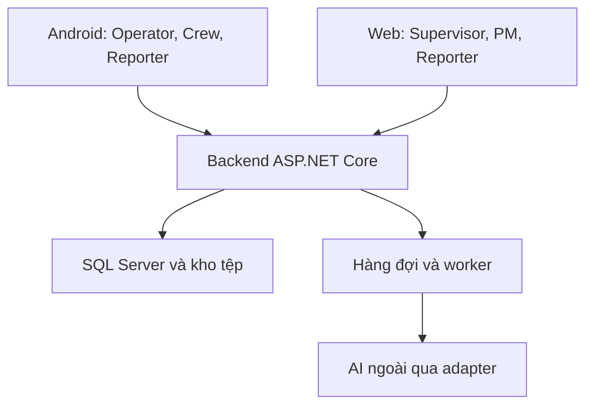

# Đặc tả use case RoadGuard / CÁT TƯỜNG

> Phạm vi bàn giao BE — 18/09/2026: đợt hiện tại phát triển backend ASP.NET Core; Android/Web thuộc FE, AI thật và thu thập số đo thực địa là tích hợp bên ngoài ở giai đoạn sau. Backend vẫn triển khai đầy đủ workflow bắt buộc, adapter AI giả lập xác định và chức năng Research Validation nhập/ghép/tính sai số/xuất báo cáo bằng dữ liệu kiểm thử hoặc dữ liệu ngoài đã có. Nghiệm thu phần mềm BE không tuyên bố độ chính xác AI hay kết quả thực nghiệm từ dữ liệu giả. Các yêu cầu sản phẩm/nghiên cứu đầy đủ bên dưới vẫn được giữ để truy vết. Xem [ADR 003](../../../adr/003-backend-delivery-and-ai-boundary.md).

Phiên bản **UC-2026-09-26-R3** — cập nhật trực tiếp từ R2 theo quyết định ngày 26/09/2026. Chỉ sửa tài liệu, chưa xác nhận backend đã có luồng mới.

> **[THÊM UC-D29 — cách đọc thay đổi]** Ghi chú **THAY THẾ** chỉ rõ quy tắc cũ ngừng áp dụng và nội dung mới ngay tại phần bị đổi; **BỎ** nghĩa bỏ điều kiện/quy tắc cũ, không xóa lịch sử; **THÊM** là chức năng/luồng mới. Giữ toàn bộ mã chức năng cũ. Các phần **ĐỀ XUẤT / CẦN CHỐT** chưa là quyết định được phê duyệt.
>
> Căn cứ chung: [Mô tả dự án](../01_Overview/01_Project_Overview.md), [Business Rules](02_Business_Rules.md), [FRD/SRS](01_FRD_SRS.md), [To-Be Process](03_To_Be_Process.md), [Stories/AC](05_User_Stories_Acceptance_Criteria.md). Nhật ký chuẩn: [RoadGuard_UseCase_Change_Log.md](../07_Change_Management/02_Use_Case_Change_Log.md). Quyết định mới nhất ưu tiên hơn điều kiện cũ trong Data Dictionary/Design v2; phần còn mở không được Codex tự chốt bằng code.

Căn cứ thêm: [Data Dictionary](../03_Data/01_Data_Dictionary.md) là chuẩn dữ liệu/công nghệ ưu tiên; đề cương `RoadGuard_Contractor_Warranty_Inspection_phuonglhk.md` và các quyết định đã chốt (vai trò tiếng Anh, khảo sát gốc bàn giao, Backend C# + hệ AI ngoài qua adapter, **thu thập ground truth nghiên cứu là bắt buộc**).

## 1. Cơ sở và ranh giới

Căn cứ đề cương RoadGuard_Contractor_Warranty_Inspection_phuonglhk.md, tài liệu yêu cầu hệ thống đã chốt và đặc biệt là [Data Dictionary](../03_Data/01_Data_Dictionary.md). Với phần chưa đổi, Data Dictionary là chuẩn tên entity, field và kiểu dữ liệu. Với thay đổi trong R1, R2 và UC-2026-09-26-R3, quyết định trực tiếp của chủ dự án ghi trong log được ưu tiên, tiếp đến Design v2 ở phần không xung đột. Data Dictionary/Domain Model/ERD/User Stories chưa được đồng bộ trong đợt này; không dùng quy tắc cũ để vô hiệu hóa Fast Track mới. Không tự suy ra schema/API đã có từ use case.

Ranh giới bao gồm ứng dụng di động Android, trang web (Web Dashboard), Backend, lưu trữ, dữ liệu không gian, và dịch vụ AI tách biệt. Có bốn vai trò nhân sự nội bộ thuộc nhà thầu và vai trò thứ năm `Reporter` cho người dân/đại diện chủ đầu tư; Reporter không cần membership dự án để gửi và xem phản ánh của mình. Thiết bị bay thu thập dữ liệu ngoài thực địa; hệ thống này **không** điều khiển thiết bị bay.

### 1.1 Kiến trúc logic (đã hướng)

| Thành phần | Công nghệ gợi ý | Vai trò |
|---|---|---|
| Backend | **C#**, ASP.NET Core, SQL Server + SQL Server Spatial, EF Core | Auth, dự án, khảo sát, đợt sửa, gọi AI, lưu kết quả |
| AI Service bên ngoài | Hệ AI qua hợp đồng có phiên bản; Python/YOLO chỉ là một hướng triển khai | Xử lý manifest theo phiên bản dữ liệu/segment/vùng quan sát; trả ứng viên phát hiện |
| Giao tiếp BE ↔ AI | Adapter, job bền vững, REST bất đồng bộ/polling | BE trả 202 + JobId sau khi lưu job; worker gọi AI; mock và AI thật cùng hợp đồng có nguồn rõ ràng |
| Android | Kotlin | Upload video/SRT, nhiệm vụ, ảnh trước/sau, sync |
| Web Dashboard | (chưa bắt buộc chốt framework) | Quản lý dự án, xác minh AI, duyệt đợt, báo cáo |

Backend sở hữu nghiệp vụ, lưu trữ và điều phối job; AI là hệ thống tích hợp bên ngoài qua adapter/hợp đồng có phiên bản. Python là hướng triển khai trước đây, không ràng buộc nhà cung cấp mới. Mock vẫn dùng để kiểm thử hợp đồng và phải ghi rõ nguồn mock; không tự xác nhận hư hỏng. Nguồn lịch sử: [thiết kế phản ánh/segment](../../RoadGuard_Incident_Segment_Design_v1.md) và [thiết kế AI/edge](../../RoadGuard_AI_Segment_Edge_Design_v1.md); các proposal này không chứng minh runtime.

### 1.2 Tác nhân

| Tác nhân | Trách nhiệm |
|---|---|
| **Supervisor** (kèm quyền **Admin**) | Khởi tạo dự án và giao PM; PM nhập hình học tuyến, Supervisor xác nhận phiên bản tuyến theo quyền đã có; quản trị đội và các quy tắc nền; policy Fast Track do PM lập theo quyết định mới; duyệt từng lỗi ở APPROVAL_TRACK, xác nhận kết quả nhánh này và hậu kiểm EMERGENCY. Với FAST_TRACK do PM đóng, chỉ nhận thông tin để theo dõi, không có bước duyệt/xác nhận bắt buộc. Quản trị tài khoản, cấu hình, nhật ký và dữ liệu. |
| **PM** (Project Manager) | Nhập GPS tim đường, bề rộng và vùng mở rộng khảo sát của dự án được giao; điều phối khảo sát/phản ánh, chọn đo thực địa hoặc drone, gom nhiều lỗi lớn/nhỏ để đo trước, giao sửa sau, chỉnh tuyến và chia segment; xác minh và lập phương án nhánh duyệt; giao Crew, kiểm tra kết quả. PM xác nhận và đóng lỗi FAST_TRACK, thông báo Supervisor; APPROVAL_TRACK trình Supervisor. Một dự án có một PM chính; một PM có thể quản lý nhiều dự án. |
| **Drone Operator** | Nhận/từ chối nhiệm vụ; thu thập và nhập video/SRT; theo dõi đồng bộ, chất lượng và xử lý; nộp dữ liệu bay bổ sung. |
| **Repair Crew** | Đội trưởng có tài khoản, nhận nhiệm vụ đo/sửa; đo và ghi ảnh trước sửa. Chỉ nhiệm vụ PM giao đo-và-sửa mới được sửa lỗi nhỏ đạt policy cùng chuyến, không chờ PM hoặc Supervisor duyệt từng lỗi trước sửa; đợt MEASURE_ONLY chỉ đo; chụp ảnh sau, báo cáo PM và tự đồng bộ khi có mạng. Lỗi vượt policy báo PM để lên phương án. Thành viên đội không có tài khoản riêng; Crew không tự nghiệm thu/đóng lỗi. |
| **Reporter** | Tự đăng ký bằng email, xác minh OTP, gửi/bổ sung phản ánh, xác nhận vị trí riêng từng ảnh, xem tiến độ và kết quả được công bố của chính mình. `ReporterType = CITIZEN / INVESTOR_REPRESENTATIVE` (Citizen / InvestorRepresentative) không cấp quyền dự án, duyệt hoặc xem dữ liệu sửa chữa nội bộ. |

## 2. Cách đọc sơ đồ

Có các nhóm tổng quan, được phân rã thành các mục trong sơ đồ chi tiết. Một số mục là hành vi con bắt buộc, không có liên kết trực tiếp tới tác nhân; chúng được gọi qua «include». Đây là danh mục chức năng, không phải số màn hình hay số API.

- Đường liền không mũi tên: tác nhân tham gia chức năng.
- A «include» B: A bắt buộc thực hiện hành vi B trong điều kiện của A.
- A «extend» B: A bổ sung cho B khi điều kiện trên đường nối xảy ra.
- Đăng nhập, quyền dự án, phiên bản hồ sơ và trạng thái hợp lệ được áp dụng làm điều kiện chung.
- Gửi hồ sơ, duyệt hồ sơ và giao việc là các tương tác riêng qua nhiều thời điểm; không nối «include» chỉ để diễn tả bước trước/sau.

## 3. Quy tắc nghiệp vụ xuyên suốt

1. **Supervisor** tạo dự án. PM/Drone Operator/Repair Crew chỉ thấy dữ liệu trong phạm vi được phân công; Repair Crew không tự nhận đợt của đội khác. Reporter tự đăng ký bằng email và phải xác minh OTP trước khi đăng nhập/gửi phản ánh; sau đó chỉ xem phản ánh của chính mình cùng kết quả được công bố, không cần và không tự được cấp membership dự án.
2. **Một dự án chỉ có một PM chính. Một PM có thể quản lý nhiều dự án cùng lúc.** Supervisor phân công đúng một PM khi tạo/cập nhật dự án.
3. **Khảo sát gốc sau bàn giao:** sau khi công trình được bàn giao (ngoài hệ thống), Supervisor khởi tạo dự án, gắn hồ sơ bàn giao/thời hạn bảo hành và phân công PM; PM nhập tim đường, bề rộng và vùng khảo sát mở rộng; backend dựng hình học hiển thị, Supervisor xác nhận phiên bản tuyến theo DA13. PM lập yêu cầu khảo sát gốc (baseline), giao Drone Operator bay lần đầu để lấy dữ liệu mẫu phục vụ đối chiếu bảo hành trong thời gian bảo hành (hồ sơ lưu tối thiểu hết bảo hành + 5 năm — xem quy tắc lưu trữ).
4. Một yêu cầu khảo sát có thể gom nhiều segment và nhiều video/lượt bay. PM chọn bộ segment đã công bố và vùng `Surface`, `LeftEdge`, `RightEdge`; Backend chia ProcessingBlock để giới hạn tài nguyên, không đồng nhất block, segment và lượt bay. Khảo sát gốc/định kỳ không cần có phản ánh. RouteCapture trước khi có segment là nhiệm vụ khởi tạo riêng, chưa phải tính năng hiện có.
5. Nhập video phải sao chép vào bộ nhớ thiết bị và kiểm tra bản sao; không phụ thuộc thẻ nhớ còn cắm. Trích phụ đề định vị từ MP4 nếu có; cho bổ sung SRT tương ứng khi cần. SRT không được mặc định là nhật ký bay đầy đủ.
6. Khi có mạng, ứng dụng tự tiếp tục hàng đợi tải số đo, ảnh trước/sau và báo cáo đã được người dùng gửi/xếp hàng, khi hệ điều hành cho phép thực thi. Không yêu cầu chọn lại từng tệp; nếu app bị dừng thì tiếp tục khi được chạy lại. Tự upload không đồng nghĩa tự gửi bản nháp chưa được người dùng xác nhận hoặc tự nghiệm thu. Chỉ báo an toàn sau server xác nhận toàn vẹn; chỉ dọn bản cục bộ khi người dùng chọn.
7. Lỗi định dạng, thiếu định vị hoặc dữ liệu không đạt được thông báo cụ thể. Sự cố máy chủ dùng cơ chế thử lại. **PM là người quyết định và xác nhận bay bổ sung** vùng chưa đạt, có thể đổi người và không giới hạn số lượt; mỗi lượt giữ lý do, phạm vi và nguồn gốc.
8. PM kiểm tra, hiệu chỉnh hoặc loại bỏ kết quả AI nhưng phải lưu lý do và lịch sử trước/sau. Kết quả được giữ lại là `Preliminary Defect`, ánh xạ bằng `Defect.status = OPEN` và chưa được xác minh chính thức; kết quả bị loại bỏ vẫn được lưu để đối chiếu. Nhãn được PM duyệt; Admin (Supervisor) phát hành mô hình.
9. Kết quả AI MVP gồm loại hư hỏng, độ tin cậy, khung bao (bounding box), liên kết khung hình/thời gian và vị trí GPS khi có. Kích thước vật lý trong MVP có thể chỉ là ước lượng 2D; không coi đầu ra YOLO tự có độ sâu hay độ chính xác địa lý đã bảo đảm. Tuy nhiên, **đề cương nghiên cứu bắt buộc** phải có một bộ dữ liệu validation riêng: kỹ sư đo thực địa bằng straightedge/depth gauge tại một mẫu điểm, ghép với số đo từ surface model và tính sai số/độ không chắc chắn. Bộ dữ liệu nghiên cứu này không biến toàn bộ pipeline nâng cao thành tiêu chí nghiệm thu MVP.
10. **[THAY THẾ UC-D21]** PM chọn đo trực tiếp hoặc drone cho một/nhiều phản ánh. Đợt gom nhiều lỗi lớn/nhỏ: Crew chỉ đo/chụp và báo; PM lập/giao sửa sau. Một lỗi nhỏ riêng lẻ có thể giao đo-và-sửa nếu đạt policy. Giữ nguồn thật, không tạo Survey giả; nghiên cứu vẫn độc lập.
11. APPROVAL_TRACK: PM chọn Defect VERIFIED có bằng chứng đủ, lập phương án tổng quát và gói trình; Supervisor quyết định từng RepairItem. Không quản lý tài chính/BOM kho/định mức hay giai đoạn thi công chi tiết; có danh sách chuẩn bị dụng cụ/vật tư theo policy. FAST_TRACK là ngoại lệ tiền điều kiện duyệt trước sửa: Crew được giao đo và sửa theo policy, không phải chờ PM chuyển VERIFIED hoặc Supervisor duyệt từng lỗi; kết quả chính thức chỉ hoàn tất sau PM kiểm tra. Không mở ngoại lệ này cho nhánh duyệt.
12. Giao việc theo Crew và từng RepairItem/phạm vi nhiệm vụ. APPROVAL_TRACK chỉ giao item đã APPROVED; FAST_TRACK cho đo và sửa trong phạm vi policy; EMERGENCY chỉ do PM kích hoạt theo v2, giao đội cấp 3 xử lý tạm và thông báo Supervisor. Một đội có thể nhận nhiều việc nhưng không tự nhận việc của đội khác. Phần thay đổi ngoài phạm vi phê duyệt phải được xét lại trước thi công.
13. **[THAY THẾ UC-D24/25]** Fast Track được dùng ảnh dân/drone làm BEFORE; đo ngoài Fast Track phải có ảnh và số đo, thiếu thì không chấp nhận. PM kiểm/đóng Fast Track và báo Supervisor; APPROVAL_TRACK PM kiểm rồi Supervisor xác nhận. Thiếu bằng chứng khác sửa chưa đạt; giữ các lần sửa và phần đã đạt.
14. **[THAY THẾ UC-D22]** Lỗi mới ngoài nhiệm vụ chỉ ghi nhận cho PM, không tự sửa. PM đã xác định nghiêm trọng thì Crew chỉ đo/báo, không tự hạ mức để Fast Track.
15. Thông tin nghiệp vụ ngừng sử dụng vẫn giữ lịch sử. Nhật ký truy vết chỉ đọc, lưu người/thời gian/trước/sau và nguồn dữ liệu.
16. Hồ sơ dự án lưu ít nhất đến hết bảo hành cộng 5 năm. Việc xóa sau hạn phải được Supervisor duyệt; đang giữ hồ sơ tranh chấp thì không được xóa.
17. Khi tài khoản bị ngừng sử dụng (QT01) mà còn nhiệm vụ hoặc đợt dở dang: hệ thống thu hồi phiên, chặn đăng nhập mới, **không xóa lịch sử** và **không tự hủy hay tự hoàn tất** công việc đang mở. Hệ thống lập danh sách việc cần bàn giao và thông báo người có quyền phân công lại. **Drone Operator:** PM phân công lại người bay (KS04); dữ liệu đã nộp được giữ. **Repair Crew:** PM phân công lại nhiệm vụ đo đạc (TN01) hoặc đợt sửa (SC11); bằng chứng đã gửi vẫn gắn đúng lỗi/đợt. **PM:** Supervisor gán đúng một PM mới (DA03); PM mới tiếp nhận yêu cầu khảo sát, đợt sửa và hồ sơ đang trình. Bản nháp trên thiết bị giữ nguyên chủ sở hữu; khi có mạng nếu tài khoản đã ngừng thì không đồng bộ và không chuyển nháp sang người khác.
18. Warranty là aggregate riêng. Theo v2, SegmentBaseline theo (segment, band) là nguồn baseline; cờ Survey.is_baseline_confirmed chỉ là dẫn xuất/lịch sử. SupplementarySurveyRequest độc lập; QualityCheck và Evidence có đúng một FK đích tương ứng. Dữ liệu có vị trí phải neo phiên bản tuyến. Schema chi tiết của Fast Track mới phải được P2 đối chiếu trước P1 triển khai, không ép dùng prerequisite PM duyệt trước sửa từ schema cũ.
19. **Chuẩn kỹ thuật:** Backend dùng C# / ASP.NET Core / EF Core với SQL Server + SQL Server Spatial. GPS/raw location dùng `geography(4326)`; geometry kỹ thuật dùng UTM `32648` hoặc `32649` theo cấu hình dự án. JSON logic ánh xạ SQL Server `nvarchar(max)` và phải qua kiểm tra `ISJSON` cùng schema ứng dụng; không dùng cú pháp PostgreSQL/PostGIS trong use case hoặc API contract.

20. **[THAY THẾ UC-D22]** PM lập FastTrackPolicy hiển thị trên app; Crew đối chiếu số đo trong nhiệm vụ được phép. LOW là điều kiện cần theo thiết kế nền, chưa đủ nếu ngoài loại/biện pháp policy. Ngoài policy báo PM để quyết định phân cấp/hàng chờ; không tự tăng severity. Chi tiết quyền phát hành/hạn mức còn Q02/Q03.
21. **[BỎ điều kiện cũ / THAY THẾ UC-D23]** Bỏ yêu cầu phải được server chấm trước sửa và ghi chú chưa chốt ngoại tuyến. Cho Fast Track ngoại tuyến không giới hạn thời gian mất mạng, giữ phạm vi/policy đã giao. Đề xuất snapshot và xử lý xung đột khi sync; không hứa thu hồi tức thời trên máy mất mạng.

22. **[THAY THẾ UC-D26]** PM nhập tim và bề rộng theo đoạn. Ví dụ 8/10 m cùng vùng tổng 12 m: tim đến biên 6 m, mở ngoài mép 2/1 m. Tính bằng CRS mét, xuất WGS84; không cộng mét vào lat/lon.
23. **[GIỮ VÀ BỔ SUNG UC-D26]** Polygon suy ra không phải GPS thực đo; overlay RoadGuard không cập nhật Google Maps. Đường cong cần đủ dữ liệu hình học; nhiều nhánh cần giữ mã/phạm vi để không nối nhầm.

24. **[THÊM UC-D20]** Độ nghiêm trọng và khẩn cấp lưu riêng; PM quyết định. Ba mức khẩn cấp Bình thường/Cần xử lý sớm/Khẩn cấp. Hệ thống chỉ gợi ý thứ tự; không tự đổi kế hoạch/giao Crew. LOW khẩn cấp vẫn Fast Track nếu được phép.
25. **[THÊM UC-D27]** Tuyến/segment để quản lý; tấm định vị; từng lỗi nghiệm thu; nhóm công việc gom sửa. Các lỗi gần nhau hoặc cùng tấm không tự là cùng Defect; gộp 1–2 m còn là quy tắc đề xuất cần xác nhận.
26. **[THÊM UC-D25]** PM phân biệt sửa trước chưa đạt và tái phát sau nghiệm thu; phương án mở lại/tạo mới và quyền mở lại hồ sơ Supervisor xem Q07.

## 4. Danh mục chức năng và kết quả mong đợi

### 01. Truy cập và làm việc ngoại tuyến

| Mã | Chức năng | Tác nhân trực tiếp | Quy tắc / kết quả |
|---|---|---|---|
| CN01 | Đăng nhập / đăng xuất | Supervisor; PM; Drone Operator; Repair Crew; Reporter | Tài khoản nội bộ do Admin cấp; Reporter tự đăng ký nhưng chỉ đăng nhập sau khi xác minh email bằng OTP. Phiên đăng nhập mang snapshot vai trò nhưng backend phải đối chiếu vai trò và quyền dự án hiện tại phía server trên mỗi request. Phiên hết hạn, mật khẩu đã đặt lại (CN10), tài khoản bị suspend hoặc role toàn hệ thống thay đổi thì thu hồi toàn bộ phiên/token và phải đăng nhập lại. |
| CN02 | Xem và cập nhật hồ sơ cá nhân | Supervisor; PM; Drone Operator; Repair Crew; Reporter | Chỉnh thông tin cá nhân; không tự thay đổi vai trò hay quyền dự án. |
| CN03 | Xem phạm vi dữ liệu được phép | Supervisor; PM; Drone Operator; Repair Crew; Reporter | Supervisor có quyền danh mục sau kiểm tra role server-side; PM/Drone Operator/Repair Crew cần membership active, còn hiệu lực và đúng vai trò. Reporter chỉ xem phản ánh của mình và dữ liệu công bố liên quan theo ownership; không truy cập API danh mục dự án. Không tin claim client thay cho kiểm tra quyền. |
| CN04 | Xem thông báo và nhắc việc | Supervisor; PM; Drone Operator; Repair Crew; Reporter | Hiển thị thông báo phù hợp vai trò: khảo sát, kết quả, duyệt, sửa lại, từ chối/hủy nhiệm vụ, phân công lại, đến hạn bảo hành; Reporter chỉ nhận sự kiện công bố của phản ánh mình. |
| CN05 | Lưu công việc và bản đồ phục vụ ngoại tuyến | Drone Operator; Repair Crew | Chuẩn bị dữ liệu đã được phép truy cập để tra cứu khi mất mạng; phạm vi bản đồ phụ thuộc dữ liệu đã tải. |
| CN06 | Lưu bản nháp và bằng chứng khi không có mạng | Drone Operator; Repair Crew | Lưu dữ liệu trong bộ nhớ ứng dụng và hiển thị trạng thái chưa đồng bộ. |
| CN07 | Tự tiếp tục đồng bộ khi có mạng | Drone Operator; Repair Crew | Tự tải tiếp hàng đợi số đo/bằng chứng/báo cáo đã xếp hàng khi có mạng và app được phép chạy; hỗ trợ Wi-Fi/dữ liệu di động. App bị dừng thì tiếp tục khi được chạy lại. Hiển thị chờ tải/đang tải/lỗi/đã xác nhận; không tự công bố hoàn thành. |
| CN08 | Kiểm tra trạng thái đồng bộ an toàn | Drone Operator; Repair Crew | Chỉ báo đã đồng bộ khi máy chủ xác nhận đủ dữ liệu và kiểm tra tính toàn vẹn thành công. |
| CN09 | Dọn bản sao cục bộ đã đồng bộ an toàn | Drone Operator; Repair Crew | Người dùng chủ động chọn dọn; giữ bản chưa đồng bộ và dữ liệu nguồn trên máy chủ. |
| CN10 | Yêu cầu / đặt lại mật khẩu | Supervisor; PM; Drone Operator; Repair Crew; Reporter | Người dùng gửi yêu cầu khôi phục. **Chỉ Supervisor (Admin) đặt lại mật khẩu**; bắt đổi mật khẩu ở lần đăng nhập kế tiếp. Không tiết lộ mật khẩu cũ. Ghi nhật ký người thực hiện và thời điểm (QT09), không ghi mật khẩu. Tài khoản đang ngừng sử dụng thì từ chối đặt lại. |
| CN11 | Reporter tự đăng ký bằng email | Reporter chưa có tài khoản | Nhập email hợp lệ, display name, ReporterType và mật khẩu. Hệ thống tạo tài khoản `PENDING`, role cố định `REPORTER`, không cấp token trước khi OTP hợp lệ. Không tiết lộ email đã tồn tại. |
| CN12 | Xác minh email bằng OTP | Reporter đang `PENDING` | Nhập registration intent và OTP nhận qua email. Code có hash, hạn dùng, giới hạn thử và dùng một lần; xác minh thành công chuyển account `ACTIVE`, `email_confirmed = true`, ghi thời điểm và có thể cấp token. Resend có cooldown/rate-limit. |

### 02. Dự án, bảo hành và kế hoạch khảo sát

| Mã | Chức năng | Tác nhân trực tiếp | Quy tắc / kết quả |
|---|---|---|---|
| DA01 | Khởi tạo và quản lý dự án | Supervisor | Tạo thông tin dự án, hồ sơ bàn giao/bảo hành và phân công PM. PM phụ trách nhập tọa độ tim đường, bề rộng và vùng mở rộng khảo sát sau đó; không bắt Supervisor nhập GPS thay PM. |
| DA02 | Nhập/chỉnh tuyến và bề rộng | PM | **[THAY THẾ UC-D26]** PM nhập chuỗi tim đường và bề rộng từng đoạn; 8 m rồi 10 m vẫn giữ hai mặt đường, vùng tổng ví dụ 12 m. Preview tuyến cong/nút giao, giữ CRS/nguồn/version. Không ghi GPS nội suy thành thực đo. |
| DA03 | Phân công nhân sự và quyền theo dự án | Supervisor | **Giao đúng một PM chính cho mỗi dự án**; giao Drone Operator và Repair Crew theo nhu cầu; không cấp quyền xem dự án khác ngoài phạm vi. Một PM có thể được giao nhiều dự án. |
| DA04 | Quản lý hồ sơ bàn giao và thông tin bảo hành | Supervisor | Ngày nghiệm thu/bàn giao, thời hạn bảo hành, ngày hết bảo hành, giá trị giữ lại và tài liệu liên quan. |
| DA05 | Xem hồ sơ dự án và thời hạn bảo hành | Supervisor; PM | PM xem dự án được giao; Supervisor xem toàn danh mục. |
| DA06 | Lập và điều chỉnh kế hoạch khảo sát định kỳ | PM | Lập kế hoạch cho dự án, **gồm khảo sát gốc (baseline) ngay sau bàn giao** và các lần kiểm tra tiếp theo trong thời gian bảo hành, kể cả khi chưa có phản ánh. |
| DA07 | Xem lịch và nhắc khảo sát sắp đến hạn | PM | Nhắc theo lịch và trước hạn bảo hành; nhắc việc không tự tạo lệnh bay. |
| DA08 | Tạo yêu cầu khảo sát từ kế hoạch hoặc phát sinh | PM | Chọn công trình, phạm vi cần kiểm tra, loại yêu cầu (gốc / định kỳ / phát sinh), thời hạn và yêu cầu đầu ra. |
| DA09 | Ghi nhận hoãn / không triển khai khảo sát theo kế hoạch | PM | Bắt buộc lý do; nếu thời tiết có thể lên lịch ngày khác; lưu lịch sử quyết định. |
| DA10 | Xác nhận baseline theo segment và vùng quan sát | PM | Xác nhận riêng (segment, band) khi dataset toàn vẹn, coverage SUFFICIENT và phát hiện trong phạm vi đã xử lý. Giữ phần đạt, bổ sung phần thiếu; không phải xác nhận hình học tuyến. |
| DA11 | Xem tình trạng công trình qua các kỳ khảo sát | Supervisor; PM | Theo dõi lỗi còn mở, mức độ và thay đổi so với hồ sơ gốc. |
| DA12 | Đóng / ngừng sử dụng dự án và tra cứu hồ sơ đã đóng | Supervisor | Ngừng tác nghiệp thông thường nhưng giữ hồ sơ theo thời hạn lưu trữ; không xóa cứng. |

### 03. Phân công khảo sát và tiếp nhận dữ liệu bay

| Mã | Chức năng | Tác nhân trực tiếp | Quy tắc / kết quả |
|---|---|---|---|
| KS01 | Phân công người bay cho yêu cầu khảo sát | PM | Giao đích danh một Drone Operator; yêu cầu có thể cần nhiều video. |
| KS02 | Xem và tiếp nhận yêu cầu khảo sát | Drone Operator | Người được giao xem phạm vi, thời hạn, hướng dẫn và xác nhận tiếp nhận; nếu không nhận được thì dùng KS03. |
| KS03 | Từ chối nhiệm vụ khảo sát kèm lý do | Drone Operator | Chỉ khi trạng thái Mới giao (chưa tiếp nhận). Lý do bắt buộc. Trả yêu cầu về PM để phân công lại (KS04). Đã nhận thì không tự từ chối; PM điều chỉnh phân công. |
| KS04 | Điều chỉnh lịch và phân công lại người bay | PM | Có thể đổi người thực hiện; lưu người cũ, người mới, lý do và lịch mới. |
| KS05 | Ghi nhận thông tin chuyến bay và tài liệu khảo sát | Drone Operator | Lưu thiết bị, thời gian, phạm vi đã bay, ghi chú và tài liệu thực hiện chuyến bay. |
| KS06 | Nhập và sao chép video từ thẻ nhớ vào ứng dụng | Drone Operator | Sao chép thật vào bộ nhớ thiết bị; không chỉ lưu đường dẫn trên thẻ nhớ; kiểm tra bản sao. |
| KS07 | Bổ sung tệp phụ đề định vị tương ứng với video | Drone Operator | Dùng khi video không có luồng phụ đề trích xuất được; kiểm tra ghép đúng video và thời gian. |
| KS08 | Kiểm tra tính hợp lệ và chất lượng dữ liệu khảo sát | Drone Operator | Kiểm tra định dạng, định vị, đồng bộ thời gian, độ rõ, ánh sáng, vùng phủ và độ chồng lấn; báo vùng không đạt. |
| KS09 | Gửi bộ dữ liệu và theo dõi tự tải lên | Drone Operator | Nhiều video trong một khảo sát; xếp hàng ngoại tuyến, tự tiếp tục khi có mạng và app được phép chạy; server xác nhận toàn vẹn riêng. Bản cục bộ giữ đến khi an toàn và người dùng chọn dọn. |
| KS10 | Xem tiến độ xử lý và kết quả kiểm tra chất lượng | Drone Operator; PM | Theo dõi trạng thái tiếp nhận, xử lý, hoàn tất hoặc lỗi; Backend gọi AI Service sau khi dữ liệu hợp lệ (hoặc trả mock ở Phase 1). |
| KS11 | Yêu cầu / xác nhận bay bổ sung vùng dữ liệu chưa đạt | PM | **PM xác nhận** cần bay bổ sung; chỉ rõ vùng và lý do; không giới hạn số lần; có thể giao người khác. |
| KS12 | Nộp dữ liệu bay bổ sung vào cùng lần khảo sát | Drone Operator | Giữ dữ liệu cũ và nguồn gốc mỗi lượt; hợp nhất có kiểm tra vùng phủ và đối sánh. |
| KS13 | Yêu cầu thử lại tác vụ xử lý thất bại | PM; Supervisor | Lỗi máy chủ thử lại trên dữ liệu đã lưu; lỗi dữ liệu chuyển PM quyết định bổ sung. |
| KS14 | Hủy / thu hồi yêu cầu khảo sát kèm lý do | PM | Lý do bắt buộc. Được hủy khi chưa có bộ dữ liệu máy chủ đã xác nhận toàn vẹn (chưa nhận hoặc đã nhận nhưng chưa nộp). Thông báo Drone Operator nếu đã giao/đã nhận. Không hủy khi đã có dữ liệu nộp thành công — khi đó chỉ điều chỉnh phân công (KS04) hoặc yêu cầu bổ sung (KS11). Yêu cầu đã hủy không xóa cứng; lưu trạng thái, lý do và lịch sử. Khác DA09 (hoãn kế hoạch, chưa tạo lệnh bay) và KS04 (đổi người/lịch, không hủy hẳn). |

### 04. Khai thác AI, rà soát sơ bộ và theo dõi hư hỏng

| Mã | Chức năng | Tác nhân trực tiếp | Quy tắc / kết quả |
|---|---|---|---|
| AI01 | Xem kết quả phân tích trên bản đồ và ảnh khảo sát | PM | Xem lỗi dự kiến, loại, độ tin cậy, khung bao và liên kết ảnh/video nguồn. |
| AI02 | Xem ảnh trực giao và mô hình bề mặt | PM | Hiển thị sản phẩm xử lý ảnh theo đề cương khi pipeline hỗ trợ; phạm vi phủ và trạng thái chất lượng. (Nâng cao / theo đề cương.) |
| AI03 | Xem vị trí, kích thước và độ không chắc chắn | PM | Trong sản phẩm: phân biệt ước lượng 2D, số đo surface model (nếu pipeline hỗ trợ) và số đo thực địa. Trong nghiên cứu: các số đo phải được ghép cặp và báo cáo sai số/độ không chắc chắn; không gán kích thước thật chỉ từ khung bao. |
| AI04 | Giữ lại phát hiện sơ bộ để kiểm chứng | PM | Tạo `Defect OPEN` biểu diễn `Preliminary Defect`, lưu nguồn/người/thời gian; PM chọn drone hoặc thực địa, chưa xác minh chính thức. Không tự tạo nhiệm vụ đo cho mọi phát hiện. |
| AI05 | Hiệu chỉnh loại, mức độ, vị trí và vùng hư hỏng | PM | Cho phép sửa kết quả sai; lưu nguồn AI và phiên bản sau chỉnh; dữ liệu sửa có thể dùng làm nhãn. |
| AI06 | Loại bỏ phát hiện sai và giữ hồ sơ đối chiếu | PM | Đánh dấu đã loại bỏ, không xóa; giữ ảnh gốc và dữ liệu phục vụ kiểm tra, huấn luyện. |
| AI07 | Ghi lý do và lịch sử quyết định rà soát/xác minh | Hành vi con trong chức năng cha | Lưu người thực hiện, thời điểm, giá trị trước/sau, phiên bản mô hình và liên kết bằng chứng kiểm chứng và số đo khi cần để xác minh chính thức. |
| AI08 | Đối chiếu các phát hiện trùng cùng một hư hỏng | PM | AI có thể đề xuất gộp; **PM xác nhận gộp hoặc giữ riêng**. Tránh đếm một lỗi nhiều lần; giữ audit. |
| AI09 | Đối chiếu cùng hư hỏng qua nhiều lần khảo sát | PM | Xác nhận hoặc sửa ghép nối; dùng chung định danh lỗi khi đủ bằng chứng. |
| AI10 | Xem lịch sử và so sánh với hồ sơ gốc bàn giao | PM; Supervisor | Xem lần đầu xuất hiện, hình ảnh, số đo và quyết định theo thời gian so với baseline (DA10). |
| AI11 | Xem lỗi mới, ổn định hoặc đang phát triển | PM; Supervisor | So sánh các kỳ tương thích; báo thiếu dữ liệu khi chưa đủ căn cứ tính mức tăng trưởng. |
| AI12 | Xem cảnh báo hư hỏng cần ưu tiên kiểm tra | PM; Supervisor | Cảnh báo mức độ cao, thay đổi nhanh hoặc nứt cần theo dõi; không cam kết dự báo thời điểm hỏng. |
| AI13 | Yêu cầu đo đạc thực tế khi cần căn cứ vật lý | PM | Khi cần số đo vật lý hoặc bằng chứng chưa đủ, PM bắt buộc giao Repair Crew đo; dùng `FieldInspectionSession`/`GroundTruthMeasurement`. PM đánh giá kết quả trước kết luận cần số đo đó; không áp dụng như tiền điều kiện chung cho mọi Defect. |
| AI14 | Duyệt nhãn hư hỏng phục vụ huấn luyện | PM | Kiểm tra loại và vùng nhãn từ kết quả đã sửa hoặc báo cáo hiện trường trước khi đưa vào tập dữ liệu. |

### 05. Đo đạc thực tế theo nhu cầu kiểm chứng

| Mã | Chức năng | Tác nhân trực tiếp | Quy tắc / kết quả |
|---|---|---|---|
| TN01 | Lập kế hoạch và giao đo/kiểm tra | PM | **[THAY THẾ UC-D21]** Một lỗi nhỏ có thể giao INSPECT_AND_REPAIR; đợt gom nhiều lỗi là chỉ-đo, kể cả có lỗi nhỏ. Crew gửi kết quả rồi PM phân công sửa sau; số lỗi/report không tự đổi quyền nhiệm vụ. BR-08/09. |
| TN02 | Xem và tiếp nhận nhiệm vụ đo đạc | Repair Crew | Đội trưởng xác nhận tiếp nhận; nếu từ chối trước khi nhận thì dùng TN12. |
| TN03 | Ghi số đo và đối chiếu policy | Repair Crew | **[THAY THẾ UC-D22/24]** Đối chiếu policy PM lập trong nhiệm vụ được phép. Đợt chỉ-đo không được sửa dù đủ policy. PM đã xác định nghiêm trọng thì chỉ đo/báo. Ngoài Fast Track thiếu ảnh hoặc số đo bắt buộc thì không chấp nhận phiên đo; phạm vi đo lại theo Q05. |
| TN04 | Gửi kết quả đo và bằng chứng | Repair Crew | **[THAY THẾ UC-D21/23]** Tự sync dữ liệu đã gửi/xếp hàng khi có mạng/app chạy được. Chuyến Fast Track một lỗi có thể gửi đo+trước/sau+sửa; đợt gom chỉ gửi kết quả đo, không tự thành báo cáo sửa. |
| TN05 | Đánh giá bằng chứng và kết quả theo nhánh | PM | Nhánh đo thông thường: xác nhận Defect OPEN thành VERIFIED/REJECTED khi căn cứ đủ, yêu cầu bổ sung khi thiếu. FAST_TRACK: kiểm tra số đo, policy, ảnh trước/sau và kết quả; đạt thì PM đóng lỗi, thông báo Supervisor; thiếu/không đạt thì yêu cầu bổ sung/sửa lại, không tự đóng từ upload. |
| TN06 | Yêu cầu bổ sung phép đo/bằng chứng | PM | Nêu rõ mẫu hoặc loại đo còn thiếu; không ghi đè phép đo cũ, tạo bản ghi/phiên bản mới. |
| TN12 | Từ chối nhiệm vụ đo đạc thực tế kèm lý do | Repair Crew | Chỉ khi trạng thái Mới giao (chưa tiếp nhận). Lý do bắt buộc. Trả nhiệm vụ về PM để giao lại (TN01). Đã nhận thì không tự từ chối; PM điều chỉnh phân công. |

### 06. Lập, phê duyệt và phân công đợt sửa chữa

| Mã | Chức năng | Tác nhân trực tiếp | Quy tắc / kết quả |
|---|---|---|---|
| SC01 | Chọn lỗi và lập gói phương án sửa | PM | APPROVAL_TRACK chỉ chọn Defect VERIFIED đủ bằng chứng; không giao trùng việc đang hiệu lực. Cụm lỗi nhỏ phải có kế hoạch đo trước kế hoạch sửa. FAST_TRACK dùng TN01/TN03 và §5.11, không buộc qua gói duyệt. |
| SC02 | Nhập phương án sửa tổng quát | PM | Nhập phương án dạng văn bản cho phạm vi lỗi đề xuất; không lập dữ liệu tài chính, vật liệu, định mức hoặc giai đoạn thi công chi tiết. |
| SC03 | Khóa phiên bản hồ sơ trình | PM | Kiểm tra danh sách, phương án/bằng chứng từng item; khóa snapshot khi trình. Quyết định từng item, không khóa việc triển khai item đạt bởi item khác bị trả. |
| SC04 | Trình gói hồ sơ để duyệt từng lỗi | PM | Gửi phiên bản gói với các RepairItem của APPROVAL_TRACK; FAST_TRACK không cần trình phê duyệt trước sửa. |
| SC05 | Quyết định phê duyệt từng lỗi | Supervisor | Mỗi RepairItem có quyết định riêng: APPROVE, REQUEST_EVIDENCE, REQUEST_RECONSIDER hoặc REJECT. Có thể thao tác nhiều lỗi nhưng giữ quyết định/bằng chứng theo từng lỗi; item APPROVED được giao ngay. |
| SC06 | Đánh giá phương án sửa | Hành vi con trong chức năng cha | Kiểm tra phương án và phạm vi lỗi của phiên bản đang trình. |
| SC07 | Yêu cầu bổ sung hoặc từ chối phương án | Supervisor | REQUEST_EVIDENCE yêu cầu bằng chứng; REQUEST_RECONSIDER yêu cầu xem lại phương án; REJECT kết thúc đề xuất sửa đó, giữ Defect chưa xử lý để PM lập đề xuất khác. Bắt buộc lý do, không chuyển thành NO_DEFECT hoặc RESOLVED. |
| SC08 | Chỉnh phần hồ sơ bị trả | PM | Bổ sung bằng chứng/đổi phương án đúng item, giữ phản hồi và snapshot cũ; không sửa tại chỗ hồ sơ đã trình. |
| SC09 | Trình lại các lỗi cần xét lại | PM | Tạo gói phiên bản mới chỉ gồm item cần trình lại, liên kết previous_item_id; không copy hoặc bắt duyệt lại item đã APPROVED không đổi. REJECT muốn đề xuất mới vẫn giữ liên kết lịch sử. |
| SC10 | Giao Crew thực hiện theo nhánh | PM | APPROVAL_TRACK giao item APPROVED; FAST_TRACK giao phạm vi đo-và-sửa theo policy; EMERGENCY do PM kích hoạt riêng. Kiểm tra cấp đội và membership, lưu lịch sử; giao cho Crew thay vì chỉ định danh đội trưởng. |
| SC11 | Điều chỉnh phân công Crew | PM | Ghi đội cũ/mới, đội trưởng tại thời điểm giao và lý do; thay đội trưởng không làm mất lịch sử. Thay phạm vi/phương án APPROVAL_TRACK phải duyệt lại phần thay đổi. |
| SC12 | Theo dõi lịch sử quyết định và tiến độ | Supervisor; PM | Xem từng item/nhánh và gói hồ sơ; trạng thái tổng hợp không thay quyết định từng lỗi. Supervisor thấy Fast Track do PM đóng, không có bước duyệt lại bắt buộc. |

### 07. Thi công, kiểm tra và xác nhận hoàn tất

| Mã | Chức năng | Tác nhân trực tiếp | Quy tắc / kết quả |
|---|---|---|---|
| HT01 | Xem và tiếp nhận việc sửa được giao | Repair Crew | Xem phạm vi, nhánh, phương án/policy và yêu cầu bằng chứng; chỉ tiếp nhận việc của Crew được giao. FAST_TRACK có thể khởi đầu từ nhiệm vụ đo-và-sửa. |
| HT02 | Xem điểm đích và mở Google Maps | Repair Crew | Từ nhiệm vụ đo/sửa được giao, xem tọa độ đích, ảnh tham chiếu và độ chính xác/ước lượng rồi bấm Chỉ đường để chuyển Google Maps. Thuộc Sprint 1; đích phải có căn cứ, không dùng GPS drone làm GPS lỗi. Xem §5.12. |
| HT03 | Ghi chú tổ chức đội thực hiện | Repair Crew | Giữ ghi chú/phân công tổng quát của đội trưởng; thành viên không có tài khoản riêng. Không quản lý kế hoạch thi công theo giai đoạn, kho vật tư, nhân công hoặc định mức; danh sách dụng cụ/vật tư chuẩn bị theo policy được hiển thị. |
| HT04 | Ghi bằng chứng trước sửa | Repair Crew | **[THAY THẾ UC-D24]** Fast Track được dùng ảnh Reporter/drone; giữ nguồn và thời điểm. Ảnh đo dùng làm BEFORE cho chuyến sửa sau. Đề xuất kiểm tính phù hợp hiện trường; thiếu BEFORE hợp lệ cục bộ chặn bắt đầu theo app. |
| HT05 | Cập nhật tiến độ sửa chữa | Repair Crew | Ghi tình trạng và kết quả thực hiện từng lỗi để PM đối chiếu. |
| HT06 | Báo cáo hư hỏng mới phát hiện tại hiện trường | Repair Crew | Lỗi phát sinh chuyển về PM xác minh; không tự thêm vào phạm vi đã duyệt. |
| HT07 | Gửi báo cáo kết quả từng lỗi cho PM | Repair Crew | Crew xác nhận gửi/xếp hàng; ảnh BEFORE/AFTER, số đo và kết quả tự tải khi có mạng. Bản chưa đồng bộ hiển thị rõ; chỉ nộp chính thức trên server khi bằng chứng bắt buộc đã xác nhận; Fast Track không tự đóng. |
| HT08 | Kiểm tra đủ bằng chứng trước/sau từng lỗi | Hành vi con trong chức năng cha | Chặn gửi chính thức nếu thiếu ảnh bắt buộc hoặc còn bản chưa đồng bộ. |
| HT09 | Kiểm tra kết quả từng lỗi | PM | Đối chiếu phương án hoặc FastTrackPolicy áp dụng, số đo và ảnh trước/sau. FAST_TRACK đạt thì PM đóng lỗi và thông báo Supervisor; APPROVAL_TRACK đạt thì trình Supervisor. |
| HT10 | Yêu cầu bổ sung hoặc sửa lại | PM; Supervisor theo nhánh | **[THAY THẾ UC-D25]** Phân biệt thiếu bằng chứng với chất lượng chưa đạt; giữ lịch sử từng lần sửa và phần đã đạt. PM có thể phân công lại đội theo quyền, không bắt buộc luôn đội cũ. |
| HT11 | Trình kết quả nhánh duyệt | PM | Chỉ APPROVAL_TRACK: trình item đã được PM kiểm tra để Supervisor xác nhận. FAST_TRACK: thông báo kết quả PM đã đóng, không tạo yêu cầu duyệt. |
| HT12 | Đóng lỗi và hồ sơ theo nhánh | PM; Supervisor | **[THAY THẾ UC-D25]** PM kiểm/đóng Fast Track và báo Supervisor; APPROVAL_TRACK xác nhận theo Supervisor. Hồ sơ hỗn hợp đủ xác nhận từng nhánh rồi Supervisor đóng tổng; còn phần bắt buộc chưa đạt không đóng. |
| HT13 | Thực hiện sửa lại và bổ sung báo cáo từng lỗi | Repair Crew | Chỉ làm lại lỗi bị trả; giữ bằng chứng cũ, bổ sung phiên bản mới rồi gửi lại qua PM. |
| HT14 | Xem lịch sử sửa chữa sau hoàn tất | Supervisor; PM; Repair Crew | Supervisor xem toàn bộ; PM và Repair Crew xem hồ sơ thuộc phạm vi phân công. |
| HT15 | Từ chối việc trước khi tiếp nhận | Repair Crew | Chỉ từ chối việc mới giao trước khi nhận/có bằng chứng, bắt buộc lý do; PM giao lại Crew. Không hủy đề xuất đã duyệt hay đổi phạm vi; đã nhận thì PM điều chuyển. |

### 08. Báo cáo quản lý và hồ sơ bằng chứng

| Mã | Chức năng | Tác nhân trực tiếp | Quy tắc / kết quả |
|---|---|---|---|
| BC01 | Xem tổng quan danh mục dự án bảo hành | Supervisor | Tình trạng, lỗi còn mở, dự án sắp hết hạn và tình trạng khảo sát. |
| BC02 | Xem tổng quan dự án được phân công | PM | Chỉ báo tương tự trong phạm vi quyền của PM. |
| BC03 | Xem tình trạng sửa chữa và hồ sơ còn mở | Supervisor; PM | Theo dõi đợt, lỗi, bằng chứng và việc cần xử lý trong phạm vi quyền. |
| BC04 | Xem công trình rủi ro cao và hư hỏng phát triển nhanh | Supervisor; PM | Hỗ trợ ưu tiên kiểm tra/sửa chữa; hiển thị căn cứ và độ tin cậy của chỉ báo. |
| BC05 | So sánh tình trạng giữa các dự án và kỳ khảo sát | Supervisor | So sánh tỷ lệ lỗi theo loại mặt đường, giai đoạn và phạm vi dữ liệu có thể so sánh. |
| BC06 | Xuất báo cáo theo dự án và khoảng thời gian | Supervisor; PM | Bộ lọc thời gian, phạm vi quyền và trạng thái được lưu trong thông tin báo cáo. |
| BC07 | Xuất hồ sơ bằng chứng cho đoạn đường hoặc một lỗi | Supervisor; PM | Chọn đoạn đường/toàn đoạn, lỗi nếu cần, và khoảng thời gian; đề xuất PDF tổng hợp kèm ZIP dữ liệu gốc. |
| BC08 | Tổng hợp ảnh gốc, số đo, lịch sử và quyết định | Hành vi con trong chức năng cha | Gồm hồ sơ bàn giao, khảo sát hiện tại, loại/số đo/độ không chắc chắn, sửa chữa, trách nhiệm (khi có) và phiên bản mô hình. |
| BC09 | Kèm nguồn gốc và thông tin kiểm tra toàn vẹn hồ sơ | Hành vi con trong chức năng cha | Kèm mã tệp, dấu kiểm tra toàn vẹn, thời gian, tác giả và lịch sử sửa đổi để đối chiếu. |
| BC10 | Tra cứu hồ sơ lưu trữ sau khi dự án đã đóng | Supervisor; PM | Dữ liệu vẫn truy xuất theo quyền trong thời hạn bảo hành cộng 5 năm hoặc lâu hơn khi còn giữ hồ sơ tranh chấp. |

### 09. Quản trị, mô hình AI và vòng đời dữ liệu

| Mã | Chức năng | Tác nhân trực tiếp | Quy tắc / kết quả |
|---|---|---|---|
| QT01 | Tạo, cập nhật và ngừng sử dụng tài khoản | Supervisor (Admin) | Không xóa lịch sử hành động khi tài khoản ngừng sử dụng. Khi ngừng mà còn việc mở: liệt kê việc cần bàn giao, thông báo PM/Supervisor; phân công lại theo quy tắc 17. |
| QT02 | Quản lý vai trò và quyền truy cập dự án | Supervisor (Admin) | Phân quyền theo năm vai trò; Reporter dùng ownership phản ánh, subtype không tăng quyền; thay đổi quyền được ghi nhật ký và có hiệu lực ngay. Đổi role toàn hệ thống phải thu hồi toàn bộ phiên/refresh token trong cùng transaction; đổi, hết hạn hoặc kết thúc quyền project phải được guard server-side áp dụng từ request kế tiếp. |
| QT03 | Quản lý danh mục loại lỗi | Supervisor (Admin) | Ngừng sử dụng mục cũ thay vì làm mất dữ liệu lịch sử. |
| QT04 | Quản lý bộ quy tắc phân mức và dung sai có phiên bản | Supervisor (Admin) | Cố định quy tắc vận hành theo chuẩn đã chọn và loại mặt đường; thay phiên bản phải lưu căn cứ. |
| QT05 | Cấu hình nhắc khảo sát và nhắc trước hạn bảo hành | Supervisor (Admin) | Quản lý giá trị mặc định, nhắc định kỳ và mốc sắp hết hạn; không tự áp dụng thời hạn pháp lý chưa xác minh. |
| QT06 | Quản lý, phát hành và ngừng dùng phiên bản mô hình AI | Supervisor (Admin) | Lưu chỉ số đánh giá, ngưỡng vận hành và phiên bản áp dụng trên hệ AI tích hợp; Python/YOLO chỉ là hướng triển khai trước đây; kết quả cũ giữ mô hình nguồn. |
| QT07 | Xuất dữ liệu và nhãn đã được duyệt cho huấn luyện | Supervisor (Admin) | Chỉ xuất tập đã qua PM duyệt; có nguồn gốc, phiên bản và phân quyền. |
| QT08 | Theo dõi tác vụ xử lý, dung lượng và tình trạng máy chủ | Supervisor (Admin) | Giám sát tải/tiến trình/lỗi Backend và hàng đợi AI; tác vụ thất bại có thể thử lại trên dữ liệu còn nguyên. |
| QT09 | Tra cứu nhật ký truy vết và lịch sử thay đổi dữ liệu | Supervisor (Admin) | Nhật ký chỉ đọc; giữ tác giả, thời gian, trước/sau và nguyên nhân; không có chức năng sửa nhật ký. |
| QT10 | Quản lý thông tin thiết bị bay và tài liệu quy trình khảo sát | Supervisor (Admin) | Lưu thiết bị và tài liệu quy trình/checklist/hồ sơ chuyến bay theo đề cương; không điều khiển bay. |
| QT11 | Lập yêu cầu xóa dữ liệu đã hết hạn lưu trữ | PM | Hồ sơ đủ thời hạn được đưa vào danh sách chờ Supervisor duyệt; không xóa ngay khi hết bảo hành. |
| QT12 | Phê duyệt yêu cầu xóa dữ liệu hết hạn | Supervisor | Supervisor xem phạm vi và điều kiện; quyết định xóa phải được lưu lịch sử. |
| QT13 | Kiểm tra hạn lưu trữ và trạng thái giữ hồ sơ | Hành vi con trong chức năng cha | Tối thiểu hết bảo hành cộng 5 năm; chặn xóa khi có tranh chấp/đang giữ hồ sơ. |
| QT14 | Thiết lập / gỡ giữ hồ sơ phục vụ tranh chấp | Supervisor | Có căn cứ và lý do; gỡ giữ không tự động xóa dữ liệu. |

### 10. Phản ánh, hồ sơ sự cố và kết quả công bố

| Mã | Chức năng | Tác nhân trực tiếp | Quy tắc / kết quả |
|---|---|---|---|
| PA01 | Gửi phản ánh và ảnh có vị trí riêng | Reporter | Đăng nhập; mỗi ReportPhoto có tọa độ được xác nhận, nguồn DeviceCapture/Exif/Manual, thời điểm và độ chính xác nếu có. Ảnh cũ không dùng GPS lúc upload; giữ nguồn gốc và lịch sử chỉnh. Tạo IncidentReport gắn IncidentCase New, chưa rõ dự án thì chờ điều phối. |
| PA02 | Bổ sung và theo dõi phản ánh của mình | Reporter | Ownership kiểm tra server-side, kể cả tệp/URL ảnh. Xem lịch sử công bố và ảnh sau sửa đúng phạm vi; không xem dữ liệu sửa chữa nội bộ, người gửi khác hoặc toàn bộ hồ sơ dự án. |
| PA03 | Điều phối và liên kết phản ánh trùng | Supervisor; PM | **[THÊM CHI TIẾT UC-D19]** Giữ nguồn người gửi/ảnh/thời điểm. Đề xuất PM xác nhận 5 report cùng lỗi vào hồ sơ chính, không tạo 5 lệnh sửa; có lịch sử tách khi gộp nhầm. Không dùng số báo hoặc khoảng 1–2 m tự kết luận cùng lỗi/severity. |
| PA04 | Chọn cách kiểm chứng phản ánh | PM | **[THAY THẾ UC-D21]** PM chọn Crew hoặc drone. Nhiều lỗi lớn/nhỏ được gom đợt đo trước rồi PM lập/giao sửa; Crew không tự Fast Track trong chuyến chỉ-đo. |
| PA05 | Ghi kết luận có/không có hư hỏng | PM | DEFECT_FOUND cần căn cứ PM chấp nhận; NO_DEFECT bắt buộc lý do do PM nhập. AI không tự kết luận; trùng/ngoài phạm vi có mã riêng DUPLICATE/OUT_OF_SCOPE. Thiếu bằng chứng tiếp tục kiểm chứng. |
| PA06 | Theo dõi và đóng hồ sơ theo nhánh | PM; Repair Crew; Supervisor | **[THAY THẾ UC-D25]** Crew không tự nghiệm thu/đóng. PM đóng Fast Track sau kiểm tra, báo Supervisor; hỗn hợp chờ đủ từng nhánh rồi Supervisor đóng tổng. State machine chi tiết phải tách case/defect/item/attempt. |
| PA07 | Công bố kết quả và ảnh sau sửa | PM | **[GHI CHÚ UC-D25 — CHỜ Q08]** Giữ điều kiện cũ Case Verified + phần bắt buộc đạt + ảnh phù hợp được PM chọn cho công bố toàn hồ sơ. Công bố riêng lỗi đã đạt khi case tổng còn mở là đề xuất chưa chốt. Không dùng upload/Fixed làm nghiệm thu. |

### 11. Phiên bản segment và phạm vi khảo sát

| Mã | Chức năng | Tác nhân trực tiếp | Quy tắc / kết quả |
|---|---|---|---|
| DA13 | Dựng, xem trước và xác nhận tuyến | PM; Supervisor | **[THAY THẾ UC-D26]** Sprint 1 nhập/chỉnh tim hoặc GPX ngoài app, bề rộng theo đoạn và vùng khảo sát. Supervisor xác nhận version theo quyền kế thừa; PM công bố segment. GPX thô và đường nội suy không tự là tim chuẩn. |
| DA14 | Xem trước, chia/gộp và chỉnh segment | PM | Nhập chiều dài dương, gồm 100 m, 250 m, 500 m, 1.000 m hoặc giá trị hợp lệ khác; chia theo khoảng cách dọc tuyến, cho trộn độ dài, chia tại lý trình/gộp đoạn liên tiếp/kéo ranh giới trên tuyến. Preview chỉ rõ đoạn dư; không hở/chồng. |
| DA15 | Công bố bộ segment và truy vết phiên bản | PM | RoadSegmentSet đã công bố bất biến; thay đổi tạo bộ mới. Nhiệm vụ/video/job/Defect cũ giữ ID cũ; RoadSegmentMapping lưu khoảng giao nhau. Chỉ ánh xạ kết quả có vị trí đủ căn cứ, không tự phân phát lỗi 1 km cho mọi đoạn con 100 m. |
| DA16 | Khởi tạo RouteCapture và nguồn GPS drone | PM; Drone Operator | Sprint 1 nhập GPX bên ngoài theo DA13. Thu/nhập track GPS từ drone để tham khảo dựng tuyến đưa Sprint 2; không điều khiển drone, không tự coi track là tim đường. Khả năng tự ghi GPS điện thoại trong RoadGuard chưa chốt (O-03); không đưa ngầm vào Sprint 1. |
| KS15 | Giao segment và vùng cần quan sát | PM; Drone Operator | **[THÊM CHI TIẾT UC-D28]** Giao nhánh/segment/band và phiên bản phạm vi; trái/phải theo chiều tuyến. Vùng ví dụ tổng 12 m dùng đối chiếu GPS. Không tự buộc bay trục chính trước; kế hoạch nhiều nhánh là đề xuất KS18. |
| KS16 | Đối chiếu vị trí bay, chất lượng và độ phủ | PM; Drone Operator | **[GHI CHÚ UC-D28]** Người dùng muốn SRT trong vùng đạt vị trí. Thiết kế đề xuất tách đạt vị trí và đạt quality/coverage, không coi drone trong vùng là đủ thấy mặt/mép. Ngưỡng và parser thiết bị cần mẫu thật/Q11. |
| KS17 | Xem điểm tiếp cận/tập kết và mở Google Maps | Drone Operator | Sprint 1: mở từ nhiệm vụ khảo sát, xem điểm tiếp cận/tập kết đã xác định rồi chuyển Google Maps. Không tự lấy trung điểm segment hoặc track bay làm điểm tập kết; chưa có điểm thì báo cần bổ sung. Nguồn/actor thiết lập điểm cần contract P1/P2, xem O-04. |

### 12. Hợp đồng phân tích AI bên ngoài

| Mã | Chức năng | Tác nhân trực tiếp | Quy tắc / kết quả |
|---|---|---|---|
| AI15 | Tạo và theo dõi phân tích bất đồng bộ | PM; Supervisor | Tái sử dụng ProcessingBlock/ProcessingJob; lưu job và ProcessingInputManifest bền vững trước trả 202/JobId. Khóa phạm vi gồm SurveyDataVersion + RoadSectionVersion + SegmentSet/Segment + TargetBand + model/preprocessing/config; worker gọi AI ngoài vòng đời request FE. |
| AI16 | Nhận kết quả có truy vết và thử lại an toàn | PM; Supervisor | Giữ tệp/raw payload bất biến; xác thực service, schema, checksum/model/phạm vi, timestamp, bbox và quyền tệp. Cùng key/fingerprint trả cùng job, payload khác bị từ chối; dedup detection theo job + detection ID; retry có backoff/giới hạn, kết quả muộn không ghi đè phiên bản hiện hành. |
| AI17 | Xử lý ngữ cảnh biên và phát hiện trùng | PM | Block có vùng chính/ngữ cảnh overlap có cấu hình; giữ các quan sát gốc, gợi ý nhóm theo lý trình/bên/thời điểm/ảnh, PM quyết định. Lỗi qua biên có một Defect liên kết nhiều segment, không tạo sửa trùng. Succeeded/no detections không chứng minh phủ đủ hoặc NO_DEFECT. |

### 13. Chức năng bổ sung R3

> **[THÊM UC-D20–28]** Các mã dưới đây mới, không đổi nghĩa ID cũ. Các giải pháp chi tiết đánh dấu đề xuất còn cần chốt.

| Mã | Chức năng | Tác nhân trực tiếp | Quy tắc / kết quả |
|---|---|---|---|
| DA17 | Quản lý mạng tuyến nhiều nhánh | PM | Nhu cầu chốt; mô hình nút/đoạn nối đề xuất, preview không nối nhầm nhánh/giao khác cao độ. |
| DA18 | Quản lý tấm và gắn nhiều hư hỏng | PM; Crew theo nhiệm vụ | Tấm thật/dự kiến phân biệt; từng lỗi độc lập, nhóm sửa theo tấm; không hard-code mọi tấm 4 m. |
| TN07 | Gom đợt đo nhiều lỗi lớn/nhỏ | PM; Repair Crew | Chỉ đo/chụp trong đợt gom; PM nhận kết quả rồi phân công sửa. |
| SC13 | Lập và xem policy Fast Track | PM; Repair Crew | PM lập, Crew xem/đối chiếu; không tự sửa policy. Quyền phát hành/khung công ty còn Q02. |
| SC14 | Phân cấp và sắp xếp ưu tiên sửa | PM | Severity/urgency riêng, gợi ý không tự đổi thứ tự PM. |
| PA08 | Phân biệt chưa đạt và tái phát sau đóng | PM; Supervisor theo thẩm quyền | PM đánh giá căn cứ; quyền mở lại case Supervisor còn Q07. |
| KS18 | Lập phạm vi bay mạng nhiều nhánh | PM; Drone Operator | Đề xuất nhóm theo phạm vi/điểm tập kết và xuất tệp Dronelink; không điều khiển drone. |

## 5. Đặc tả các tình huống trọng tâm

### 5.1 Khảo sát gốc sau bàn giao — DA01–DA10, KS01–KS14, AI04, DA10

**Điều kiện:** công trình đã bàn giao ngoài hệ thống; Supervisor có quyền tạo dự án.  
**Kết quả thành công:** dự án có tuyến, một PM chính và baseline theo (segment, band) được PM xác nhận cho phạm vi đủ điều kiện; phần thiếu được theo dõi để bổ sung.

1. Supervisor khởi tạo dự án (DA01), ghi hồ sơ bàn giao/bảo hành (DA04) và giao **đúng một PM** (DA03).
2. PM nhập GPS tim đường, chiều lý trình, loại mặt đường, bề rộng theo đoạn và vùng khảo sát (DA02); backend dựng vùng hiển thị để PM xem/chỉnh trên MapLibre.
3. Supervisor xác nhận RoadSectionVersion theo DA13; PM công bố segment trước giao khảo sát. PM có thể quản lý nhiều dự án; bước nhập GPS thuộc PM, không thuộc Supervisor.
4. PM lập kế hoạch / tạo yêu cầu **khảo sát gốc** (DA06, DA08) và phân công Drone Operator (KS01).
5. Drone Operator nhận nhiệm vụ, thu thập và nộp MP4 (+ SRT nếu cần) (KS02, KS06–KS09).
6. Backend lưu dữ liệu, gọi AI Service ngoài qua adapter hoặc dùng mock có nhãn nguồn; PM xem tiến độ (KS10).
7. Nếu vùng chưa đạt, **PM xác nhận bay bổ sung** (KS11); Drone Operator nộp bổ sung (KS12).
8. PM xử lý các phát hiện (AI04…) rồi xác nhận baseline từng (segment, band) đủ điều kiện (DA10); giữ phần đạt và bổ sung phần thiếu.
9. Các kỳ khảo sát sau so sánh với hồ sơ gốc (AI10, DA11) trong thời gian bảo hành.

**Ngoại lệ:** chưa phân công PM thì không tạo yêu cầu khảo sát gốc; dữ liệu không đạt thì chưa xác nhận DA10; thiếu định vị/định dạng thì không coi bộ dữ liệu đạt. PM hủy/thu hồi yêu cầu (KS14) khi chưa có dữ liệu đã nộp; Drone Operator từ chối kèm lý do (KS03) thì PM phân công lại (KS04), không coi khảo sát gốc đã hoàn tất. Chỉnh sửa tuyến/đoạn sau khi đã có khảo sát (DA02) tạo phiên bản mới, không tự gắn lại dữ liệu cũ.

### 5.2 Nhập dữ liệu khảo sát và xử lý — KS06–KS13

**Điều kiện:** Drone Operator được giao yêu cầu đang còn hiệu lực; thiết bị có đủ bộ nhớ để lưu bản sao. **Kết quả thành công:** bộ dữ liệu hợp lệ được lưu toàn vẹn trên máy chủ, xử lý xong (AI Service hoặc mock) và kết quả chuyển tới PM.

1. Drone Operator mở yêu cầu, chọn một hoặc nhiều video trên thẻ nhớ.
2. Ứng dụng sao chép, kiểm tra bản sao và gắn dữ liệu vào đúng lần khảo sát.
3. Hệ thống đọc định vị từ phụ đề trong video nếu có; nếu không, người dùng bổ sung SRT tương ứng.
4. Ứng dụng lưu hàng đợi và tự tiếp tục khi có mạng/app được phép chạy; nếu bị dừng thì tiếp tục khi chạy lại. Backend xác nhận toàn vẹn riêng.
5. Backend lưu job/manifest bền vững theo dataset + segment + TargetBand + model/config, trả 202 + JobId; worker gọi AI ngoài hoặc mock có nhãn nguồn, kiểm tra hợp đồng và lưu detections theo AI15–AI17.
6. Drone Operator / PM xem tiến độ, vùng dữ liệu chưa đạt và kết quả.

**Ngoại lệ:** thiếu bộ nhớ thì chưa coi nhập thành công; thiếu định vị hoặc sai định dạng thì không coi bộ dữ liệu đạt; lỗi máy chủ thử lại, không tự yêu cầu bay lại. Khi cần bổ sung, **PM xác nhận** vùng/lý do, có thể giao người khác; dữ liệu mới liên kết cùng lần khảo sát và không ghi đè bản gốc. PM không hủy yêu cầu (KS14) sau khi máy chủ đã xác nhận toàn vẹn bộ dữ liệu.

### 5.3 Kiểm tra phát hiện sơ bộ, đo thực tế và xác minh chính thức — AI01–AI14, TN01–TN06

Luồng này mô tả xác minh thông thường; Fast Track được giao đo-và-sửa có ngoại lệ không chờ PM xác minh trước sửa, theo §5.11.

**Điều kiện:** PM có quyền trên dự án; kết quả có liên kết dữ liệu nguồn và phiên bản mô hình. **Kết quả:** phát hiện bị loại có lý do, còn chờ rà soát/đo bổ sung, hoặc được PM xác minh thành `Defect` chính thức bằng bằng chứng drone/thực địa phù hợp; số đo vật lý bắt buộc khi quyết định cần số đo đó.

1. Mở phát hiện trên bản đồ, xem ảnh/video, khung bao, loại và độ tin cậy.
2. Đối chiếu vị trí, số đo ước lượng, chất lượng, lỗi trùng và lịch sử khảo sát (kể cả hồ sơ gốc).
3. PM giữ lại thành `Preliminary Defect` bằng cách tạo `Defect OPEN`; hoặc sửa thuộc tính/vùng nhãn; hoặc đánh dấu đã loại bỏ và ghi lý do. `OPEN` chưa phải xác minh chính thức.
4. AI có thể đề xuất gộp trùng; PM quyết định gộp hoặc giữ riêng (AI08).
5. PM chọn bằng chứng drone hoặc giao Crew kiểm chứng. Khi cần số đo vật lý hoặc còn thiếu căn cứ, dùng AI13/TN01–TN06 để giao đo; Crew nhập số liệu/bằng chứng rồi gửi PM. Kiểm tra trực tiếp từ phản ánh chưa có Survey vẫn được phép.
6. PM đánh giá kết quả: yêu cầu bổ sung nếu chưa đạt; chuyển lỗi sang `REJECTED` có lý do nếu bằng chứng không xác nhận; hoặc chuyển lỗi từ `OPEN` sang `VERIFIED` và liên kết đầy đủ nguồn AI/ảnh, quyết định kiểm chứng và bằng chứng; kèm nhiệm vụ/số đo nếu cần đo. Không có detection không đồng nghĩa không có hư hỏng.
7. Lưu quyết định và phiên bản; nhãn hiệu chỉnh phải được duyệt trước khi xuất huấn luyện. **Research Validation Track** vẫn thực hiện RS01–RS06 độc lập và phải giữ định danh/mục đích nghiên cứu riêng.

**Ngoại lệ:** chưa đủ căn cứ thì giữ trạng thái chờ xác minh. Vết nứt nhỏ vẫn được ghi nhận để kiểm tra; không tự loại chỉ vì nhỏ hoặc mô hình không chắc chắn.

### 5.4 Lập phương án APPROVAL_TRACK — SC01–SC04

**Điều kiện:** Defect VERIFIED đủ căn cứ, các phép đo cần thiết đã được chấp nhận; không có việc sửa hiệu lực trùng. Với cụm lỗi nhỏ, PM đã lên kế hoạch đo trước khi lập kế hoạch sửa. FAST_TRACK dùng §5.11.

1. PM chọn lỗi và nhập phương án tổng quát từng item, đính kèm bằng chứng.
2. Gửi gói hồ sơ, giữ snapshot phiên bản để Supervisor quyết định từng item.
3. Thiếu bằng chứng/phương án giữ nháp hoặc yêu cầu bổ sung; không giao phần APPROVAL_TRACK chưa được duyệt.

### 5.5 Duyệt từng lỗi và trình lại — SC05–SC12

1. Supervisor xem từng item của phiên bản đã trình, ghi APPROVE / REQUEST_EVIDENCE / REQUEST_RECONSIDER / REJECT.
2. Item APPROVED được PM giao Crew ngay, không chờ item khác.
3. Yêu cầu bằng chứng và yêu cầu xem lại phương án có lý do riêng. PM trình lại chỉ item bị trả trong gói mới, giữ liên kết lịch sử; không copy phần đã được duyệt không đổi.
4. REJECT kết thúc đề xuất đó. Defect vẫn chưa xử lý để PM lập phương án khác, không đổi thành NO_DEFECT/RESOLVED.
5. Giao lại đội không làm mất quyết định; đổi phạm vi/phương án đã duyệt phải xét lại phần thay đổi. Chặn quyết định stale hoặc retry tạo trùng.

### 5.6 Báo cáo, kiểm tra và đóng theo nhánh — HT04–HT15

> **[THAY THẾ UC-D24/25]** Bỏ diễn đạt ảnh trước luôn phải do Crew chụp mới và quyền đóng toàn case chưa chốt. Thay bằng nguồn BEFORE theo nhánh, PM đóng Fast Track, hồ sơ hỗn hợp Supervisor đóng tổng. Giữ duyệt cuối APPROVAL_TRACK.

**Trigger:** Crew gửi/xếp hàng kết quả hoặc báo cáo đã được server nhận đủ. **Tác nhân:** Crew, PM, Supervisor theo nhánh. **Tiền điều kiện:** nhiệm vụ và phạm vi hợp lệ; nguồn ảnh/số đo truy vết được. **Kết quả:** đóng đúng phần đã đạt hoặc giữ mở để bổ sung/sửa lại.

1. Crew ghi BEFORE hợp lệ: Fast Track có thể dùng ảnh Reporter/drone; ảnh phiên đo dùng cho chuyến sửa sau. Đề xuất kiểm ảnh còn phù hợp hiện trường.
2. Ghi AFTER, số đo/công việc và lần sửa; xác nhận gửi/xếp hàng. Server nhận đủ mới nộp chính thức; offline không phải mất kết quả.
3. PM kiểm từng lỗi: thiếu căn cứ yêu cầu bổ sung; sửa chưa đạt yêu cầu sửa lại; giữ phần đạt.
4. Fast Track đạt: PM đóng và gửi báo cáo Supervisor, không tạo yêu cầu duyệt sửa mới.
5. APPROVAL_TRACK: PM trình phần đạt; Supervisor xác nhận/trả phần chưa đạt. EMERGENCY hậu kiểm phần tạm, không tự đóng hư hỏng gốc.
6. Hồ sơ hỗn hợp chờ đủ phần bắt buộc theo từng nhánh rồi Supervisor đóng tổng.

**Ngoại lệ:** mất BEFORE sau khi đã sửa không thể giải bằng đo lại nguyên trạng; Q06 còn mở. Mở lại hồ sơ Supervisor Q07 còn mở. Crew không tự đóng; không tự thêm lỗi mới ngoài nhiệm vụ. Trace BR-17–28, FR-21–25, US-13/14/23/37.

### 5.7 Xuất hồ sơ — BC06–BC10

**Điều kiện:** người yêu cầu có quyền đọc phạm vi dữ liệu được chọn. **Kết quả:** tệp xuất tái hiện được nội dung và nguồn gốc hồ sơ tại thời điểm xuất.

1. Chọn dự án, đoạn đường hoặc một lỗi và khoảng thời gian.
2. Hệ thống tổng hợp hồ sơ bàn giao, dữ liệu khảo sát, số đo, quyết định và bằng chứng sửa chữa.
3. Kèm phiên bản mô hình, nhật ký, thông tin tệp và dấu kiểm tra toàn vẹn.
4. Người dùng tải về. Phương án đề xuất là PDF tổng hợp cùng ZIP chứa dữ liệu gốc và bảng kê.

**Ngoại lệ:** dữ liệu thiếu phải được ghi rõ, không tạo cảm giác hồ sơ đầy đủ khi thiếu bằng chứng.

### 5.8 Xóa hồ sơ sau thời hạn — QT11–QT14

**Điều kiện:** dữ liệu đủ hạn bảo hành cộng 5 năm; không bị giữ do tranh chấp. **Kết quả:** Supervisor duyệt hoặc từ chối; lịch sử quyết định được bảo toàn.

1. Lập yêu cầu với phạm vi dữ liệu cụ thể và căn cứ hết hạn.
2. Hệ thống kiểm tra hạn lưu trữ, hồ sơ liên quan và trạng thái giữ hồ sơ.
3. Supervisor xem xét và quyết định.
4. Chỉ khi đủ điều kiện và đã duyệt mới thực hiện xóa theo chính sách; lưu biên bản/mục nhật ký về thao tác.

**Ngoại lệ:** còn thời hạn, đang tranh chấp hoặc chưa rõ phạm vi thì chặn xóa. Dọn bản sao trên điện thoại là chức năng riêng, không phải xóa hồ sơ trên máy chủ.

### 5.9 Phản ánh, hồ sơ và nhiều người báo cùng lỗi — PA01–PA07

> **[THÊM/THAY THẾ UC-D19/21/25]** Làm rõ report–evidence–ticket–notification; bỏ diễn đạt gom nhiều lỗi thì mặc nhiên được tự sửa trong chuyến đo. Công bố từng phần còn chờ Q08.

**Trigger:** Reporter gửi phản ánh hợp lệ. **Tiền điều kiện:** tài khoản/ownership theo PA01. **Kết quả:** hồ sơ có người xử lý hoặc hàng điều phối; không mất nguồn khi liên kết trùng.

1. Lưu report và ảnh có vị trí/nguồn riêng; tạo hồ sơ tiếp nhận, thông báo người phụ trách. Ticket đề xuất ánh xạ IncidentCase, không tạo entity trùng Notification.
2. Chưa rõ dự án/PM thì chờ điều phối. PM nhận và chọn cách kiểm chứng.
3. Đề xuất: năm người báo cùng lỗi giữ năm report; PM xác nhận liên kết hồ sơ chính, không giao năm việc sửa. Sai liên kết được tách có lịch sử.
4. Một lỗi nhỏ có thể giao đo-và-sửa; đợt gom lớn/nhỏ giao chỉ-đo, PM phân công sửa sau. Không tự chờ đủ tuần hoặc đếm report để cấp quyền.
5. Không có lỗi cần lý do PM; trùng/ngoài phạm vi khác NO_DEFECT. Ngoài policy chờ PM quyết định, không tự đổi severity/urgency.
6. Kết quả và đóng theo §5.6. Public timeline chỉ từ sự kiện thật, đúng owner/phạm vi; công bố từng phần chưa chốt.
7. Phản ánh sau đóng do PM phân biệt chưa đạt/tái phát; không tự gộp vì GPS gần.

**Ngoại lệ:** một report nhiều lỗi phải có liên kết phạm vi rõ; GPS 1–2 m chỉ là đề xuất gợi ý, chưa đủ chứng minh trùng. Trace BR-29–31/47/48, FR-11–13/24/25, US-21–23/37.

### 5.10 Phân đoạn, khảo sát hai mép và phân tích — DA13–DA16, KS15–KS16, AI15–AI17

1. Sprint 1: sau khi Supervisor tạo dự án, PM nhập/chỉnh tim đường hoặc import GPX ngoài app, xác định chiều lý trình, bề rộng và vùng mở rộng mỗi bên. Backend dựng mặt đường/vùng khảo sát theo §5.13; Supervisor xác nhận tuyến. Sprint 2 bổ sung GPS drone tham khảo, vẫn cần chỉnh/xác nhận. Xác nhận hình học khác xác nhận baseline.
2. PM xem trước/chỉnh và công bố segment. Tuyến 100 km chia 100 m cho 1.000 segment; tuyến 100,4 km chia 1 km cho 101 segment: 100 đoạn 1 km và đoạn dư 400 m. Biên theo [đầu, cuối), đoạn cuối gồm điểm cuối; chiều dài tính dọc polyline theo mét.
3. PM lên lịch baseline/định kỳ hoặc khảo sát từ phản ánh, chọn bộ segment và vùng cần nhìn. Bay ngược không đổi LeftEdge/RightEdge. Không buộc mỗi segment/vùng có một chuyến bay hoặc video riêng.
4. Operator nộp video/telemetry; Backend giữ bản gốc và ánh xạ khoảng thời gian theo định vị đồng bộ/vùng thực nhìn thấy. Không chia video theo tốc độ cố định, không lấp khoảng mất GPS để giả phủ đủ và không gán GPS drone thành GPS lỗi.
5. Backend tạo manifest/job theo phiên bản và vùng quan sát, worker gọi AI. Block có overlap tại biên; clip dẫn xuất giữ checksum và ánh xạ về video gốc. URL đọc có phạm vi/thời hạn; không gửi PII/dữ liệu sửa chữa nội bộ hoặc ảnh Reporter không liên quan cho AI.
6. Backend kiểm tra nhận kết quả; theo dõi phần trăm job riêng với độ phủ Sufficient/Partial/Insufficient/Unknown từng segment/band/dataset. Mép trái đạt nhưng phải thiếu thì giữ trái, bổ sung phải. PM kiểm chứng ứng viên và quyết định gộp, không tự kết luận không lỗi khi danh sách AI rỗng.

**Ngoại lệ:** cùng input retry giữ danh tính; thay dataset/model/config/phạm vi tạo phân tích mới. Bộ segment mới không đổi job đang chạy. Ánh xạ kết quả sang bộ mới chỉ khi đủ vị trí; trường hợp không đủ thì PM đối chiếu hoặc phân tích lại.

### 5.11 Fast Track một lỗi nhỏ và policy PM — TN01–TN05, SC13, HT04–HT12

> **[BỎ/THAY THẾ UC-D21/22/23/24]** Bỏ gate server chấm trước sửa, bỏ ghi chú offline chưa chốt, bỏ quyền sửa ngay lỗi nhỏ trong chuyến gom chỉ-đo. Thay bằng quyền theo nhiệm vụ và policy PM, ngoại tuyến không giới hạn thời gian; BEFORE có thể từ Reporter/drone.

**Trigger:** PM giao một lỗi nhỏ theo nhiệm vụ đo-và-sửa. **Tác nhân:** PM, Crew; Supervisor nhận báo cáo. **Tiền điều kiện:** Crew được giao, policy tải được, không có chỉ đạo nghiêm trọng/cấm sửa trong bản đã nhận. **Hậu điều kiện:** kết quả đã lưu chờ sync/PM; chưa tự đóng.

1. PM lập policy và giao scope; Crew xem lỗi dự kiến, policy, dụng cụ/vật tư tham khảo.
2. Crew xác định đúng lỗi, đo và ghi dữ liệu. Mất mạng không tự hết quyền do thời gian.
3. Nếu PM xác định nghiêm trọng: chỉ đo/báo. Nếu nhiệm vụ chỉ-đo: gửi kết quả, không sửa. Lỗi mới ngoài nhiệm vụ chỉ ghi nhận.
4. Nhiệm vụ cho phép + đạt policy + có BEFORE hợp lệ: Crew sửa và chụp AFTER.
5. Ngoài policy/thiếu căn cứ: báo PM, chờ quyết định phân cấp/hàng chờ; không tự sửa và không tự tăng severity.
6. Gửi/xếp hàng; tự sync khi có mạng/app chạy được. Giữ thời điểm thực và version policy/nhiệm vụ.
7. PM nhận đủ, kiểm đạt thì đóng Fast Track và báo Supervisor; chưa đạt thì bổ sung/sửa lại.

**Ngoại lệ:** lệnh đổi/thu hồi khi mất mạng không tới tức thì; đề xuất snapshot và xung đột cho PM, Q04. PM lập policy đã chốt; quyền phát hành/hạn mức Q02/Q03. Lỗi nhỏ sửa sau đợt gom Q01 cần chốt nhánh. Trace BR-05–20/25, FR-15–18/21/22, US-33/35.

### 5.12 Chỉ đường đến hiện trường — HT02, KS17 — Sprint 1

1. Crew mở nhiệm vụ sửa/đo để xem điểm lỗi/điểm tiếp cận, ảnh tham chiếu và độ chính xác khi có. Operator mở nhiệm vụ khảo sát để xem điểm tiếp cận/tập kết.
2. Người dùng kiểm tra điểm đích rồi bấm **Chỉ đường**; RoadGuard chuyển sang Google Maps để di chuyển. RoadGuard không cần tự tính lộ trình trong luồng này.
3. Điểm đích gửi là WGS84; GeoJSON [longitude, latitude], dữ liệu chỉ đường phải chuyển đúng thứ tự mà bên nhận yêu cầu. Không gửi tọa độ UTM, không gán GPS drone thành vị trí lỗi, không tự lấy trung điểm segment làm điểm tiếp cận.
4. Thiếu/không hợp lệ/chưa xác định điểm đích: hiển thị cần bổ sung, không tự đoán. Khi không mở được ứng dụng ngoài, cho xem và sao chép tọa độ đích đã biết.
5. Bấm chỉ đường/quay lại app không tự đánh dấu đến nơi, đã đo, đã sửa hoặc hoàn tất. Chỉ dùng dữ liệu điểm đích cần thiết, không đưa mã hồ sơ/người phản ánh vào liên kết chỉ đường.

**Tiêu chí nghiệm thu:** Crew/Operator chỉ mở dữ liệu nhiệm vụ có quyền; điểm đúng và không đảo tọa độ; lỗi mở liên kết có phương án sao chép; không đổi trạng thái nghiệp vụ; kiểm tra đích Operator không bị suy từ trung điểm segment. Android/FE chịu trách nhiệm mở ứng dụng; P1 chịu contract dữ liệu/phân quyền, P2 kiểm tra nguồn điểm khi cần.

**Phụ thuộc Sprint 1:** yêu cầu chỉ đường đã được chủ dự án đưa vào Sprint 1, nhưng file Sprint 1 cũ chưa có task này và đang loại khảo sát/sửa chữa. Bước sửa Sprint 1 kế tiếp phải bổ sung contract điểm đích và nguồn nhiệm vụ tối thiểu hoặc xác định blocker nếu chưa có API. Demo bằng fixture có nhãn chỉ chứng minh UI/contract, không chứng minh module nhiệm vụ thật đã triển khai. Không đưa toàn bộ sửa chữa/khảo sát vào Sprint 1 chỉ vì thêm nút này.

### 5.13 Khởi tạo dự án, dựng mặt đường và vùng khảo sát — DA01–DA03, DA13, KS15–KS16

> **[THAY THẾ/BỔ SUNG UC-D26]** Bề rộng một giá trị cho tuyến được mở rộng thành bề rộng từng đoạn. Ví dụ mới P1–P2 rộng 8 m, P2–P3 rộng 10 m, vùng khảo sát chung tổng 12 m; tim→biên 6 m, ngoài mép 2/1 m. Ví dụ 8 m + margin 1/2 m bên dưới vẫn là ví dụ từng mặt cắt, không bắt mọi đoạn có cùng margin. Mạng nhánh và tấm ở §5.14/5.15 là thiết kế đề xuất trên nhu cầu đã chốt.

**Luồng nghiệp vụ đã chốt:** Supervisor khởi tạo dự án → giao PM → PM nhập GPS tim đường và bề rộng → backend dựng hình học mặt đường cùng vùng mở rộng → FE hiển thị các lớp trên MapLibre. Quyền Supervisor xác nhận phiên bản tuyến được giữ từ DA13; việc PM nhập dữ liệu không tự chuyển quyền xác nhận cuối.

1. **Supervisor:** tạo hồ sơ dự án và phân công PM. Bước khởi tạo không đòi hỏi Supervisor nhập tọa độ thay PM.
2. **PM:** nhập chuỗi tọa độ tim đường theo thứ tự hoặc import/chỉnh GPX; tuyến cong phải có polyline mô tả đường cong, không suy từ hai điểm đầu/cuối. Nhập bề rộng mặt đường (ví dụ 8 m), chiều lý trình và độ mở rộng khảo sát trái/phải mong muốn (khoảng 1–2 m mỗi bên theo yêu cầu hiện tại).
3. **Backend:** kiểm tra tọa độ, geometry và tham số; chuyển có kiểm soát sang CRS kỹ thuật của dự án để tính theo mét. Dựng vùng mặt đường từ tim/bề rộng và vùng khảo sát mở rộng ra ngoài mép; dữ liệu trả cho FE là GeoJSON WGS84 [longitude, latitude]. Không cộng trực tiếp số mét vào độ kinh/vĩ độ và không chỉ thêm điểm lên đường tim để giả thành bề rộng.
4. **Frontend/MapLibre:** hiển thị lớp tim đường, vùng mặt đường và vùng khảo sát bằng kiểu hiển thị phân biệt. Đây là overlay dữ liệu RoadGuard nên tuyến mới vẫn xuất hiện dù nền bản đồ chưa có đường đó; không phải thao tác xuất bản đường mới lên bản đồ nền hoặc Google Maps.
5. **PM:** kiểm tra hình học dựng được với thực địa/hồ sơ, chỉnh tim hoặc bề rộng khi cần. Bước xác nhận phiên bản giữ theo DA13, sau đó PM chia/công bố segment. Bản xem trước phải có nhãn nháp; thay dữ liệu đã xác nhận giữ lịch sử/version.
6. **Khảo sát:** Operator tham khảo vùng mở rộng khi lập hành lang bay/quan sát mép. GPS drone lệch tim được đối chiếu với hành lang phù hợp; coverage vẫn được đánh giá riêng trên phần đường/mép thực nhìn thấy. Drone ngoài vùng tạo tình huống cần đánh giá, không tự kết luận dữ liệu hoàn toàn sai hay phải bay lại; PM quyết định từ bằng chứng.

**Ví dụ mặt cắt trên đoạn thẳng, tim nằm giữa mặt đường có bề rộng đều:**

| Thành phần | Cách tính | Đường rộng 8 m, mở mỗi bên 1 m | Đường rộng 8 m, mở mỗi bên 2 m |
|---|---|---:|---:|
| Khoảng tim đến mỗi mép mặt đường | width / 2 | 4 m | 4 m |
| Phần mở rộng ngoài từng mép | margin | 1 m | 2 m |
| Khoảng tim đến biên ngoài vùng khảo sát | width / 2 + margin | 5 m | 6 m |
| Tổng bề rộng vùng khảo sát | width + marginLeft + marginRight | 10 m | 12 m |

Các tọa độ đỉnh polygon do backend tính là **tọa độ suy ra**, không được gắn nhãn GPS đo thực địa. Mặt đường thực tế có thể khác mô hình tim/bề rộng đều; PM phải xem trước và hiệu chỉnh. Với tim không ở giữa, đường đổi bề rộng hoặc cấu trúc nhiều phần đường, cần đầu vào/hợp đồng bổ sung; không áp công thức đối xứng như số đo thực tế đã xác nhận.

**Dữ liệu logic cần phân biệt (tên API/cột sẽ do P1/P2 đối chiếu checkout):** tim đường; bề rộng mặt đường; độ mở rộng trái/phải; polygon mặt đường; vùng khảo sát tổng hoặc dải mở rộng từng bên; CRS nguồn/kỹ thuật; phiên bản tuyến và nguồn/tham số sinh hình học. Chưa quyết định lưu polygon hay tính khi đọc; nếu tính khi đọc thì cần bảo đảm tái hiện từ đúng phiên bản tham số/phương pháp. Band SURFACE/LEFT_EDGE/RIGHT_EDGE là yêu cầu quan sát, không tự đồng nghĩa mọi pixel trong vùng mở rộng đã được khảo sát.

**Tiêu chí kiểm chứng cho lần triển khai:**

- Supervisor tạo dự án, PM đúng dự án nhập/chỉnh nháp; người ngoài phạm vi bị chặn. Giữ riêng thao tác xác nhận phiên bản của Supervisor.
- Tim đường 8 m trên đoạn thẳng sinh mặt đường 4 m mỗi bên; margin 1 m hoặc 2 m sinh vùng tổng 10 m hoặc 12 m. Chấp nhận tọa độ/tuyến cong hợp lệ, không dựng đường cong bằng nối thẳng hai đầu.
- Bề rộng không dương, margin âm, tọa độ/CRS không hợp lệ hoặc hình học không dựng được: trả lỗi có nghĩa, không âm thầm đổi hình học nguồn. Khoảng 1–2 m là nhu cầu cấu hình hiện tại; trần validation khác phải được chốt, không tự dựng tiêu chuẩn kỹ thuật.
- Với khúc cua, đầu/cuối tuyến, tự giao nhau hoặc nhiều polygon: kiểm tra preview hợp lệ và truy vết quy tắc tạo biên; hợp đồng chi tiết phải chốt ở thiết kế P1/P2, không giả định các polygon đơn giản luôn đủ.
- Lớp overlay giữ đúng vị trí trên MapLibre, kể cả nền chưa có tuyến; đổi tim/bề rộng/margin đã xác nhận không sửa dữ liệu khảo sát/job cũ.
- Drone trong vùng mở rộng nhưng không nhìn thấy mép yêu cầu vẫn thiếu coverage; GPS nằm trong vùng không tự đánh dấu SUFFICIENT hoặc không có lỗi. Vùng 1–2 m không phải bảo đảm chống gió, tránh vật cản hoặc tính năng điều khiển drone.

### 5.14 Mạng đường nhiều nhánh — DA17

> **[THÊM UC-D26 — thiết kế đề xuất]** Nhu cầu nhiều nhánh đã chốt; mô hình dữ liệu chưa phải schema đã có.

PM nhập trục/nhánh, chọn điểm nối, chiều lý trình và bề rộng từng khoảng. Backend dựng preview mặt đường/vùng, kiểm hình học. PM xác nhận nhánh khi điểm gần giao lộ có nhiều ứng viên; không nối tự động đường khác cao độ. Xác nhận version theo DA13; dữ liệu cũ giữ version. Thêm điểm nội suy không tăng độ chính xác GPS gốc. Trace FR-05/09, US-38, BR-34–36.

### 5.15 Tấm bê tông, từng lỗi và nhóm sửa — DA18

> **[THÊM UC-D27]** Tấm để định vị, từng lỗi để nghiệm thu, nhóm công việc để gom sửa. Lưới sinh tự động và bán kính gộp 1–2 m là đề xuất, không quy tắc tự xác nhận.

PM nhập/đối chiếu khe nối, dải và hồ sơ thực. Hệ thống sinh tấm dự kiến nếu chỉ có khoảng ước tính; Crew/PM xác nhận khi đủ căn cứ. Vỡ mép và ổ gà cùng tấm giữ hai lỗi. Một lỗi có thể chạm nhiều tấm; sửa một lỗi không đóng tấm/hồ sơ còn lỗi khác. Segment cắt qua tấm không cắt giả tấm thật. Trace FR-10, US-36, BR-31–33.

### 5.16 Gom đợt, phân cấp và PM sắp xếp — TN07, SC14

> **[THAY THẾ UC-D20/21]** Đợt gom chỉ đo trước, thay cách hiểu Crew tự sửa ngay các lỗi nhỏ trong đợt.

PM chọn nhiều lỗi lớn/nhỏ theo tuyến/dự án, giao chỉ-đo. Crew đo/chụp; thiếu dữ liệu bắt buộc không chấp nhận (Q05 phạm vi đo lại). PM xem kết quả, quyết định phân cấp, kế hoạch/nhánh và thứ tự, trình phần cần duyệt rồi giao Crew. Gợi ý mới không tự xếp lại kế hoạch. Lỗi nhỏ sửa sau đợt gom chưa chốt nhánh Q01; không tự áp Supervisor cho mọi lỗi chỉ vì gom đợt. Trace FR-14/16/19/20, US-34/35.

### 5.17 Sửa lại và phản ánh sau đóng — HT10/HT13/PA08

> **[THÊM UC-D25]** Không tự tạo ticket mới mỗi lần sửa chưa đạt; không tự gộp tái phát vào lỗi cũ do GPS gần.

Đang sửa dở tiếp tục việc; thiếu bằng chứng bổ sung; chất lượng chưa đạt thêm lần sửa có lịch sử. Nếu đổi phương án, PM xét lại theo nhánh. PM phân biệt chưa đạt với tái phát sau nghiệm thu. Đề xuất chưa đạt mở lại hồ sơ cũ, tái phát tạo mới liên kết; quyền mở lại case Supervisor Q07. Trace FR-23/24, US-14/37.

### 5.18 Khảo sát nhiều nhánh và kiểm SRT — KS15/KS16/KS18

> **[THÊM UC-D28 — hướng giải quyết đề xuất]** Không bắt mọi chuyến bay trục chính trước; không dùng duy nhất GPS trong vùng để khẳng định toàn dữ liệu đạt.

PM chọn nhánh/segment/band; hệ thống có thể gợi ý nhóm; Operator kiểm điểm cất/hạ cánh và kế hoạch ngoài RoadGuard, nhập tệp Dronelink đã kiểm tương thích. Video/SRT gắn đúng nhiệm vụ/version. Đề xuất tách khảo sát với chuyển nhánh/cất-hạ cánh, đánh giá vị trí và quality/coverage riêng. Thiếu telemetry/camera thì chưa đủ căn cứ; PM quyết định bổ sung phần thiếu. Ngưỡng đạt và thiết bị Q11/Q14. Trace FR-26–30/33, US-25/39.

## 6. Các trạng thái để triển khai nhất quán

| Đối tượng | Các trạng thái nghiệp vụ chính |
|---|---|
| IncidentCase | New → Assigned → Open → Fixed → Retest → Verified → Closed; Retest không đạt → Open; đóng không sửa cần lý do riêng và người quyết định. |
| IncidentReport (công bố) | SUBMITTED → RECEIVING → ACCEPTED → VERIFYING → DEFECT_FOUND hoặc NO_DEFECT (lý do bắt buộc); nhánh có lỗi tiếp AWAITING_REPAIR/REPAIRING → RETESTING → REPAIRED; DUPLICATE/OUT_OF_SCOPE riêng. |
| Độ phủ theo segment/band/dataset | Sufficient; Partial; Insufficient; Unknown — độc lập trạng thái job AI. |
| Nhiệm vụ khảo sát | Mới giao; đã nhận; từ chối; đang thực hiện; đã nộp; yêu cầu bổ sung; hoàn tất; đã hủy. Hoãn thuộc kế hoạch; đổi người thuộc lịch sử phân công theo v2. |
| Dữ liệu khảo sát | Đang sao chép; đã lưu cục bộ; chờ tải; đang tải; máy chủ đã xác nhận toàn vẹn; không hợp lệ. |
| Tác vụ phân tích | Chờ xử lý; đang xử lý; thất bại có thể thử lại; cần bổ sung dữ liệu; hoàn tất. |
| Phát hiện AI / Preliminary Defect | Chờ rà soát; cần kiểm tra thêm; chờ kiểm chứng; đang kiểm chứng/đo khi cần; chờ PM đánh giá; đã loại bỏ; đã xác minh chính thức. `Preliminary Defect = Defect OPEN`; PM xác minh bằng chứng phù hợp mới chuyển `Defect VERIFIED`, kèm số đo đã chấp nhận khi cần. |
| Nhiệm vụ đo đạc thực tế | Mới giao; đã nhận; từ chối; đang thực hiện; cần bổ sung; đã gửi; hoàn tất. |
| Gói trình duyệt APPROVAL_TRACK | DRAFT; SUBMITTED; DECIDED — trạng thái gói không thay quyết định từng item. |
| Quyết định từng lỗi | APPROVE; REQUEST_EVIDENCE; REQUEST_RECONSIDER; REJECT. REJECT không đóng Defect. |
| Nhánh sửa | FAST_TRACK; APPROVAL_TRACK; EMERGENCY. Fast Track hoàn tất do PM, nhánh duyệt cần Supervisor, khẩn cấp cần hậu kiểm. |
| Kết quả từng lỗi | Chưa sửa; đang sửa; chờ PM kiểm tra; cần sửa lại; đã hoàn tất. Chờ Supervisor xác nhận chỉ ở APPROVAL_TRACK; EMERGENCY có hậu kiểm riêng. |

Các trạng thái ở bảng là đề xuất tên chuẩn cho thiết kế dữ liệu. `Defect VERIFIED` là xác nhận hư hỏng trước sửa; `IncidentCase Verified` là nghiệm thu sau sửa. ReportStatusEvent là tiến độ công bố cho chủ phản ánh, không lấy trực tiếp enum nội bộ và không công khai dữ liệu sửa chữa nội bộ. Trạng thái đợt tổng hợp từ các lỗi; một lỗi đã đạt không bị kéo về chưa đạt chỉ vì lỗi khác cần sửa lại. Supervisor duyệt từng lỗi của APPROVAL_TRACK; phần đạt được giao riêng. FAST_TRACK không có bước duyệt trước sửa hoặc Supervisor xác nhận cuối; PM đóng từng lỗi sau kiểm tra. Không đồng nhất đóng từng lỗi với đóng toàn case; hồ sơ hỗn hợp đủ từng nhánh rồi Supervisor đóng tổng.

## 7. Đối chiếu độ phủ với đề cương

| Nhóm yêu cầu trong đề cương | Mã chức năng / nơi thể hiện |
|---|---|
| Reporter, ảnh có vị trí và kết quả công bố | PA01–PA07; §5.9; US-21–US-23 |
| Segment có phiên bản, RouteCapture, hai mép và coverage | DA13–DA16, KS15–KS16; §5.10; US-24–US-25 |
| AI ngoài bất đồng bộ, manifest, retry và ngữ cảnh biên | AI15–AI17; §5.10; US-26 |
| Danh mục dự án, giá trị giữ lại, thời hạn và nhắc bảo hành | DA01–DA12, BC01–BC05, QT05 |
| Hồ sơ khảo sát gốc lúc bàn giao | DA01–DA04, DA06, DA08, DA10, AI10, BC08; kịch bản §5.1 |
| Phân công bay, siêu dữ liệu, tiếp nhận và kiểm tra chất lượng | KS01–KS14, QT10 |
| Ảnh trực giao, mô hình bề mặt, phân tích hình học | AI02–AI03 (nâng cao); chuỗi xử lý nội bộ / AI Service |
| Phát hiện, phân đoạn, mức độ, ghép lỗi và theo dõi tăng trưởng | AI01–AI12, QT04, QT06; AI08 do PM xác nhận gộp |
| Kiểm chứng và đo khi cần do Repair Crew | AI13, TN01–TN06 — bắt buộc khi cần số đo vật lý/thiếu căn cứ; PM kết luận sau đánh giá |
| Gói duyệt từng lỗi, Fast Track, phân công và bằng chứng | SC01–SC12, TN01–TN05, HT01–HT15; §5.4–5.6, §5.11 |
| Chỉ đường tới hiện trường trong Sprint 1 | HT02, KS17; §5.12 |
| PM nhập tim đường, backend dựng mặt đường và vùng khảo sát | DA01–DA03, DA13, KS15–KS16; §5.13 |
| Trang web cuối kỳ và ứng dụng hiện trường ngoại tuyến | Ranh giới tổng quan, CN05–CN09, KS06–KS09, HT04–HT07 |
| Báo cáo, hồ sơ bằng chứng, nguồn gốc và lưu trữ | BC01–BC10, QT09, QT11–QT14 |
| Dữ liệu nhãn và phiên bản mô hình | AI05–AI07, AI14, QT06–QT07 |
| Backend C# + AI ngoài qua adapter | §1.1 kiến trúc; KS10, QT06, QT08 |
| Đo đạc thực tế và thử nghiệm thực địa | AI13, TN01–TN06 cho căn cứ nghiệp vụ; RS01–RS06 cho Research Validation. |

## 8. Các điểm cần chốt khi đặc tả kỹ thuật, không cản trở vẽ use case

- **Stack đã hướng:** Backend **C# (ASP.NET Core)**; hệ AI ngoài qua adapter có phiên bản, Python/YOLO là hướng trước đây. Chốt capability async/polling, storage, model/version và idempotency bằng hợp đồng/video mẫu; mock có nhãn nguồn không chứng minh độ chính xác. Framework Web/queue và onboarding Reporter cần đặc tả kỹ thuật riêng.
- Ngưỡng chất lượng ảnh/định vị/chồng lấn; giới hạn dung lượng, thời gian xử lý và số tác vụ song song cần chốt sau khảo sát thử. Không gán các con số thử nghiệm trước đây thành tiêu chuẩn đã nghiệm thu.
- Bộ quy tắc phân mức phải gắn đúng loại mặt đường, từng loại hư hỏng và phiên bản tài liệu chuẩn. Chưa mặc định các ngưỡng chiều rộng nứt áp dụng chung cho toàn hệ thống.
- Phân quyền PM lập yêu cầu xóa, định dạng PDF + ZIP và việc Repair Crew ghi kế hoạch phân việc là lựa chọn thiết kế được đề xuất; có thể tinh giản khi đặc tả màn hình mà không đổi quyền năm vai trò đã nêu.
- **Đo đạc theo nhu cầu (AI13, TN01–TN06):** PM ghi căn cứ chọn drone hoặc thực địa. Khi cần số đo vật lý hoặc còn thiếu bằng chứng, Repair Crew phải đo; PM chấp nhận kết quả trước kết luận cần phép đo đó. Không bỏ nghĩa vụ ground truth nghiên cứu RS01–RS06.
- **Research Validation Track là bắt buộc theo đề cương:** phải lập mẫu các đoạn/điểm khảo sát, kỹ sư đo depression depth và slab faulting bằng straightedge/depth gauge, lưu phương pháp/dụng cụ/người đo/thời điểm/tọa độ, ghép với số đo từ surface model và báo cáo sai số (ít nhất bias, MAE/RMSE và độ không chắc chắn phù hợp thiết kế thí nghiệm).
- Ground truth nghiên cứu có thể được thu thập ngoài app bằng Excel/giấy, nhưng trước khi phân tích phải nhập/chuẩn hóa vào `FieldInspectionSession`, `GroundTruthMeasurement`, `DerivedMeasurement` và `MeasurementValidationSample` theo Data Dictionary. Đo đạc hỗ trợ nghiệp vụ do Repair Crew thực hiện cũng dùng cùng cấu trúc đo, nhưng không tự chuyển trạng thái `Defect` hoặc `Warranty`.
- Ảnh trực giao, mô hình bề mặt, so sánh RGB với RGB + surface model và nghiên cứu liên hệ xói lề–vỡ mép thuộc đề cương nghiên cứu. Sơ đồ chức năng không chứng minh mô hình đã đạt độ chính xác trước khi có báo cáo validation.

### 8.1 Quyết định đợt này và phân kỳ

- **[CẬP NHẬT PHẠM VI R3]** Đồng bộ UseCase, User Stories, Data Dictionary, mô tả dự án, FRD/SRS, Business Rules, To-Be Process và log theo các yêu cầu tiếp theo; không sửa code, migration hoặc hai plan P1/P2.
- Sprint 1: Supervisor tạo dự án, PM nhập/chỉnh tim đường hoặc import GPX bên ngoài, bề rộng và vùng mở rộng khảo sát; backend dựng lớp mặt đường/vùng khảo sát trên MapLibre và Supervisor xác nhận phiên bản. Bổ sung chỉ đường Google Maps cho Crew/Operator theo §5.12. Đây là mục tiêu tài liệu, chưa xác minh API đã có.
- Sprint 2: nguồn track GPS drone để tham khảo dựng tuyến, vẫn cần PM chỉnh và Supervisor xác nhận; cách thu/đọc dữ liệu drone chưa phải khả năng đã triển khai.
- Thử nghiệm thứ nhất: **Vĩnh Long**. Thử nghiệm thứ hai: **Bảo Lộc**. Đây là địa điểm thử, chưa phải tọa độ tuyến cụ thể hoặc SRID được tự động chốt theo tên địa phương; từng dự án vẫn cần cấu hình SRID phù hợp khu vực tuyến.
- PM được chọn đo trực tiếp hoặc drone cho một/nhiều phản ánh; quyết định này thay điều kiện field-first cứng tại D-02 v2. Các yếu tố nguy hiểm/phạm vi rộng/vị trí chưa rõ vẫn là căn cứ lựa chọn, không tước lựa chọn của PM.

### 8.2 Điểm còn mở — đồng bộ R3

> **[BỎ/THAY THẾ UC-D23/25/29]** O-01 về có được sửa offline đã trả lời: được, không giới hạn thời gian mất mạng. O-02 quyền đóng đã có quyết định theo nhánh. Không tiếp tục hỏi lại hai câu này; chỉ giữ ngoại lệ kỹ thuật/nghiệp vụ thật sự còn mở.

Dùng ID Q01–Q18 tại mô tả dự án §21 qua [decision register](../../../../planning/V2/V2-3_DECISION_REGISTER.md). D02-D19 đã chốt business behavior tương ứng; Q03 technical dossier, CRS/parser/calibration, wire schema và runtime tests còn gate theo từng dòng, không quay lại nhãn OPEN chung.

**Đã chốt, không tự đổi:** PM lập policy; ngoại tuyến vô thời hạn; đợt gom chỉ đo; Crew không vượt kết luận nghiêm trọng; lỗi mới chỉ ghi nhận; gợi ý không tự sắp thứ tự; vùng ví dụ tổng 12 m.

## 9. Research Validation Track (bắt buộc theo đề cương, độc lập với MVP sản phẩm)

Các mã `RS01–RS06` dưới đây là yêu cầu thực nghiệm của đề cương, không phải màn hình nghiệp vụ bắt buộc trong MVP. Việc ghi nhận ngoài app bằng Excel/giấy được phép, nhưng dữ liệu cuối cùng phải được chuẩn hóa và truy vết trong bộ dữ liệu nghiên cứu.

| Mã | Hoạt động bắt buộc | Kết quả tối thiểu |
|---|---|---|
| `RS01` | Chọn mẫu đoạn đường/điểm lún và điểm slab faulting đại diện; gắn với `RoadSectionVersion` và survey tương ứng. | Có danh sách mẫu và mã mẫu duy nhất. |
| `RS02` | Kỹ sư kiểm tra tại chỗ, ghi loại lỗi, mức độ, phạm vi; đo depression depth/slab faulting bằng straightedge và depth gauge. | Có `GroundTruthMeasurement` cho từng mẫu đo thực tế. |
| `RS03` | Ghi dụng cụ, phương pháp, người đo, thời điểm, vị trí, đơn vị và bằng chứng ảnh/biên bản. | Có chain of custody và metadata đủ tái hiện phép đo. |
| `RS04` | Ghép từng ground-truth sample với kết quả đo từ DSM/surface model hoặc pipeline tương ứng. | Có cặp `GroundTruthMeasurement`–`DerivedMeasurement`, không ghép theo thứ tự dòng không có ID. |
| `RS05` | Tính sai số và độ không chắc chắn; tối thiểu báo bias, MAE/RMSE và số lượng mẫu, kèm phương pháp tính. | Có `MeasurementValidationRun` và kết quả theo loại phép đo. |
| `RS06` | Đưa dữ liệu paired ground truth vào annotated dataset và báo cáo field trial. | Dataset/báo cáo nêu rõ mẫu, thiếu dữ liệu, outlier và giới hạn suy luận. |

Ràng buộc: RS01–RS06 chỉ là bằng chứng đánh giá độ tin cậy của phép đo và mô hình.

## 10. Nguồn đồng bộ và trạng thái thiết kế

- Nguồn lịch sử: [Thiết kế phản ánh và segment](../../RoadGuard_Incident_Segment_Design_v1.md), [Thiết kế AI, segment và hai mép](../../RoadGuard_AI_Segment_Edge_Design_v1.md), [Domain model v1](../../RoadGuard_Domain_Model_v1.md) và [ERD v1](../../RoadGuard_ERD_v1.md).
- Nguồn V2 đang bảo trì: [User stories và AC](05_User_Stories_Acceptance_Criteria.md) và [Data Dictionary](../03_Data/01_Data_Dictionary.md).

Giữ nguyên mã CN/DA01–DA12/KS01–KS14/AI01–AI14/TN/SC/HT/BC/QT/RS hiện có; mã mới không đổi nghĩa ID lịch sử. Các quyền, entity, trạng thái và hợp đồng mới ở tài liệu này là thiết kế để triển khai sau, không phải bằng chứng endpoint hoặc migration đã tồn tại. Đề cương được nêu tên là căn cứ lịch sử, chưa có bản tệp trong checkout này để tạo liên kết.

## 11. Bàn giao thay đổi tài liệu và backend

Nguồn chuyển tiếp của các đợt R1/R2/R3 là [RoadGuard_UseCase_Change_Log.md](../07_Change_Management/02_Use_Case_Change_Log.md). Mỗi thay đổi có mã UC-Dxx, mô tả trước/sau và owner P1/P2; không sửa lịch sử Done. P1 sở hữu nghiệp vụ/API/DTO, P2 sở hữu hình dạng entity/mapping/migration/repository/SQL. FE sở hữu ghi nháp/hàng đợi trên máy và chuyển Google Maps. Chưa chạy build, API hoặc SQL vì chỉ sửa tài liệu; các trạng thái trong log là trích từ hai plan được cung cấp, không phải xác minh checkout.

Các đường dẫn Incident/Segment, AI/Edge và ADR còn lại là nguồn tham chiếu repository chưa có trong bộ tệp; không tuyên bố đã đọc hoặc kiểm chứng chúng. User Stories và Data Dictionary đã được đồng bộ trong bộ R3. Domain Model, ERD, Design v2 và Sprint 1 vẫn cần đồng bộ theo các mã thay đổi trước khi giao triển khai phần bị ảnh hưởng; không nhận là đã sửa các tài liệu đó.

## 12. Bảng ghi chú sửa trực tiếp R3

| Delta | Bỏ/thay nội dung cũ | Nội dung dùng thay | Nơi sửa |
|---|---|---|---|
| UC-D19 | Ticket lẫn thông báo, báo trùng thiếu chi tiết | Report/evidence/hồ sơ/thông báo riêng; nhiều report giữ nguồn | PA03, §5.9 |
| UC-D20 | Chưa có urgency và quyền sắp xếp rõ | PM quyết định severity/urgency/thứ tự, hệ thống gợi ý | SC14, quy tắc 24, §5.16 |
| UC-D21 | Lỗi nhỏ trong đợt gom tự sửa ngay | Chỉ đo trước, PM phân công sửa sau | TN01/03/04/07, PA04, §5.11/5.16 |
| UC-D22 | Policy chỉ Supervisor; Crew có thể tự hạ nhãn PM | PM lập; kết luận nghiêm trọng của PM chặn tự sửa; lỗi mới chỉ ghi nhận | Quy tắc 14/20, SC13, §5.11 |
| UC-D23 | Server chấm trước; offline chưa chốt | Cho offline vô thời hạn, snapshot/xung đột là đề xuất | Quy tắc 21, §5.11/8.2 |
| UC-D24 | Mọi BEFORE phải Crew chụp mới | Fast Track dùng ảnh dân/drone; ảnh đo cho sửa sau | HT04, §5.6/5.11 |
| UC-D25 | Quyền đóng tổng chưa chốt, sửa lại thiếu phân biệt | PM Fast Track, Supervisor hỗn hợp; phân biệt sửa lại/tái phát | HT10/12, PA06/07/08, §5.6/5.17 |
| UC-D26 | Một bề rộng, tuyến đơn | Bề rộng từng đoạn, vùng 12 m ví dụ, mạng nhánh đề xuất | DA02/13/17, §5.13/5.14 |
| UC-D27 | Chỉ segment/GPS để gom | Tấm và từng lỗi riêng, nhóm việc; lưới dự kiến | DA18, §5.15 |
| UC-D28 | Phạm vi bay chưa bao quát mạng nhánh | Mission theo nhánh, đánh giá SRT/coverage có giới hạn | KS15/16/18, §5.18 |
| UC-D29 | Các tài liệu mới không có trace | BR/FR/US/PF, ghi chú trực tiếp và log P1/P2 | Toàn bộ R3 |

Không xóa mã chức năng cũ; các điều kiện bị bỏ được nêu tại chỗ thay thế và bảng này. Research RS01–RS06 giữ nguyên. Chưa chạy kiểm thử phần mềm; không sửa trạng thái Done backend.

## V2(3) amendment — 2026-09-28

This document follows `planning/V2/V2-3_DECISION_REGISTER.md`. D01-D28 are approved business decisions; `APPROVED_PILOT_CONFIG` and `APPROVED_TARGET` are not empirical verification. The document must distinguish `contractStatus`, `implementationStatus`, and `verificationStatus`. Reporter email/password plus one-time email OTP is the approved authentication flow; web cookie transport, pilot limits, retention and performance values remain configuration/target registers. Fast Track uses measurement-only intake followed by a separately authorized PM repair task; policy framework, reopen, partial publication, handover/conflict, BEFORE incident, curing and traffic release remain explicit contracts. Offline evaluation and AI two-stage processing are proposed until schema, fixtures and runtime/provider evidence pass.
