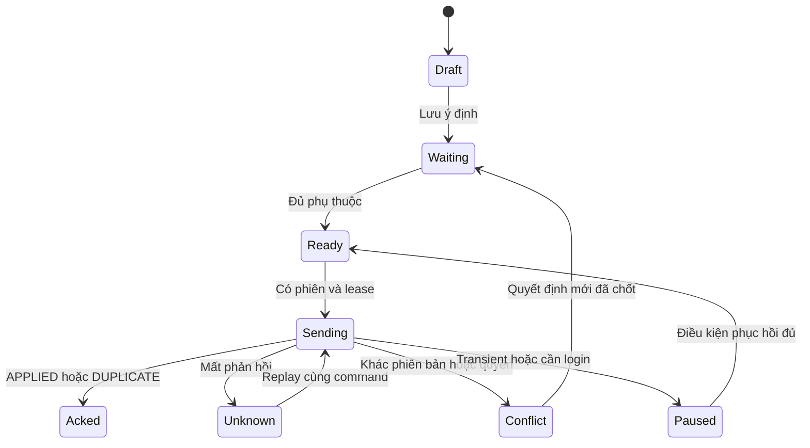

# RoadGuard — 09. App offline và đồng bộ dữ liệu

**Phiên bản:** FE-R3-v1 • **Ngày:** 27/09/2026 • **Trạng thái:** đặc tả đề xuất để FE/BE/QA review, chưa xác nhận triển khai.

## 1. Phạm vi, điều đã chốt và nhãn thiết kế

Đây là đặc tả triển khai chi tiết cho FR-22, liên quan FR-01/17/18/21/26/27, Data Dictionary §9.5. Tác nghiệp offline không tự hết hạn; token vẫn có hạn. D05/D06/42A đã chốt authority cho handover/conflict/rescue và bảo toàn actor/source; acknowledgement/intake/rescue wire schema, security và E2E tests chưa hoàn tất.

**Đề xuất trong tài liệu này:** cấu trúc local DB, state machine, worker, budget, cơ chế unlock, giao diện Sync Center và recovery. **Contract gap:** baseline chưa đủ cho mọi nhánh offline end-to-end; xem §10–12 và tài liệu12. Không gọi tính năng đã sẵn sàng chỉ vì có màn hình capture offline.

### Ma trận chức năng

| Chức năng | Android offline | Web offline v1 đề xuất |
|---|---|---|
| Xem nhiệm vụ/policy/evidence đã tải đủ | Có, nhãn snapshot | Cache đọc có nhãn stale; không hứa task pack đầy đủ |
| Capture ảnh, số đo, notes theo task | Local durable save | Nháp form nếu được duyệt scope; không thay app hiện trường |
| Fast Track đủ task/policy/snapshot | Ghi nhận cục bộ theo quyền đã giao; không TTL | Không cam kết sửa offline trên web |
| Nhận nhiệm vụ mới/đổi đội/chính sách | Cần server online | Cần online |
| Duyệt/nghiệm thu/đóng/công bố | Cần server online, đúng actor | Cần online |
| Reporter đăng ký/OTP/gửi phản ánh | Login/gửi server online; nháp nếu scope bổ sung | Có thể giữ nháp, chưa gửi |
| Operator quay/nhập video và telemetry | Giữ file/metadata theo task đã nhận | Upload online, resume theo contract |
| AI analysis/dashboard mới | Không chạy server AI offline; xem kết quả cũ có nhãn | Cache đọc, không tạo số liệu mới |
| Map | Chỉ vùng/tiles/font/sprite đã tải và được phép dùng | Không hứa tile/cache trình duyệt bền vững |

Offline không đồng nghĩa thiết bị không cần bảo mật hoặc file không thể mất khi user gỡ app/reset máy. App cần cảnh báo trước thao tác chủ động xóa/gỡ trong hướng dẫn vận hành; không hứa chống mọi lỗi phần cứng. Đề xuất backup/recovery có mã hóa cần Q17 và policy phê duyệt.

## 2. Kiến trúc local-first

UI đọc local repository làm nguồn hiển thị tác nghiệp. Repository phối hợp Room + private file store (Android); network worker không ghi trực tiếp state màn hình. Server cache và draft overlay riêng; immutable task snapshot dùng làm base. WorkManager là scheduler đề xuất, không bảo đảm chạy lập tức khi OS hạn chế; foreground có nút “Đồng bộ ngay”. Video lớn cần worker phù hợp giới hạn OS và foreground UX, benchmark trên thiết bị mục tiêu.

| Store đề xuất | Khóa / dữ liệu | Invariant |
|---|---|---|
| AccountPartition | environment, API origin, actorId, localSchemaVersion | Một account không đọc queue account khác |
| TaskPack | localPackId, server task/snapshot IDs, assignmentVersion, policy snapshot, hash, downloadedAt, ready flags | Snapshot bất biến; refresh tạo revision mới |
| ServerCache | resourceType/id, DTO, ETag, fetchedAt, authorization scope | Không ghi local edits đè baseline |
| Draft | localDraftId, taskPackId, form/measurement data, revision | Autosave version riêng, không bằng server version |
| MediaAsset | localMediaId, relative path, sha256, size, purpose, source, capturedAt, task/attempt links | File gốc immutable; provenance không chế lại |
| OutboxIntent | localIntentId, actor, kind, dependencies, baseSnapshot, state | Ý định chưa đủ ID khác wire command đã serialize |
| WireCommand | operationId, endpoint/kind, exact serialized payload, hash, idempotency key, serializer version | Sau lần gửi đầu, payload/key bất biến |
| UploadLedger | localMediaId, uploadId/fileId, part size, part ACK/ETag, state, nextRetryAt | Complete chưa VERIFIED không unblock business |
| IdMap | local entity ID → server UUID và version/reference | Ghi atomically cùng ACK, không dùng temp ID làm UUID server |
| ConflictRecord | base/local/server, code, references, resolution status | Không overwrite evidence hoặc tự hạ quyền |
| SyncRun | lease owner/generation, last success, errors, queue counts | Một runner per partition, durable recovery |

Không để raw token trong các store trên. Khóa mã hóa local tách credential phiên; logout không làm mất khả năng khôi phục partition hợp lệ. Backup không sao token; ownership không tự đổi khi restore thiết bị mới.

## 3. Tải gói trước khi ra hiện trường

1. Đăng nhập online và `/me`; tải các trang nhiệm vụ đúng scope. Nhận nhiệm vụ bằng endpoint accept online và lưu response/version mới. Không tự xem offline checkbox là server đã accept.
2. Crew GET `/inspection-tasks/{taskId}/snapshot`; lưu task, policy, assignmentVersion, pmFastTrackBlocked, evidence references và destination. Kiểm task ID/project/crew khớp mục đã chọn.
3. Với từng file cần dùng, GET metadata và content có quyền, ghi temp file, kiểm byte count/hash, chuyển file private store. Snapshot metadata một mình không chứng minh ảnh đã tải.
4. Tải geometry/map assets cần thiết theo license/provider; thiếu map không chặn nhập số đo nếu nghiệp vụ cho phép nhưng phải báo không dẫn đường được. Thiếu evidence/policy bắt buộc thì task chưa ready cho sửa.
5. Trong transaction local, đánh dấu readiness theo từng khả năng: `metadataReady`, `requiredEvidenceReady`, `policyReady`, `mapReady`; chỉ “Sẵn sàng tác nghiệp offline” khi tập bắt buộc của task đủ. Không yêu cầu mapReady cho mọi task nếu không cần map.
6. Hiển thị phiên bản snapshot/thời điểm tải/dung lượng và checklist kiểm offline bằng chế độ máy bay. Đồng bộ lại trước xuất phát nếu có mạng, nhưng không tự cài hạn hết quyền tác nghiệp.

Baseline chưa có repair-assignment/survey-task snapshot trọn gói. Không lấy InspectionTask DTO giả làm SurveyTask. Thiết kế package tương ứng cần FE-GAP-07, gồm assignment, destination, route/corridor/model/parser refs và quyền; map endpoint riêng cũng chưa đầy đủ.

## 4. Ghi ảnh và số đo an toàn

Ảnh: chụp/copy vào temporary private file → flush/close → tính SHA256/size → atomic rename khi filesystem hỗ trợ → transaction media metadata + draft/outbox refs → xác nhận UI “Đã lưu trên máy”. File rename và DB không cùng transaction: dùng journal/marker để recovery. Crash sau rename trước DB tạo orphan được phát hiện và quarantine; không xóa tùy tiện. DB commit chỉ khi file đọc được và hash đã có. Crash trước commit không báo saved.

Draft autosave đề xuất debounce500ms và flush khi rời bước, nhưng không hứa OS callback luôn chạy. Nút lưu hoàn tất phải await durable commit. Capture file lớn giữ placeholder “Đang lưu” cho đến khi write thực sự xong. Nếu lưu thất bại, giữ capture buffer khi khả thi và yêu cầu user xử lý; không tăng count đã lưu.

Measurement cần defectId, type/value/unit, measuredAt, ảnh đo theo schema, optional instrument/position. Clock máy và nguồn vị trí được ghi thật; không có GPS thì biểu diễn thiếu/unknown đúng schema và xử lý yêu cầu bắt buộc, không tự dùng GPS drone. Không sửa EXIF để hợp thức hóa BEFORE. Trước khi bắt đầu sửa phải gắn BEFORE; ảnh tái sử dụng giữ source/file/checksum/time, thiếu provenance wire contract là FE-GAP-14.

Thiếu dung lượng: báo dung lượng khả dụng, chặn thao tác không lưu được; chỉ đề xuất dọn bản đã verified và user chủ động chọn theo quy tắc dữ liệu. Không auto dọn evidence pending/conflict để giải phóng chỗ.

## 5. State machine local

### Outbox state (đề xuất, không phải enum BE)

| State | Khi vào | Chuyển tiếp |
|---|---|---|
| DRAFT | Người dùng đang sửa, chưa submit intent | READY/WAITING_DEPENDENCIES sau lưu/validate |
| WAITING_DEPENDENCIES | Thiếu file verified, server ID hoặc evaluation | READY khi đủ; BLOCKED_CONTRACT nếu thiếu API |
| READY | Wire command hợp lệ, dependencies đủ | IN_FLIGHT khi có lease/auth/network |
| IN_FLIGHT | Request đã gửi | ACKED, CONFLICT, REJECTED, UNKNOWN_OUTCOME |
| UNKNOWN_OUTCOME | Timeout/crash/response sai sau gửi | Reconcile/replay cùng command; không key mới |
| AUTH_REQUIRED | Session hết hạn hoặc không refresh được | Resume sau login cùng actor, recheck scope |
| PAUSED_RETRY | Transient/rate-limit hết budget | READY theo nextRetryAt hoặc user resume hợp lệ |
| CONFLICT | Stale snapshot/version/assignment | Chờ Q04 review; giữ base/local/server |
| REJECTED | Lỗi business/validation cuối cùng | Chỉnh draft tạo ý định mới sau biết outcome; giữ audit |
| BLOCKED_CONTRACT | Hành vi cần API chưa có | Chờ contract approved; giữ bản ghi và thông báo |
| ACKED | APPLIED/DUPLICATE đã validate và lưu mapping | Chờ business review riêng, không ACCEPTED tự động |

DRAFT có thể hủy khi user xác nhận. Đã IN_FLIGHT/UNKNOWN không được nút xóa queue biến thành “server canceled”; phải đối chiếu. ACKED chỉ nói việc gửi thành công, không PM đã duyệt/đóng.

Conflict→Waiting biểu thị ý định mới có reference quyết định, không tự sửa command cũ. UI phải phân biệt hai bản. Sơ đồ rút gọn; bảng là đầy đủ.

### Media state

LOCAL_SAVING → LOCAL_READY → SESSION_CREATED → UPLOADING → COMPLETE_REQUESTED → VERIFYING → VERIFIED. Có PAUSED/FAILED tại mỗi bước; failed có retry giữ hash. Không xóa local sau UPLOADING100% hoặc HTTP202.

## 6. Thứ tự một lượt đồng bộ

1. Acquire durable lease per partition, recover IN_FLIGHT từ run chết thành UNKNOWN_OUTCOME; UI foreground/worker không gửi đồng thời cùng command.
2. Kiểm API reachable, credential và cùng actor. Auth hết hạn xử lý mục02. Khi role/assignment bị thu hồi, không gửi command bằng quyền cũ; giữ local vào hàng có vấn đề.
3. Đọc version/state hiện tại khi cần và lưu song song base snapshot; khác biệt không được rewrite expectedVersion của command đã capture. Không replace policy snapshot cũ bằng policy mới để vượt check.
4. Upload media độc lập theo concurrency budget đề xuất2 files/2 parts mỗi file; actual provider/quota có thể thấp hơn. File DAG hoàn tất trước command tham chiếu.
5. Chọn intents độc lập đã đủ file/ID. Materialize thành wire commands và hash trước lần gửi đầu. Chọn batch tối đa100 ops theo baseline, đề xuất chunk25 để giảm partial failure; không có API guarantee max bytes nên giữ conservative config.
6. POST `/sync/batches` với Idempotency-Key của **envelope cụ thể**, deviceId và operations. Thứ tự ops hợp lệ, không có dependency đang chưa ACK trong cùng lượt nếu cần ID response.
7. Parse toàn bộ response 200: một outcome cho mỗi operationId, không thiếu/trùng/lạ; kiểm success resourceId/version/error. Sau đó transaction ACK từng op hợp lệ và IdMap; không ACK toàn batch theo HTTP.
8. Replay unknown giữ nguyên envelope/key khi còn không biết outcome. Sau đã nhận outcome đầy đủ, retry subset được phép dùng envelope key mới nhưng giữ operationId/payload từng operation; backend operation dedup vẫn bắt buộc.
9. Sau ACK phase trước, fetch resource/evaluation cần thiết, materialize phase phụ thuộc. Không tự thay version old command; ý định chưa gửi có thể dùng version từ kết quả dependency đã xác nhận nếu vẫn cùng quyền/snapshot theo BE contract.
10. Refetch resource/task/job để cập nhật UI từ server; phần cache refetch lỗi không hủy ACK đã commit. Persist last sync success và summary. Release lease.

Batch không atomic toàn bộ: A APPLIED, B CONFLICT, C REJECTED là kết quả hợp lệ. A không rollback chỉ vì B lỗi. Nếu response envelope thiếu một result, giữ nguyên response để chẩn đoán đã redact và coi lượt đó chưa đủ để ACK an toàn; replay/reconcile cùng key. Không suy result theo index duy nhất dù server hứa order; luôn kiểm operationId.

## 7. Multipart upload và phục hồi

| Bước | Endpoint / dữ liệu | Durable local |
|---|---|---|
| Init | POST `/uploads`: UploadCreate + key | uploadId/fileId/partSizeBytes/expiresAt/version |
| Cấp part URL | POST `/uploads/{uploadId}/part-urls`: partNumbers | Không lưu URL quá hạn như credential bền vững; lưu part index |
| PUT bytes | Signed URL tương ứng part, exact slice | ACK part/ETag theo provider, byte count |
| Complete | POST `/uploads/{uploadId}/complete`: parts+checksum, key+If-Match đúng upload aggregate | Command complete bất biến và kết quả/job reference |
| Verify | GET upload/file metadata và job khi trả202 | VERIFIED+hash khớp mới release dependency |

Không gắn access token RoadGuard vào signed PUT. URL hết hạn403 của storage không có nghĩa RoadGuard account revoked: gọi part-urls qua API để gia hạn và recheck quyền; không refresh JWT chỉ vì storage trả403. Giữ file bytes, size và chunk boundaries ổn định. Part ETag không mặc nhiên là MD5 hoặc file checksum.

Baseline UploadSession chưa có danh sách part server đã nhận, required signed headers hay cơ chế abort/expiry rõ. FE-GAP-06 cần BE bổ sung để resume chính xác khi mất ACK hoặc session hết hạn; không ghi “resumable hoàn chỉnh” chỉ với ledger local. Nếu provider xác nhận PUT cùng part+bytes idempotent, có thể resend part không chắc; nếu không, phải query server/provider qua contract. Session mới chỉ sau biết session cũ không usable, vẫn cùng media hash và không nhân business link. POST complete timeout cần query status/replay cùng key, không init lại ngay.

Read evidence có quyền tại download. Cache ảnh đã tải không tự chứng minh còn quyền online, nhưng dữ liệu phục vụ hồ sơ offline đang pending không bị purge mù khi quyền đổi; bảo vệ partition và xử lý Q17. Attachment cleanup cần cả server VERIFIED, command tham chiếu đã ACK, không còn local dependency/review cần bản đó và user chọn dọn. File server chưa liên kết nghiệp vụ được BE retention riêng, FE không quyết định xóa object.

## 8. Luồng đo offline

Crew đã nhận task → tải pack đủ → chọn defect → nhập đo/ảnh → durable save → đánh dấu “Chờ đồng bộ”. Khi có mạng: upload ảnh đo → VERIFIED → INSPECTION_SUBMIT với taskId/expectedVersion/capturedAt/payload → nhận InspectionSession resourceId/version → cập nhật task/result.

Nếu batch nhiều lỗi MEASURE_ONLY thì dù tất cả số đo nhỏ vẫn không hiện nút sửa. Nộp thiếu một lỗi giữ tiến độ từng lỗi và validation; có phải đo lại cả đợt hay phần thiếu theo Q05, không tự tạo policy mới. PM xem số đo sau sync, FE không gọi nộp xong là đã duyệt.

## 9. Luồng Fast Track offline — ranh giới quan trọng

Trước thi công: task INSPECT_AND_REPAIR, đúng assignment, một lỗi theo điều kiện nghiệp vụ, policy snapshot đầy đủ, không PM block, đo đạt, BEFORE hợp lệ và dụng cụ/vật tư theo policy. Mất mạng/token hết hạn tự nó không làm mất quyền tác nghiệp đã được giao.

Local evaluate phải dùng đúng rules/version, đơn vị/rounding/exclusions đã chốt. PolicyRule hiện chứa exclusions chuỗi tự do, thiếu semantics AND/OR nhiều rule và rounding; chưa thể viết evaluator an toàn chỉ từ schema. Nếu rule chưa máy hóa rõ: kết quả INSUFFICIENT_DATA/contract blocked, không default ELIGIBLE. Đây là thiếu contract để hiện thực, không thay đổi quyết định nghiệp vụ offline.

Local lưu evaluation record (input values/units, evidence refs, policy/hash, reasons, thời điểm), local attempt, BEFORE và AFTER theo lần sửa. App cho phép capture evidence thực tế ngay cả khi không thể sync, giữ trạng thái chưa server xác nhận. Không dùng UUID tự sinh giả làm evaluationId server.

**Đường sync khả thi có điều kiện khi snapshot không đổi:** upload VERIFIED → INSPECTION_SUBMIT → có server sessionId → POST `/inspection-tasks/{taskId}/evaluations` với sessionId/policyVersionId (key/If-Match theo operation) → server Evaluation ELIGIBLE → materialize REPAIR_START (hoặc startRepairAttempt) → server attemptId → REPAIR_SUBMIT. Mỗi phase phải kiểm phiên bản và quyết định hiện hành.

**Khoảng trống không thể né:** v1 chưa truyền snapshotId/assignmentVersion/local evaluation/physical-work-already-done và provenance đầy đủ trong sync operation; server evaluation sau reconnect không thể đại diện chắc chắn quyền tại lúc tác nghiệp. Nếu PM đổi task/policy/đội hoặc kết quả lệch, **không cố tạo evaluation mới để hợp thức hóa sửa cũ**. Giữ CONFLICT, chuyển PM theo Q04. Release Fast Track offline end-to-end bị gate FE-GAP-05/07/09/14 đến khi BE có contract tiếp nhận bằng chứng thực tế và conflict resolution đã duyệt.

Sau sync thành công, PM kiểm/đóng Fast Track và hệ thống báo Supervisor. Crew upload xong không gọi ACCEPTED; Supervisor không được thêm bước duyệt sửa Fast Track trước thi công.

## 10. Sửa theo APPROVAL_TRACK và sửa lại

Task/item phải đã được duyệt và giao trước khi tải offline package. Pack phải có item/assignment/version/scope/BEFORE và các điều kiện. Local start/save after tương tự nhưng không cần giả evaluation Fast Track. Sync REPAIR_START có payload.repairItemId; field top-level taskId trong SyncStart còn mơ hồ giữa inspection task và repair assignment, cần FE-GAP-05 chốt mapping. Không dùng inspectionTaskId bất kỳ để điền đủ UUID.

Sửa lại tạo attempt mới, giữ lịch sử BEFORE/AFTER cũ. Endpoint startReworkAttempt có trong baseline nhưng SyncOperation chưa có REWORK_START; local có thể giữ intent, khi online dùng endpoint đúng với dedup sau contract được xác nhận. Không reuse attempt ACCEPTED cũ hoặc đưa status REWORK_REQUIRED về IN_PROGRESS bằng patch tùy ý.

## 11. Operator offline

Operator nhận survey task online → tải scope, corridor/route/device/parser và destination cần thiết → quay/nhập video+telemetry cục bộ → giữ checksum/time/source và manifest theo task. Không kết luận coverage đủ chỉ vì SRT có tọa độ trong vùng; FE hiển thị UNKNOWN khi chưa phân tích.

`/sync/batches` cho role OPERATOR; union hiện có INSPECTION_SUBMIT/REPAIR_START/REPAIR_SUBMIT và `FAST_TRACK_EVALUATE` ở mức proposed draft. **Không có command survey hợp lệ để tự chế gửi**. Đề xuất local outbox kiểu online-command: upload video/telemetry VERIFIED → POST `/survey-tasks/{taskId}/datasets` với DatasetSubmit, key+If-Match theo operation → ACK datasetId → job server khi được tạo. Đây là orchestration FE, không thêm kind SURVEY_SUBMIT vào YAML gốc. `FAST_TRACK_EVALUATE` chỉ được replay sau khi task/policy snapshot, assignment và permission hiện hành được kiểm; runtime vẫn `NOT_ENABLED`. Thiếu pack/recovery/permissions vẫn cần gate.

Video không sao vào RAM toàn bộ để hash/upload; stream/chunk. Pause mạng metered/battery thấp theo user preference đề xuất, luôn cho user biết upload chưa xong. Không xóa video sau đổi tab. Tệp gốc trên SD/removable storage phải được copy private hoặc có quyền truy cập bền vững đã kiểm; URI tạm của picker không đủ.

## 12. Conflict và quyền bị thu hồi

| Nguyên nhân | FE làm ngay | Ai/quy trình quyết định |
|---|---|---|
| Task version đổi | Giữ base/local/server, không tự If-Match mới | PM/Q04; command mới sau đối chiếu |
| Đổi đội/hủy task | Khóa gửi theo assignment cũ, giữ evidence thực tế | PM xử lý liên kết/tồn đọng; BE kiểm quyền |
| Policy khác/PM block | Không local hạ mức nghiêm trọng | PM theo Q04; không approve auto |
| Task/case đã đóng | Không reopen tự động | Q07 và actor có quyền |
| User suspended | Dừng sync/auth; khóa partition phù hợp | Supervisor/Q17 cứu dữ liệu có audit |
| Upload thiếu/ảnh hỏng | Giữ gốc; retry verify hoặc bổ sung đúng source | Crew/Operator + PM nếu chứng cứ thiếu |
| Hai thiết bị cùng làm | Không merge theo timestamp máy | Dedup operation và aggregate version; PM giải quyết duplicate work |
| Schema cũ không còn hỗ trợ | Chặn gửi command incompatible, giữ raw local | FE/BE migration và hỗ trợ, không drop queue |

UI conflict gồm lý do, đối tượng, snapshot/version lúc làm, server version, bản local, file refs và next action. Không có nút “Ghi đè server” mặc định. Có thể sao ghi chú sang nháp mới sau review nhưng vẫn giữ lịch sử. Chưa có endpoint resolve-conflict hoặc emergency bypass được phê duyệt; tài liệu không giả định PM có thể bấm và hoàn tất giải quyết qua API hiện tại.

## 13. Recovery, migration và dọn dữ liệu

App killed sau request commit nhưng trước ACK: startup replay cùng operationId/key/body → DUPLICATE → ghi mapping atomically. Crash sau IdMap trước ACK phải được tránh bằng cùng transaction. Nếu crash ghi ACK xong chưa refetch thì ACK giữ, refetch sau.

Local schema migration phải có version, backup/recovery thích hợp, forward migration của draft trước gửi; transaction có thể rollback. Queue đã IN_FLIGHT không rewrite serializer hoặc body hash. Migration fail mở recovery/read-only, không destructive migration để app chạy. App update/service-worker update không xóa pending. Kiểm queue graph không cycle; cycle → BLOCKED_CONTRACT/diagnostics, không vô hạn.

User xóa cache: tách cache tái tải được khỏi evidence pending; clear-cache không được clear-all DB. User logout: giữ partition. Reinstall/reset có thể mất local, phải có hướng dẫn và backup được phê duyệt; export cứu dữ liệu phải mã hóa và kiểm scope, không zip ảnh nhạy cảm công khai. Không tự chuyển owner để cứu data.

## 14. Tiêu chí hoàn tất một lượt và quan sát

“Đã đồng bộ hết” chỉ khi không còn pending/unknown/conflict/rejected cần xử lý trong partition và tất cả file bắt buộc của command đã VERIFIED. Dashboard Sync Center vẫn tách số đã gửi, chờ xác minh, conflict và failed. lastSuccessfulSync không thay lastAttemptAt; tài khoản khác/môi trường khác có mốc riêng.

Metrics đề xuất: queue oldest age, counts by state, sync latency, dedup count, upload byte retry, conflict ratio, local write failures. Log IDs đã authorize, không ảnh/GPS/raw body/URL/token. Tuổi hàng đợi dùng cảnh báo vận hành, **không TTL làm hết quyền Fast Track**. Các test restart/network/clock/partial/revocation ở tài liệu11 là gate bắt buộc trước rollout hiện trường.

## REVIEW-01 — bổ sung

Xem [đề xuất sync evaluation](../05_Technical/06_Sync_Evaluation_Amendment_Proposal.md). Approval Track không cần evaluation Fast Track; thiếu hụt của nhánh đó là task/assignment identity và snapshot/intake. Q04/Q17 vẫn là gate nghiệm thu conflict/rescue end-to-end, không chỉ ghi chú triển khai.

## V2(3) amendment — 2026-09-28

This document follows `planning/V2/V2-3_DECISION_REGISTER.md`. D01-D28 are approved business decisions; `APPROVED_PILOT_CONFIG` and `APPROVED_TARGET` are not empirical verification. The document must distinguish `contractStatus`, `implementationStatus`, and `verificationStatus`. Reporter email/password plus one-time email OTP is the approved authentication flow; web cookie transport, pilot limits, retention and performance values remain configuration/target registers. Fast Track uses measurement-only intake followed by a separately authorized PM repair task; policy framework, reopen, partial publication, handover/conflict, BEFORE incident, curing and traffic release remain explicit contracts. Offline evaluation and AI two-stage processing are proposed until schema, fixtures and runtime/provider evidence pass.
